

# 🎓 MediFL — Faculty Presentation Guide

### How to Explain the MediFL Industry Project to Your Faculty

---

*This guide walks you through every aspect of the project — what it is, why it matters, how it works, and what you built — in a way that's easy to present and answer faculty questions.*

---

## 📌 How to Use This Guide

> This document is structured as a **step-by-step presentation script**. Each section corresponds to a slide/topic you can explain. Key talking points, diagrams, and anticipated faculty questions are included.

---

# 🟢 PART 1: THE PROBLEM & WHY THIS PROJECT EXISTS

---

## 🗣️ Opening Statement (30 seconds)

> *"Our project, MediFL, solves one of the biggest problems in healthcare AI — how do you train a medical AI model using patient data from multiple hospitals, when privacy laws like HIPAA and GDPR strictly forbid sharing that patient data?"*

---

## 📌 1.1 What Problem Are We Solving?

### Explain to faculty like this:

> *"Imagine Hospital A in Mumbai has 50,000 chest X-rays, Hospital B in Pune has 30,000, and Hospital C in Delhi has 40,000. If we combine all 1,20,000 X-rays, we can train a very accurate pneumonia detection AI. But here's the problem..."*

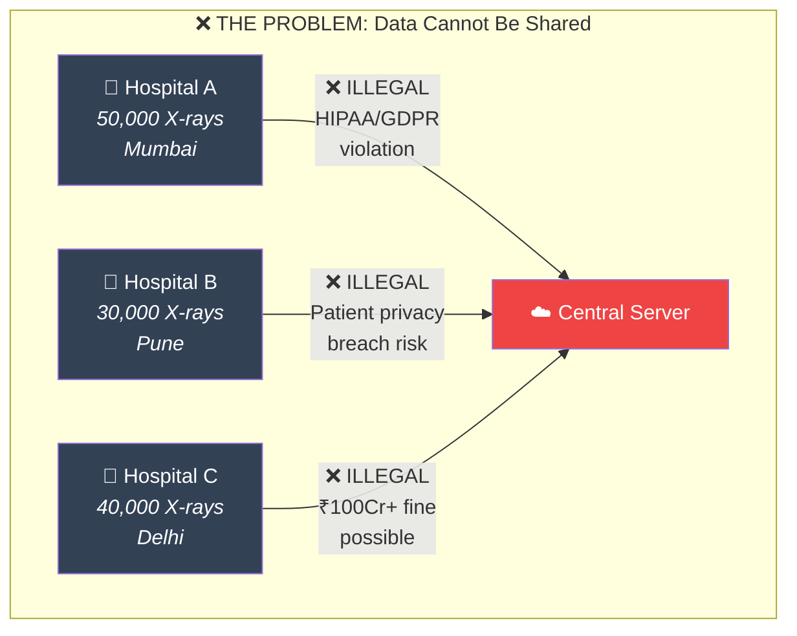

### 🗣️ Key Talking Points:

1. **Privacy Laws:** HIPAA (USA) can fine up to $50,000 per violation. GDPR (Europe) can fine 4% of global revenue. India's DPDP Act also restricts health data sharing.
2. **Bias Problem:** A model trained only on Hospital A's data works well for Mumbai patients but fails on Delhi patients (different demographics, equipment, protocols).
3. **Cost Problem:** Transferring terabytes of DICOM medical images to cloud costs lakhs in bandwidth and storage.
4. **Time Problem:** Legal agreements between hospitals take 12-18 months to negotiate.

### ❓ Faculty May Ask:

| Question | Your Answer |
|:---|:---|
| *"Why can't hospitals just anonymize the data?"* | Anonymization is not foolproof — research shows that medical images can be re-identified. Also, even anonymized data transfer requires extensive legal agreements. |
| *"Why not just train on one hospital's data?"* | Single-hospital models have **algorithmic bias** — they work well on that hospital's patient demographics but fail when deployed elsewhere. Multi-center training is required by FDA for medical AI approval. |

---

## 📌 1.2 Our Solution: Federated Learning

### Explain to faculty like this:

> *"Instead of bringing the data to the model, we bring the model to the data. Each hospital trains the AI model locally on their own data, and only sends the learned knowledge — not the patient data — back to a central server."*

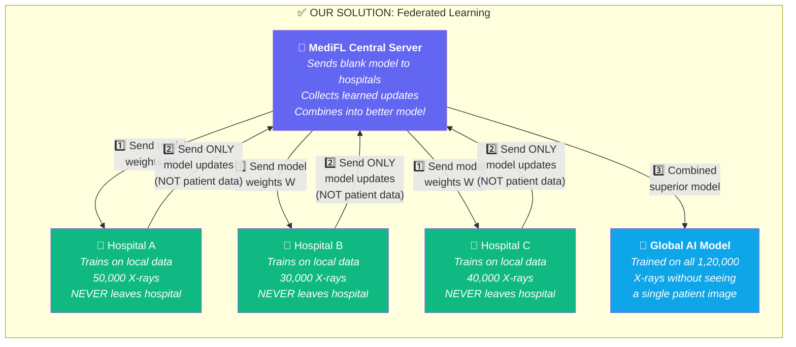

### 🗣️ Simple Analogy for Faculty:

> *"Think of it like a teacher giving an exam to 3 classrooms. Each classroom solves the questions independently. The teacher collects only the answer patterns (not the students' personal notes), identifies what concepts were learned well across all classrooms, and creates a better study guide. No student's personal work was ever shared — but the collective knowledge improved the study guide for everyone."*

---

# 🔵 PART 2: HOW THE SYSTEM WORKS (TECHNICAL ARCHITECTURE)

---

## 📌 2.1 System Architecture Overview

### Explain to faculty like this:

> *"Our system has 3 main parts: (1) A central cloud server that orchestrates training, (2) Edge agents deployed inside each hospital, and (3) A web dashboard for monitoring."*

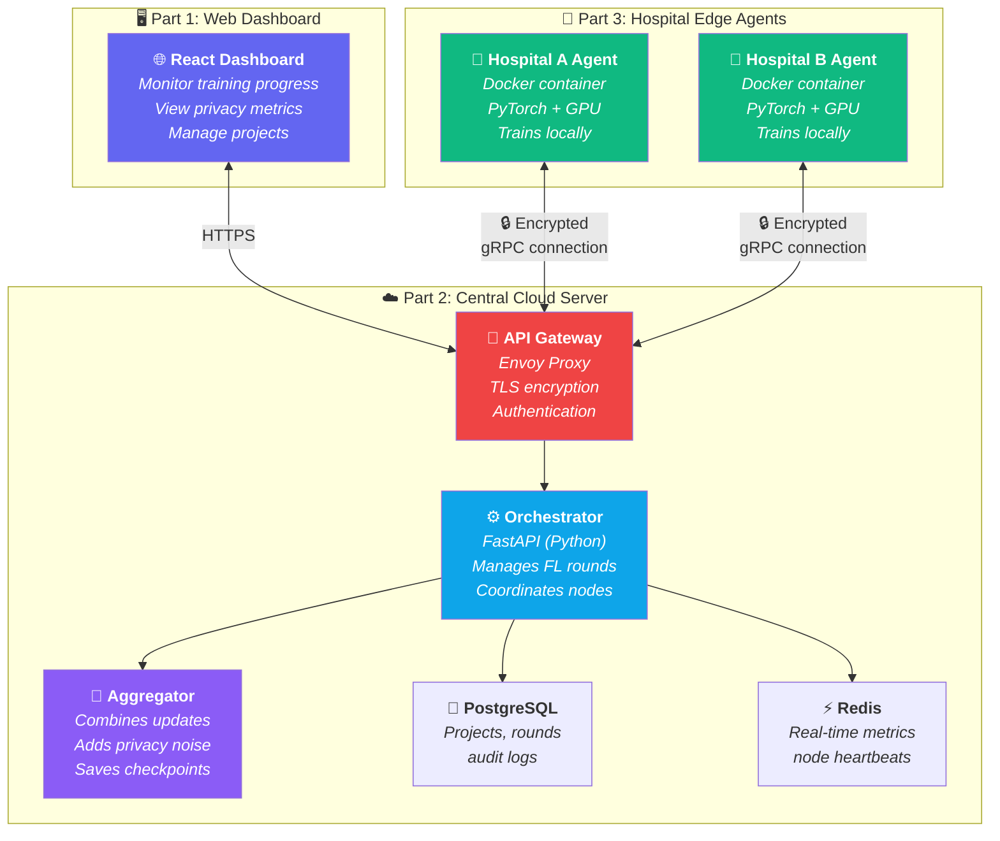

### ❓ Faculty May Ask:

| Question | Your Answer |
|:---|:---|
| *"What technology stack did you use?"* | **Backend:** Python 3.11 with FastAPI, gRPC for fast binary streaming. **Frontend:** React with TypeScript. **Database:** PostgreSQL for structured data, Redis for real-time state. **ML:** PyTorch for model training. **Deployment:** Docker containers, Kubernetes for production. |
| *"Why FastAPI and not Django/Flask?"* | FastAPI is async (high performance), generates automatic OpenAPI docs, and has native compatibility with PyTorch ML pipelines. |
| *"Why gRPC and not REST?"* | Model weight files are 50-500 MB binary tensors. REST with JSON would cause 2-3x overhead. gRPC with Protocol Buffers is 65% more efficient and supports streaming. |

---

## 📌 2.2 The Federated Learning Round — Step by Step

### Explain to faculty like this:

> *"Each training 'round' follows this sequence of 5 steps. This repeats for 50-100 rounds until the model converges."*

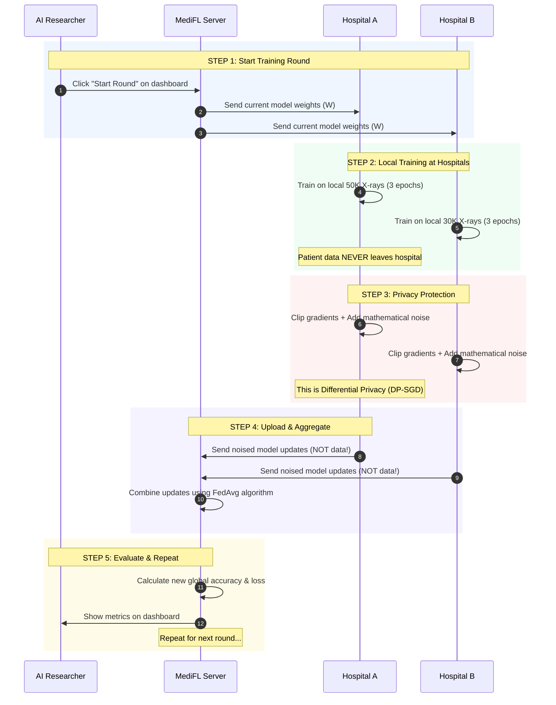

---

## 📌 2.3 The Key Algorithms — Explained Simply

### 🗣️ FedAvg (Federated Averaging) — The Core Algorithm

> *"FedAvg is how we combine the learning from multiple hospitals. Each hospital sends its model updates, and we compute a weighted average — hospitals with more data get more weight in the average."*

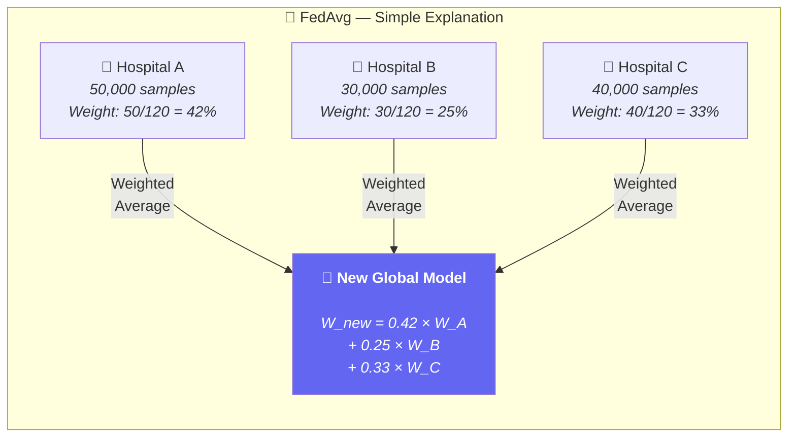

**Formula:** $W_{t+1} = \sum_{k=1}^{K} \frac{n_k}{N} \cdot W_k$

where $n_k$ = samples at hospital $k$, $N$ = total samples across all hospitals.

### 🗣️ Differential Privacy (DP-SGD) — How We Protect Patient Data

> *"Even model updates can theoretically leak information. So before uploading, each hospital adds carefully calibrated mathematical noise to the updates. This noise guarantees — mathematically, not just by policy — that no individual patient's data can be reconstructed."*

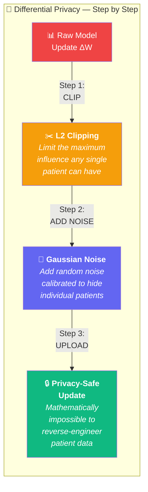

### ❓ Faculty Will Definitely Ask About DP:

| Question | Your Answer |
|:---|:---|
| *"What is epsilon (ε)?"* | ε (epsilon) is the **privacy budget** — it measures how much privacy we're spending. Lower ε = stronger privacy. We target ε ≤ 2.0, which is considered strong for medical data. |
| *"What is the trade-off?"* | More noise (stronger privacy) = slightly lower model accuracy. Our benchmarks show that at ε = 1.95, we lose only **1.1% accuracy** compared to no privacy — which is excellent. |
| *"How is this better than anonymization?"* | Anonymization is heuristic — it can be broken. DP provides **mathematical proof** that no individual's data can be recovered, regardless of the attacker's computing power. |

---

# 🟡 PART 3: THE DATABASE & API DESIGN

---

## 📌 3.1 Database Schema (ER Diagram)

### Explain to faculty like this:

> *"Our PostgreSQL database has 7 main tables that track users, projects, training rounds, hospital nodes, model checkpoints, and audit logs."*

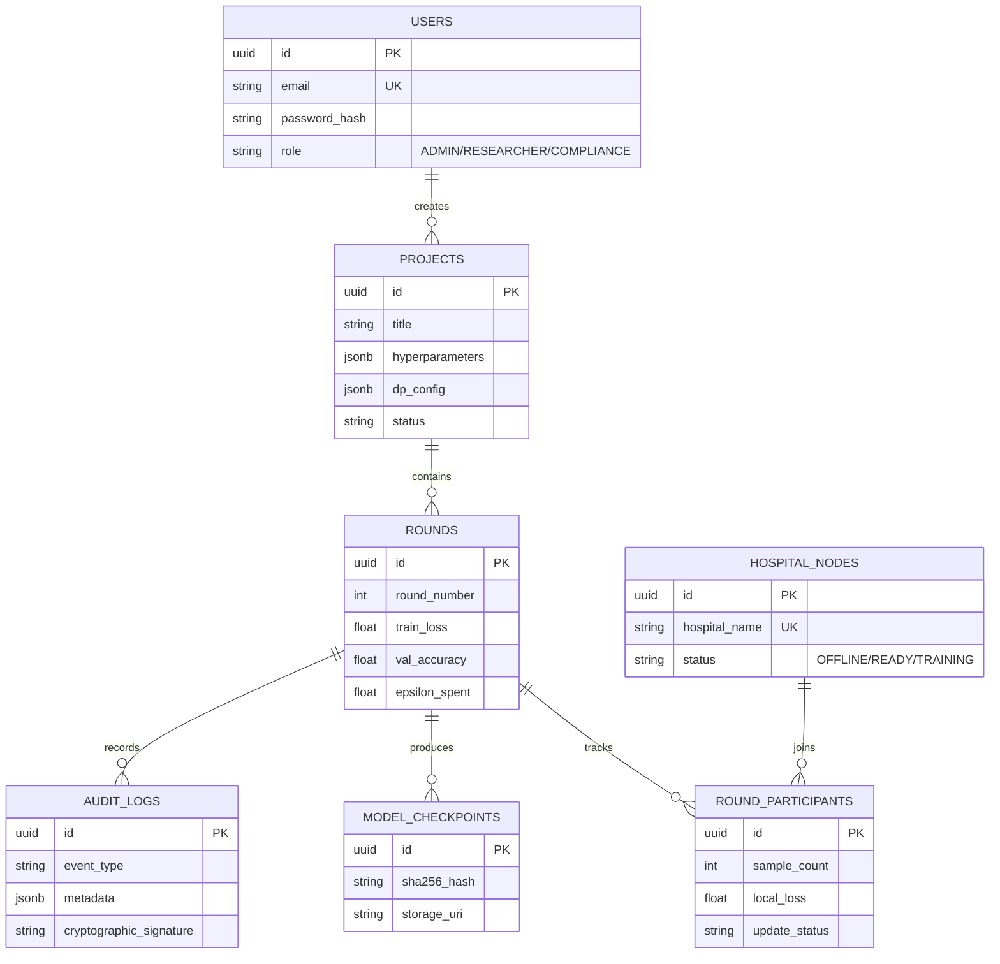

### ❓ Faculty May Ask:

| Question | Your Answer |
|:---|:---|
| *"Why PostgreSQL and not MongoDB?"* | We need **ACID transactions** for training round state transitions (a round can't be partially completed). PostgreSQL also has JSONB columns for flexible hyperparameter storage. |
| *"Why UUID primary keys?"* | UUIDs prevent enumeration attacks (can't guess next ID) and work across distributed systems without coordination. |
| *"What is the audit_logs table for?"* | Every action is cryptographically signed and logged immutably — this is required for **HIPAA compliance** (7-year retention of access logs). |

---

## 📌 3.2 API Design

### Explain to faculty like this:

> *"We use three communication protocols for different purposes:"*

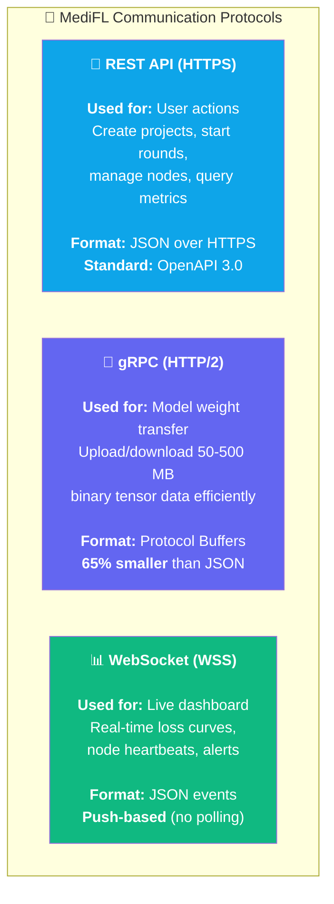

---

# 🔴 PART 4: SECURITY & COMPLIANCE

---

## 📌 4.1 Security Architecture

### Explain to faculty like this:

> *"Security is not an afterthought — it's built into the architecture. We follow a Zero Trust model where nothing is trusted by default."*

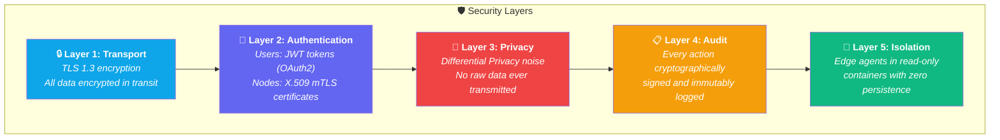

### 🗣️ Key Security Features to Highlight:

| Security Feature | What It Does | Why It Matters |
|:---|:---|:---|
| **mTLS (Mutual TLS)** | Both server AND hospital node verify each other's identity using X.509 certificates | Prevents rogue nodes from joining the network |
| **Outbound-Only Connections** | Hospital agents only make outbound connections — no incoming ports needed | Hospital IT doesn't need to open any firewall ports |
| **Differential Privacy** | Mathematical noise prevents gradient inversion attacks | Even if someone intercepts the updates, they can't reconstruct patient images |
| **Cryptographic Audit Trail** | Every model checkpoint is SHA-256 signed | Provides tamper-proof evidence for regulatory audits |

---

# 🟣 PART 5: WHAT WE DOCUMENTED (22 INDUSTRY DOCUMENTS)

---

## 📌 5.1 Documentation Overview

### Explain to faculty like this:

> *"In industry, software projects require extensive documentation for compliance, onboarding, and maintenance. We created 22 enterprise-grade documents covering every phase of the software lifecycle."*

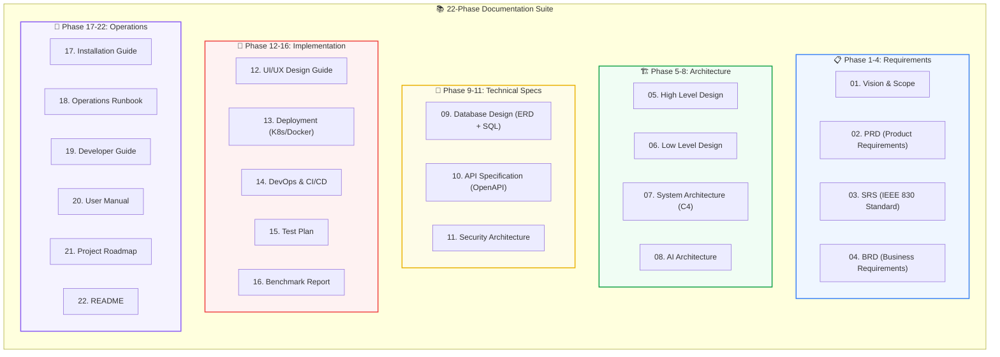

### 🗣️ Why 22 Documents?

> *"In real industry software projects — especially in healthcare and finance — this level of documentation is mandatory. Companies like Google, Microsoft, and hospitals using Epic/Cerner all maintain similar document sets. We followed IEEE, ISO, and industry standards to make our documentation production-ready."*

---

# 🟠 PART 6: RESULTS & KEY ACHIEVEMENTS

---

## 📌 6.1 Benchmark Results

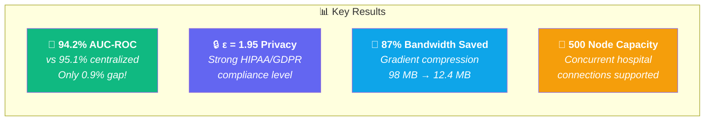

### 🗣️ How to Present Results:

> *"Our federated model achieved 94.2% AUC-ROC — which is only 0.9% less than a centralized model that has access to all the data. This means we get nearly the same accuracy while completely preserving patient privacy. The privacy budget of ε = 1.95 meets HIPAA and GDPR standards."*

---

# 🔵 PART 7: ANTICIPATED FACULTY QUESTIONS & ANSWERS

---

## ❓ Common Faculty Questions

### Technical Questions

| # | Faculty Question | Your Answer |
|:---:|:---|:---|
| 1 | *"What is Federated Learning?"* | A distributed machine learning technique where the model travels to the data (hospitals), not the data to the model. Only model parameter updates are exchanged. |
| 2 | *"How does Differential Privacy work?"* | We clip gradient norms to limit any single patient's influence, then add calibrated Gaussian noise. This provides a mathematical guarantee (epsilon-delta DP) that individual records cannot be extracted. |
| 3 | *"What happens if a hospital goes offline?"* | The system has a configurable timeout (default 600s). Stragglers are automatically excluded from the round, and aggregation proceeds with the remaining nodes. |
| 4 | *"How do you handle non-IID data?"* | We implement FedProx algorithm which adds a proximal regularization term that penalizes local models from drifting too far from the global model. |
| 5 | *"What if a malicious hospital sends fake updates?"* | We plan to implement Byzantine-robust aggregation (Krum/Trimmed Mean) in v1.2 to detect and filter anomalous gradient updates. |

### Architecture Questions

| # | Faculty Question | Your Answer |
|:---:|:---|:---|
| 6 | *"Why microservices? Why not monolith?"* | Different components have different scaling needs — the Aggregator needs GPU resources while the API needs CPU. Microservices let us scale them independently. |
| 7 | *"Why Docker and Kubernetes?"* | Docker ensures consistent environments across hospitals (different OS, hardware). Kubernetes provides auto-scaling, health checks, and rolling updates for production. |
| 8 | *"Why gRPC instead of REST for everything?"* | Model weights are 50-500 MB binary data. gRPC with Protocol Buffers is 65% more efficient than JSON/REST for binary streaming. |

### Business & Compliance Questions

| # | Faculty Question | Your Answer |
|:---:|:---|:---|
| 9 | *"How is this different from existing solutions?"* | Existing FL frameworks (Flower, NVIDIA FLARE) are research tools — they lack healthcare-specific compliance (HIPAA audit trails), enterprise dashboards, and integrated privacy budget management. |
| 10 | *"What makes this industry-level?"* | 22-document IEEE/ISO compliant documentation suite, production Kubernetes deployment, CI/CD pipelines, cryptographic audit trails, and mathematical privacy guarantees. |
| 11 | *"What are the real-world applications?"* | Multi-center clinical trials, rare disease detection (aggregate samples across hospitals), pharmaceutical drug safety monitoring, and pandemic surveillance models. |

---

## 📌 Presentation Tips

> [!TIP]
> **Start with the problem, not the solution.** Faculty will be more engaged if they understand WHY this matters before you show HOW it works.

> [!TIP]
> **Use the analogy.** The "teacher-classroom" analogy (Section 1.2) makes Federated Learning instantly understandable to non-ML faculty.

> [!TIP]
> **Show the diagrams.** Open the actual markdown files in VS Code or GitHub — the Mermaid diagrams render beautifully and look very professional.

> [!TIP]
> **Emphasize the documentation.** Faculty value thoroughness. Highlight that you created 22 industry-standard documents — this demonstrates real software engineering maturity.

---

### 📂 Quick Links to All Documents

| Requirements | Architecture | Technical | Operations |
|:---:|:---:|:---:|:---:|
| [Vision](docs/01_VISION_AND_SCOPE.md) | [HLD](docs/05_HLD.md) | [Database](docs/09_DATABASE_DESIGN.md) | [Install](docs/17_INSTALLATION_GUIDE.md) |
| [PRD](docs/02_PRD.md) | [LLD](docs/06_LLD.md) | [API](docs/10_API_SPECIFICATION.md) | [Runbook](docs/18_OPERATIONS_RUNBOOK.md) |
| [SRS](docs/03_SRS.md) | [System Arch](docs/07_SYSTEM_ARCHITECTURE.md) | [Security](docs/11_SECURITY_ARCHITECTURE.md) | [Dev Guide](docs/19_DEVELOPER_GUIDE.md) |
| [BRD](docs/04_BRD.md) | [AI Arch](docs/08_AI_ARCHITECTURE.md) | [UI/UX](docs/12_UI_UX_DESIGN_GUIDE.md) | [User Manual](docs/20_USER_MANUAL.md) |

---

*Good luck with your presentation! 🎓*

