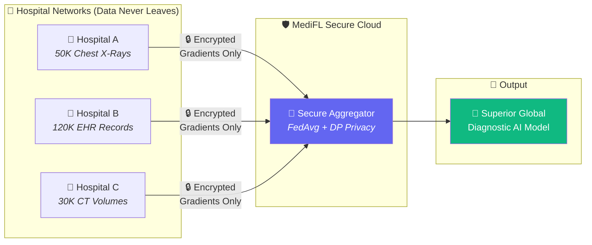
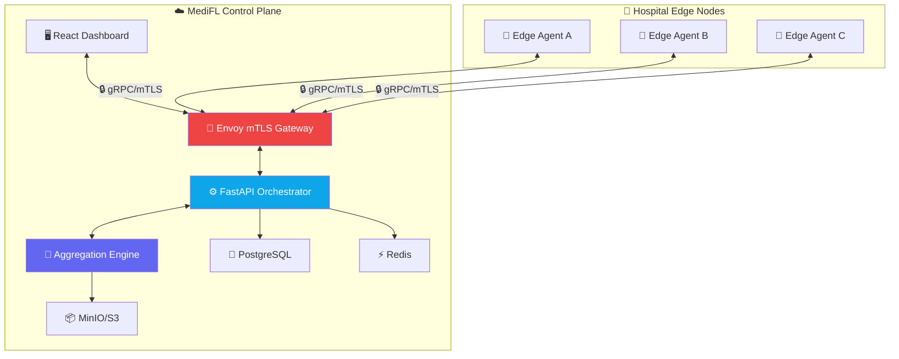

<div align="center">

# 🧠 MediFL

### Enterprise Medical Federated Learning Platform

*Privacy-preserving collaborative AI training for healthcare institutions — without centralizing sensitive patient data.*

---

[](LICENSE)
[](https://python.org)
[](https://pytorch.org)
[](https://grpc.io)
[](https://postgresql.org)
[](https://kubernetes.io)
[](#-security--compliance)
[](#-security--compliance)

---

</div>

## 🌟 What is MediFL?

**MediFL** enables hospital networks, academic medical centers, and pharmaceutical organizations to **collaboratively train diagnostic AI models** without transferring any raw patient data across institutional boundaries.



### 🔑 Key Capabilities

| Feature | Description |
|:---|:---|
| 🔒 **Zero Data Exposure** | Patient records never leave hospital intranets. Only DP-noised gradients transit. |
| 🧮 **Differential Privacy** | Formal $(\epsilon, \delta)$-DP guarantees via calibrated DP-SGD noise injection. |
| 📡 **Secure Communication** | gRPC over mTLS with X.509 certificates. Outbound-only hospital connections. |
| 📊 **Real-Time Dashboard** | Live training loss curves, node health monitoring, privacy budget gauges. |
| 🏥 **500+ Node Scale** | Support for 500+ concurrent hospital edge nodes across continents. |
| ⚖️ **HIPAA & GDPR Compliant** | Cryptographic audit trails, immutable model lineage, and zero PHI exposure. |

---

## 🏗️ System Architecture



---

## ⚡ Quick Start

```bash
# 1. Clone & configure
git clone https://github.com/medifl/medifl-platform.git
cd medifl-platform
cp .env.example .env

# 2. Launch all services
docker compose up -d --build

# 3. Verify health
curl http://localhost:8000/healthz
# → {"status": "HEALTHY", "services": {"database": "UP", "redis": "UP", "aggregator": "UP"}}
```

---

## 🛠️ Technology Stack

| Layer | Technologies |
|:---|:---|
| 🧠 **AI & Privacy** | PyTorch 2.x, Opacus (DP-SGD), Flower/PySyft, TenSEAL (HE) |
| ⚙️ **Backend** | Python 3.11, FastAPI, gRPC, Protocol Buffers, Keycloak (OIDC) |
| 🖥️ **Frontend** | React 18, TypeScript, TailwindCSS, Recharts |
| 💾 **Data** | PostgreSQL 15, Redis 7, MinIO (S3-compatible) |
| 🏗️ **Infrastructure** | Docker, Kubernetes (EKS/GKE), Envoy Proxy, Helm |
| 📊 **Observability** | Prometheus, Grafana, Loki, Alertmanager |
| 🔐 **Security** | HashiCorp Vault, CloudHSM, mTLS X.509, TLS 1.3 |

---

## 📚 Documentation Suite

> **22 enterprise-grade documents** covering every aspect of the platform — from vision to production operations.

| Phase | Document | Description |
|:---:|:---|:---|
| 01 | 📄 [Vision & Scope](docs/01_VISION_AND_SCOPE.md) | Business objectives, stakeholders, success KPIs |
| 02 | 📄 [PRD](docs/02_PRD.md) | User personas, feature epics, MoSCoW prioritization |
| 03 | 📄 [SRS](docs/03_SRS.md) | IEEE 830 functional & non-functional requirements |
| 04 | 📄 [BRD](docs/04_BRD.md) | ROI analysis, RACI matrix, regulatory compliance |
| 05 | 📄 [HLD](docs/05_HLD.md) | Microservice architecture, data flow, tech stack |
| 06 | 📄 [LLD](docs/06_LLD.md) | Class diagrams, DP-SGD code, state machine |
| 07 | 📄 [System Architecture](docs/07_SYSTEM_ARCHITECTURE.md) | C4 Model diagrams, deployment topology, ADRs |
| 08 | 📄 [AI Architecture](docs/08_AI_ARCHITECTURE.md) | FedAvg/FedProx math, DP formulas, model lineage |
| 09 | 📄 [Database Design](docs/09_DATABASE_DESIGN.md) | ERD, PostgreSQL DDL schema, Redis data architecture |
| 10 | 📄 [API Specification](docs/10_API_SPECIFICATION.md) | REST (OpenAPI 3.0), gRPC proto, WebSocket events |
| 11 | 📄 [Security Architecture](docs/11_SECURITY_ARCHITECTURE.md) | Zero Trust, mTLS, STRIDE threat matrix, key management |
| 12 | 📄 [UI/UX Design Guide](docs/12_UI_UX_DESIGN_GUIDE.md) | Design tokens, dashboard wireframes, components |
| 13 | 📄 [Deployment Architecture](docs/13_DEPLOYMENT_ARCHITECTURE.md) | Kubernetes topology, Helm charts, Dockerfiles |
| 14 | 📄 [DevOps Guide](docs/14_DEVOPS_GUIDE.md) | GitHub Actions CI/CD, ArgoCD GitOps |
| 15 | 📄 [Test Plan](docs/15_TEST_PLAN.md) | Test pyramid, privacy verification, load testing |
| 16 | 📄 [Benchmark Report](docs/16_BENCHMARK_REPORT.md) | Performance metrics, DP trade-offs, compression |
| 17 | 📄 [Installation Guide](docs/17_INSTALLATION_GUIDE.md) | Docker Compose setup, edge agent deployment |
| 18 | 📄 [Operations Runbook](docs/18_OPERATIONS_RUNBOOK.md) | Prometheus alerts, incident SOPs |
| 19 | 📄 [Developer Guide](docs/19_DEVELOPER_GUIDE.md) | Code standards, git workflow, PR checklist |
| 20 | 📄 [User Manual](docs/20_USER_MANUAL.md) | Role-specific guides for researchers, IT, compliance |
| 21 | 📄 [Project Roadmap](docs/21_PROJECT_ROADMAP.md) | 6-month Gantt timeline, sprint milestones |

---

## 🔒 Security & Compliance

| Standard | Status | Details |
|:---|:---:|:---|
| 🇺🇸 **HIPAA Security Rule** | ✅ Compliant | TLS 1.3, access controls, 7-year audit retention |
| 🇪🇺 **GDPR Article 25/32** | ✅ Compliant | Privacy by design (DP-SGD), zero data transfer |
| 🔒 **SOC 2 Type II** | 🟡 In Progress | External audit scheduled Q1 2027 |
| 🏥 **ISO/IEC 27001** | 📋 Planned | Target Q2 2027 |

---

## 📄 License

MediFL is open-source software licensed under the [Apache License 2.0](LICENSE).

---

<div align="center">

*Built with ❤️ for privacy-preserving healthcare AI*

**© 2026 MediFL Platform**

</div>
