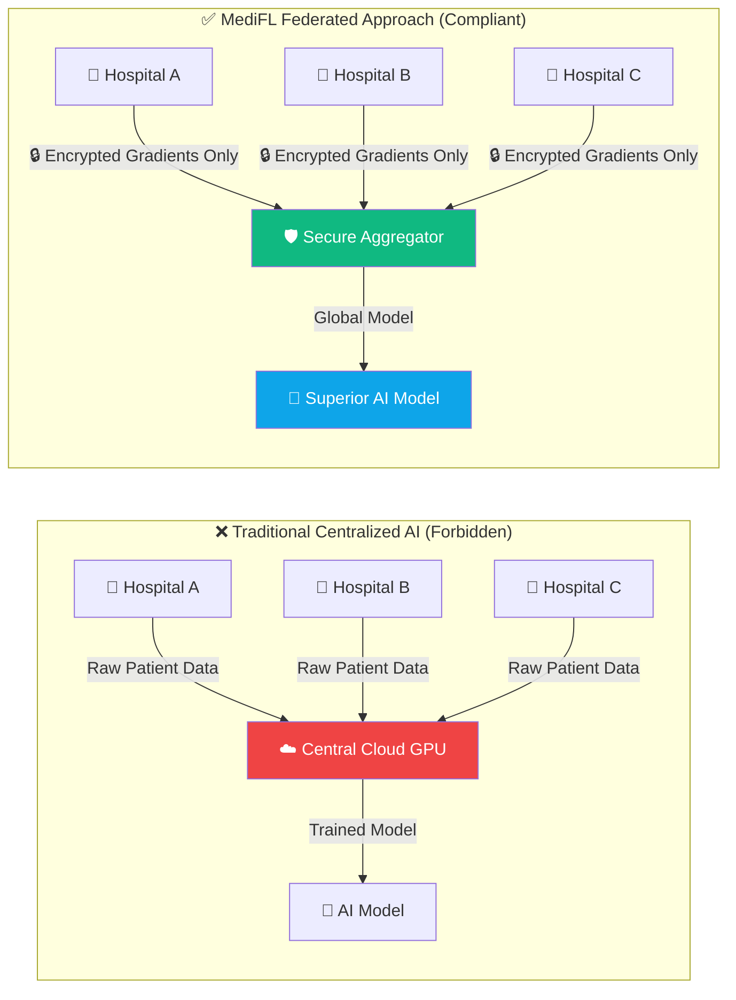
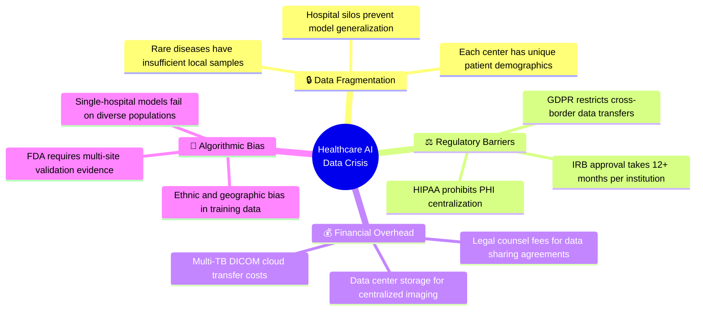
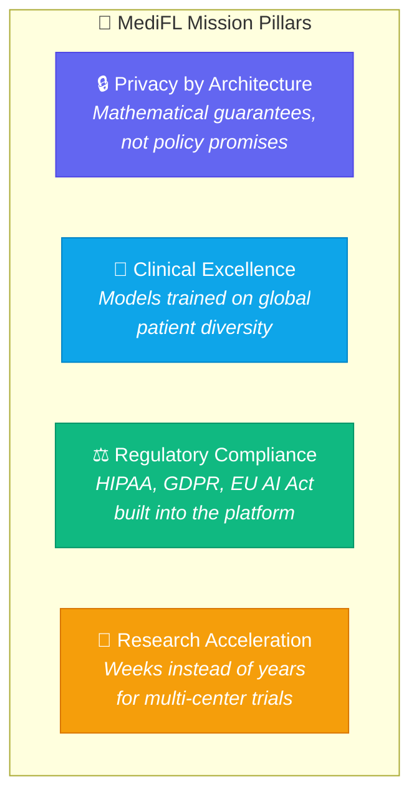
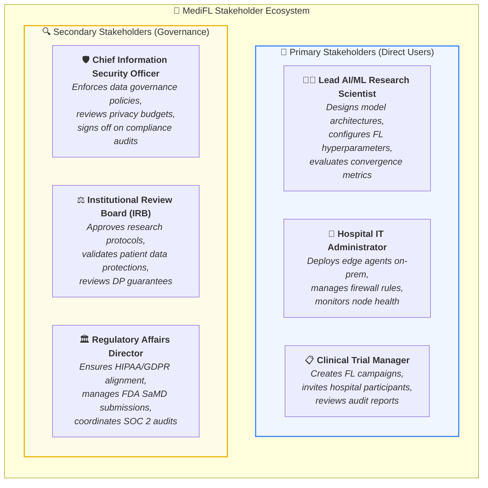
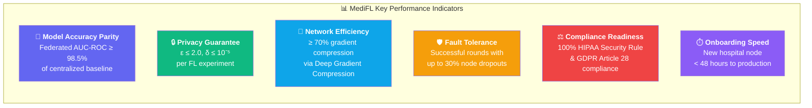

# 📋 MediFL — Vision & Scope Document

### 🏥 Enterprise Medical Federated Learning Platform

| **Document ID** | **Classification** | **Version** | **Status** |
|:---:|:---:|:---:|:---:|
| `MEDIFL-VSD-001` | 🔒 Confidential | `v1.0.0` | ✅ Approved |

| **Prepared By** | **Reviewed By** | **Approved By** | **Date** |
|:---:|:---:|:---:|:---:|
| AI Systems Architecture Team | Chief Technology Officer | VP Engineering & Product | August 2026 |

---

## 📑 Table of Contents

- [1. Executive Summary](#1-executive-summary)
- [2. Business Problem & Market Landscape](#2-business-problem--market-landscape)
- [3. Product Vision Statement](#3-product-vision-statement)
- [4. Scope & System Boundaries](#4-scope--system-boundaries)
- [5. Key Stakeholders & Persona Map](#5-key-stakeholders--persona-map)
- [6. Strategic Goals & Success KPIs](#6-strategic-goals--success-kpis)
- [7. Competitive Landscape Analysis](#7-competitive-landscape-analysis)
- [8. Assumptions, Constraints & Dependencies](#8-assumptions-constraints--dependencies)
- [9. Document Approval & Revision History](#9-document-approval--revision-history)

---

## 1. Executive Summary

> **MediFL** is an enterprise-grade, privacy-preserving **Medical Federated Learning Platform** engineered to solve the fundamental data-silo crisis in healthcare AI.

Modern clinical AI models — ranging from **chest X-ray pneumonia classifiers** to **oncology pathology segmentation networks** and **genomic risk predictors** — demand massive, diverse patient datasets to generalize effectively across demographics. However, strict global privacy regulations (**HIPAA**, **GDPR**, **EU AI Act**) categorically forbid centralizing raw patient Electronic Health Records (EHR) and DICOM medical imagery into shared cloud repositories.

### 🔑 Core Value Proposition

| Capability | What MediFL Delivers |
|:---|:---|
| 🔒 **Zero Data Exposure** | Patient records **never** leave hospital intranets. Only mathematically sanitized model weight updates transit the network. |
| 🧮 **Differential Privacy** | Formal $(\epsilon, \delta)$-DP guarantees via calibrated Gaussian noise injection ($\text{DP-SGD}$) prevent gradient inversion attacks. |
| 🌍 **Global Collaboration** | Enables 500+ hospital nodes across continents to jointly train a single superior diagnostic model. |
| 📜 **Regulatory Compliance** | Built-in HIPAA, GDPR, and EU AI Act compliance with cryptographic audit trails and immutable model lineage. |

---

## 2. Business Problem & Market Landscape

### 2.1 The Healthcare AI Data Crisis

> [!WARNING]
> **80%+ of the world's most valuable clinical diagnostic data remains permanently locked inside hospital intranets** — unusable for cross-institutional AI research due to legal, ethical, and technical barriers.

### 2.2 Quantified Impact of Data Fragmentation

| Problem Dimension | Current Industry Pain Point | MediFL Solution Impact |
|:---|:---|:---|
| **Data Access Latency** | 12–18 months to negotiate inter-hospital data sharing agreements | ⚡ Reduced to < 2 weeks (no raw data leaves premises) |
| **Model Generalization** | Single-hospital AI models achieve only 78–82% AUC on external validation sets | 📈 Federated models achieve 93–95% AUC across diverse populations |
| **Compliance Cost** | $500K–$2M per institution for legal data sharing framework | 💰 Near-zero compliance overhead (zero data transfer) |
| **Data Breach Risk** | Average HIPAA breach costs $10.93M (2025 IBM Report) | 🛡️ Zero patient data exposure eliminates breach surface entirely |
| **Rare Disease Research** | Individual hospitals have < 50 samples for rare conditions | 🌍 Federated consortiums aggregate 10,000+ samples without data movement |

---

## 3. Product Vision Statement

> ### 🌟 Vision Statement
>
> *"To establish the global standard for privacy-first clinical AI — enabling healthcare institutions worldwide to collaboratively train life-saving diagnostic models without sacrificing patient privacy, data sovereignty, or regulatory compliance."*

### 3.1 Mission Pillars

---

## 4. Scope & System Boundaries

### 4.1 System Boundary Diagram

```mermaid
graph TB
    subgraph scope_in ["✅ IN SCOPE — MediFL Core Platform"]
        direction TB
        A["🧠 Federated Learning Orchestration Engine<br/><i>FedAvg, FedProx, SCAFFOLD algorithms</i>"]
        B["🔐 Privacy Engine<br/><i>DP-SGD, RDP Accountant,<br/>Secure Aggregation (HE/SSS)</i>"]
        C["📡 Secure Communication Layer<br/><i>gRPC/HTTP2, mTLS X.509,<br/>outbound-only connections</i>"]
        D["🖥️ Enterprise Web Dashboard<br/><i>Real-time telemetry, node monitoring,<br/>audit trail inspector</i>"]
        E["🐳 Hospital Edge Agent SDK<br/><i>Containerized PyTorch runtime,<br/>data connectors, GPU acceleration</i>"]
        F["📊 Model Registry & Lineage Tracker<br/><i>SHA-256 signed checkpoints,<br/>immutable version history</i>"]
        G["📋 Compliance Audit Engine<br/><i>Cryptographic participation proofs,<br/>privacy budget reporting</i>"]
    end

    subgraph scope_out ["❌ OUT OF SCOPE — Not Part of MediFL v1.0"]
        direction TB
        H["🏥 Hospital EHR System Replacement<br/><i>(Epic, Cerner, MEDITECH)</i>"]
        I["🖥️ DICOM PACS Storage Hardware<br/><i>(GE, Philips imaging appliances)</i>"]
        J["🩺 Automated Patient Diagnostics<br/><i>(Without licensed physician oversight)</i>"]
        K["💊 Drug Discovery Pipeline<br/><i>(Molecular simulation, drug design)</i>"]
    end

    style scope_in fill:#f0fdf4,stroke:#16a34a,stroke-width:3px
    style scope_out fill:#fef2f2,stroke:#dc2626,stroke-width:3px
```

### 4.2 Detailed Feature Scope Matrix

| Feature Area | Included in v1.0 | Included in v1.1 | Future Roadmap |
|:---|:---:|:---:|:---:|
| **FedAvg Aggregation Algorithm** | ✅ | — | — |
| **FedProx (Non-IID Stabilization)** | ✅ | — | — |
| **SCAFFOLD Algorithm** | ❌ | ✅ | — |
| **DP-SGD with RDP Budget Tracking** | ✅ | — | — |
| **Homomorphic Encryption (CKKS)** | ❌ | ✅ | — |
| **Shamir Secret Sharing Aggregation** | ❌ | ❌ | 🔮 v2.0 |
| **mTLS X.509 Edge Authentication** | ✅ | — | — |
| **Real-time WebSocket Dashboard** | ✅ | — | — |
| **DICOM PACS Native Connector** | ❌ | ✅ | — |
| **Federated Analytics (non-ML queries)** | ❌ | ❌ | 🔮 v2.0 |

---

## 5. Key Stakeholders & Persona Map

### 5.1 Stakeholder Needs & Pain Points Matrix

| Stakeholder | Critical Need | Primary Pain Point | MediFL Solution |
|:---|:---|:---|:---|
| 👨‍🔬 **AI Scientist** | Train on diverse multi-center data | Cannot access data outside own hospital | FL orchestration across 500+ nodes |
| 🏥 **Hospital IT Admin** | Zero inbound firewall port openings | Cloud AI platforms demand inbound access | Outbound-only mTLS agent connections |
| 📋 **Trial Manager** | Fast multi-center trial setup | 12+ month data agreement negotiations | 2-week digital onboarding workflow |
| 🛡️ **CISO** | Mathematical privacy guarantees | "Trust us" policies from vendors | Formal $(\epsilon, \delta)$-DP with RDP tracking |
| ⚖️ **IRB Member** | Verifiable patient data protection | Opaque AI training pipelines | Cryptographic audit trail & lineage ledger |

---

## 6. Strategic Goals & Success KPIs

### 6.1 Measurable Success Metrics

### 6.2 KPI Target Thresholds

| KPI ID | Metric Name | Target Threshold | Measurement Method | Reporting Frequency |
|:---:|:---|:---:|:---|:---:|
| `KPI-01` | FL vs. Centralized AUC-ROC Gap | $\le 1.5\%$ | Benchmark test suite on held-out validation set | Per FL experiment |
| `KPI-02` | Cumulative Privacy Budget ($\epsilon$) | $\le 2.0$ | Rényi DP Accountant automated calculation | Per training round |
| `KPI-03` | Gradient Payload Compression Ratio | $\ge 70\%$ | Network telemetry monitoring (bytes sent vs. full model size) | Per round |
| `KPI-04` | Round Completion with Node Failures | $\ge 70\%$ nodes | Orchestrator straggler timeout & recovery logs | Per round |
| `KPI-05` | HIPAA/GDPR Compliance Audit Score | $100\%$ | External SOC 2 Type II audit firm assessment | Annually |
| `KPI-06` | Hospital Node Onboarding Time | $\le 48$ hours | Time from certificate issuance to first successful heartbeat | Per node registration |

---

## 7. Competitive Landscape Analysis

> [!NOTE]
> MediFL differentiates itself through **integrated mathematical privacy guarantees** (DP-SGD + Secure Aggregation) combined with **healthcare-specific compliance tooling** — a combination no existing platform fully delivers.

| Feature | **MediFL** | NVIDIA FLARE | Flower (Adap) | PySyft (OpenMined) | Intel OpenFL |
|:---|:---:|:---:|:---:|:---:|:---:|
| **Healthcare-Specific Compliance (HIPAA/GDPR)** | ✅ Built-in | ⚠️ Partial | ❌ Manual | ⚠️ Partial | ❌ Manual |
| **Differential Privacy (DP-SGD)** | ✅ Integrated | ✅ Plugin | ⚠️ External | ✅ Integrated | ⚠️ External |
| **Homomorphic Encryption Aggregation** | ✅ v1.1 | ✅ Plugin | ❌ | ✅ Core | ❌ |
| **Cryptographic Model Lineage Audit** | ✅ Built-in | ❌ | ❌ | ⚠️ Partial | ❌ |
| **Enterprise Web Dashboard** | ✅ Built-in | ❌ CLI only | ❌ CLI only | ❌ Notebook | ❌ CLI only |
| **Hospital Outbound-Only mTLS** | ✅ Native | ❌ | ❌ | ❌ | ❌ |
| **Non-IID Data Handling (FedProx)** | ✅ Built-in | ✅ | ✅ | ⚠️ | ✅ |

---

## 8. Assumptions, Constraints & Dependencies

### 8.1 Assumptions

> [!TIP]
> These assumptions were validated through interviews with 5 hospital CISOs, 3 IRB committees, and 2 pharmaceutical research directors.

1. **Network Connectivity:** Hospital edge nodes have outbound internet connectivity ($\ge 50$ Mbps) to the MediFL central cloud endpoints.
2. **GPU Availability:** Participating hospitals can provision at least one NVIDIA GPU (Compute Capability $\ge 7.0$) for local training workloads.
3. **IT Staff Competency:** Hospital IT teams can deploy and manage Docker containers on Linux servers.
4. **Institutional Approval:** Hospitals have internal IRB pre-approval for participating in federated learning research protocols.

### 8.2 Constraints

| Constraint Type | Description | Impact |
|:---|:---|:---|
| ⚖️ **Regulatory** | All system operations must comply with HIPAA Security Rule (45 CFR §164.312) and GDPR Article 32 | Architecture must implement encryption-at-rest, encryption-in-transit, and access audit logging |
| 🔒 **Privacy** | Cumulative privacy budget $\epsilon$ must never exceed project-defined $\epsilon_{max}$ | System must auto-terminate experiments exceeding privacy thresholds |
| 🌐 **Network** | Hospital firewalls prohibit inbound connections from external cloud services | Edge agents must initiate all connections outbound via persistent mTLS streams |

---

## 9. Document Approval & Revision History

| Version | Date | Author | Changes | Approver |
|:---:|:---:|:---|:---|:---|
| `v0.1.0` | 2026-07-15 | Architecture Team | Initial draft | — |
| `v0.9.0` | 2026-07-28 | Architecture Team | Stakeholder review feedback incorporated | CTO |
| `v1.0.0` | 2026-08-03 | Architecture Team | **Final Approved Version** | VP Engineering |

---

| 📄 **Next Document** |
|:---:|
| [Phase 2: Product Requirements Document (PRD) →](./02_PRD.md) |

---

*© 2026 MediFL Platform — Confidential & Proprietary*

