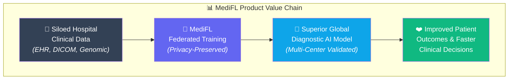
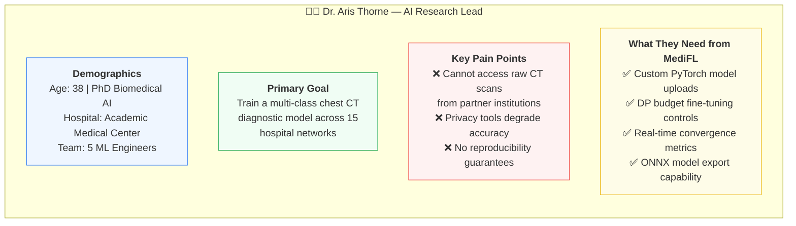
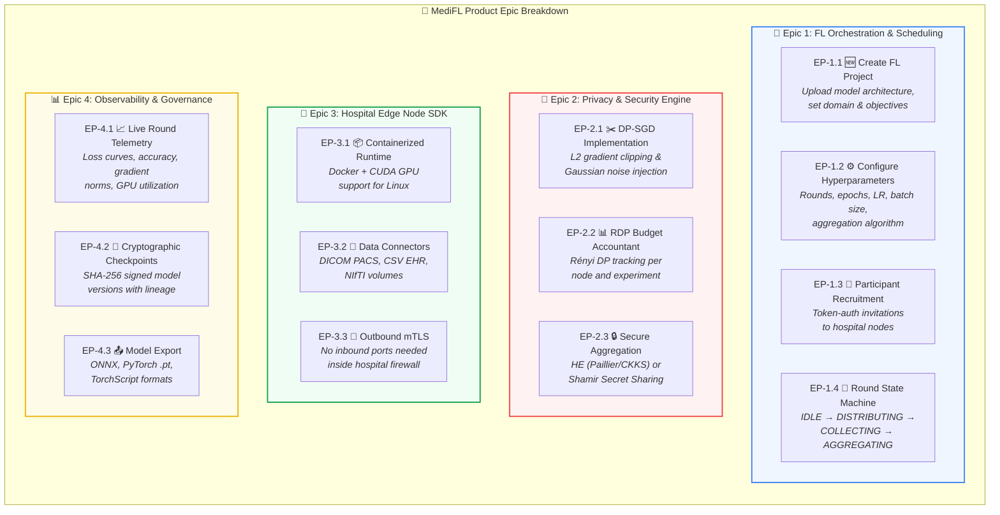
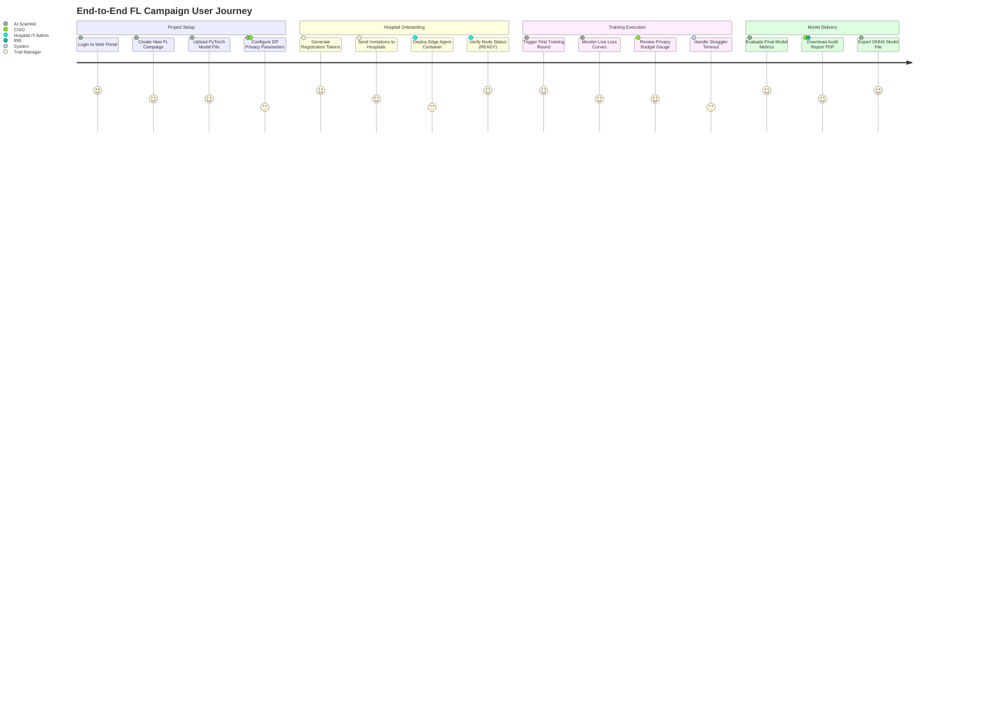
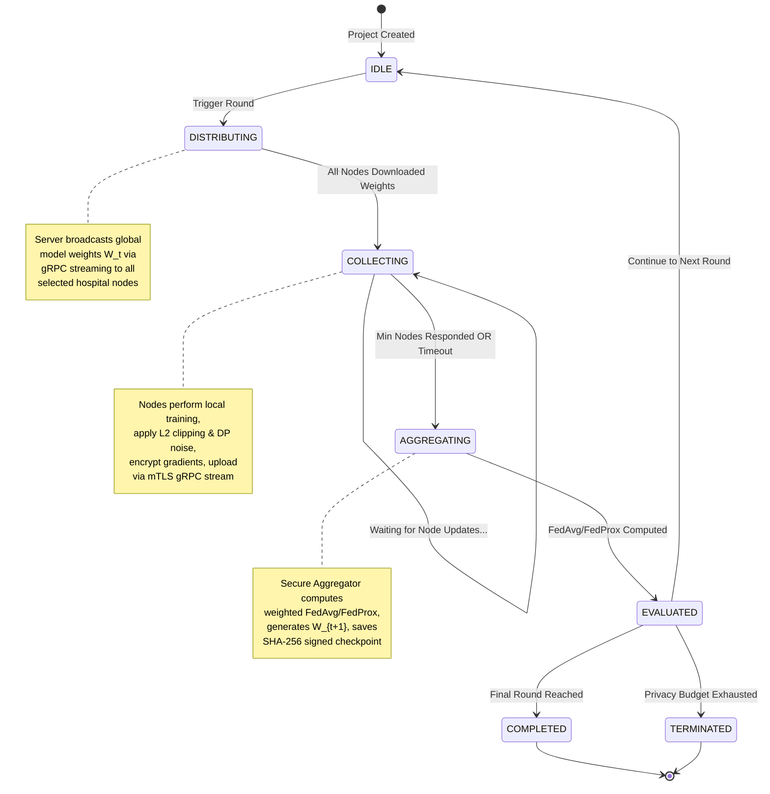
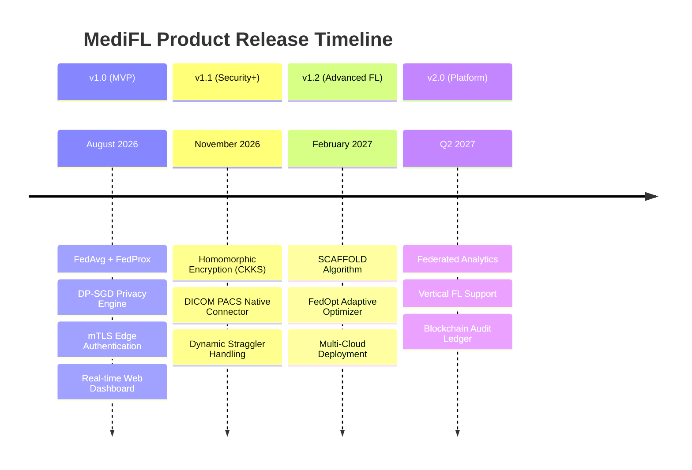

<div align="center">

# 📋 MediFL — Product Requirements Document (PRD)

### 🏥 Enterprise Medical Federated Learning Platform

| **Document ID** | **Classification** | **Version** | **Status** |
|:---:|:---:|:---:|:---:|
| `MEDIFL-PRD-002` | 🔒 Confidential | `v1.0.0` | ✅ Approved |

| **Prepared By** | **Reviewed By** | **Approved By** | **Date** |
|:---:|:---:|:---:|:---:|
| Product Management Team | Lead AI Scientist & CISO | VP Product & Engineering | August 2026 |

---

</div>

## 📑 Table of Contents

- [1. Product Overview & Strategic Goal](#1-product-overview--strategic-goal)
- [2. Target User Personas](#2-target-user-personas)
- [3. Epics & Feature Capability Map](#3-epics--feature-capability-map)
- [4. User Journey & Workflow Mapping](#4-user-journey--workflow-mapping)
- [5. Feature Prioritization (MoSCoW)](#5-feature-prioritization-moscow)
- [6. Non-Functional Product Requirements](#6-non-functional-product-requirements)
- [7. Release Strategy & Versioning](#7-release-strategy--versioning)

---

## 1. Product Overview & Strategic Goal

MediFL transforms multi-center clinical AI research from a **12+ month legal negotiation process** into a **2-week technical onboarding workflow** by eliminating the need to transfer any raw patient data between institutions.



---

## 2. Target User Personas

### 👨‍🔬 Persona A: Dr. Aris Thorne — Chief Medical AI Scientist



### 🛡️ Persona B: Elena Rostova — Hospital CISO

| Attribute | Detail |
|:---|:---|
| **Role** | Chief Information Security Officer, Regional Hospital Chain (12 sites) |
| **Primary Goal** | Ensure all hospital compute jobs adhere to HIPAA & GDPR without risk of data leaks |
| **Pain Points** | ❌ Cloud AI providers demand data upload — ❌ No visibility into what leaves hospital — ❌ Audit trail gaps |
| **Needs from MediFL** | ✅ Transparent edge agent source code — ✅ Outbound-only mTLS connections — ✅ Verifiable DP audit logs — ✅ Real-time privacy budget monitoring |

### 🔧 Persona C: Mark Vance — Enterprise DevOps Engineer

| Attribute | Detail |
|:---|:---|
| **Role** | Senior Infrastructure Engineer, Pharmaceutical Company IT Division |
| **Primary Goal** | Deploy and maintain MediFL edge nodes across 20 remote hospital K8s clusters |
| **Pain Points** | ❌ Fragmented hardware specs across hospitals — ❌ Unpredictable network disconnects — ❌ Manual certificate management |
| **Needs from MediFL** | ✅ Helm charts & automated deployment — ✅ Auto-reconnection logic — ✅ Health check dashboards — ✅ Certificate auto-rotation |

---

## 3. Epics & Feature Capability Map



### 3.1 Epic Detail Specifications

> [!IMPORTANT]
> Each Epic has been decomposed into **User Stories** following the format:
> *"As a [persona], I want to [action], so that [outcome]."*

#### 📡 Epic 1: FL Orchestration & Scheduling

| Story ID | User Story | Acceptance Criteria | Priority |
|:---:|:---|:---|:---:|
| `US-101` | As an **AI Scientist**, I want to create a new FL project by uploading my PyTorch model file | Model file validated, project workspace initialized, registration tokens generated | 🔴 P0 |
| `US-102` | As an **AI Scientist**, I want to configure FL hyperparameters (rounds $R$, epochs $E$, LR $\eta$, batch size $B$) | All parameters persisted in project config, validated against allowed ranges | 🔴 P0 |
| `US-103` | As a **Trial Manager**, I want to invite specific hospitals by sending token-authenticated invitations | Invitation tokens generated with 72-hour expiry, logged in audit trail | 🔴 P0 |
| `US-104` | As the **System**, I want to manage a round state machine (IDLE → DISTRIBUTING → COLLECTING → AGGREGATING → COMPLETED) | State transitions enforced atomically with PostgreSQL row-level locking | 🔴 P0 |
| `US-105` | As the **System**, I want to handle straggler nodes that exceed timeout $T_{max}$ | Straggler nodes excluded from aggregation; round proceeds with available updates | 🟡 P1 |

#### 🔐 Epic 2: Privacy & Security Engine

| Story ID | User Story | Acceptance Criteria | Priority |
|:---:|:---|:---|:---:|
| `US-201` | As an **AI Scientist**, I want to set L2 clipping bound $C$ and noise multiplier $\sigma$ for my experiment | Parameters validated and applied to every local update before aggregation | 🔴 P0 |
| `US-202` | As the **System**, I want to track cumulative $(\epsilon, \delta)$ privacy expenditure via Rényi DP | RDP accountant updated after every round; budget displayed on dashboard | 🔴 P0 |
| `US-203` | As the **System**, I want to **auto-terminate** an experiment when $\epsilon \ge \epsilon_{max}$ | Experiment status set to `TERMINATED_PRIVACY_LIMIT`; all stakeholders notified | 🔴 P0 |

---

## 4. User Journey & Workflow Mapping



### 4.1 Critical User Flow: Round Execution Lifecycle



---

## 5. Feature Prioritization (MoSCoW)

```mermaid
quadrantChart
    title MediFL Feature Priority vs. Implementation Effort
    x-axis Low Effort --> High Effort
    y-axis Low Priority --> High Priority
    quadrant-1 Must Have (v1.0)
    quadrant-2 Should Have (v1.1)
    quadrant-3 Won't Have (v1.0)
    quadrant-4 Could Have (v1.2)
    FedAvg Algorithm: [0.3, 0.95]
    DP-SGD Privacy: [0.4, 0.9]
    mTLS Auth: [0.35, 0.88]
    WebSocket Dashboard: [0.5, 0.82]
    PyTorch Adapter: [0.25, 0.85]
    Homomorphic Encryption: [0.75, 0.7]
    DICOM PACS Connector: [0.65, 0.6]
    Straggler Auto-Scaling: [0.6, 0.65]
    SCAFFOLD Algorithm: [0.7, 0.5]
    Multi-Cloud Deploy: [0.8, 0.45]
    Patient Diagnostics: [0.9, 0.2]
```

### 5.1 MoSCoW Classification Table

| Priority | Feature | Target Release | Justification |
|:---:|:---|:---:|:---|
| 🔴 **Must Have** | FedAvg & FedProx aggregation | v1.0 | Core FL algorithms required for MVP |
| 🔴 **Must Have** | DP-SGD with RDP accountant | v1.0 | Privacy is the platform's core value proposition |
| 🔴 **Must Have** | mTLS X.509 edge authentication | v1.0 | Zero-Trust security is non-negotiable for hospital adoption |
| 🔴 **Must Have** | Real-time WebSocket telemetry dashboard | v1.0 | Operators must monitor training progress in real-time |
| 🔴 **Must Have** | PyTorch local training adapter | v1.0 | PyTorch dominates medical AI research (85%+ market share) |
| 🟡 **Should Have** | Homomorphic Encryption (CKKS) for aggregation | v1.1 | Additional security layer for highest-sensitivity deployments |
| 🟡 **Should Have** | DICOM PACS native connector | v1.1 | Direct integration eliminates manual data export steps |
| 🟡 **Should Have** | Automated straggler timeout & dynamic cohort scaling | v1.1 | Improves robustness in unreliable hospital network environments |
| 🔵 **Could Have** | SCAFFOLD & FedOpt algorithms | v1.2 | Advanced convergence optimization for extreme non-IID scenarios |
| ⚪ **Won't Have** | Automated direct-to-patient diagnostic reporting | Never | Requires licensed physician oversight — regulatory restriction |

---

## 6. Non-Functional Product Requirements

| NFR Category | Requirement | Target Metric |
|:---|:---|:---|
| ⚡ **Performance** | Dashboard telemetry refresh latency | $\le 1.0$ second |
| 📈 **Scalability** | Maximum concurrent edge hospital nodes | 500 nodes |
| 🔒 **Security** | Transport encryption standard | TLS 1.3 / AES-256-GCM |
| 🛡️ **Privacy** | Maximum allowed privacy budget per experiment | $\epsilon \le 8.0$, $\delta \le 10^{-5}$ |
| 🕐 **Availability** | Central orchestrator uptime SLA | $\ge 99.9\%$ |
| 📱 **Usability** | New user time-to-first-FL-round | $\le 30$ minutes |

---

## 7. Release Strategy & Versioning



---

<div align="center">

| ← [Phase 1: Vision & Scope](./01_VISION_AND_SCOPE.md) | 📄 **Next Document** | [Phase 3: SRS →](./03_SRS.md) |
|:---:|:---:|:---:|

---

*© 2026 MediFL Platform — Confidential & Proprietary*

</div>
