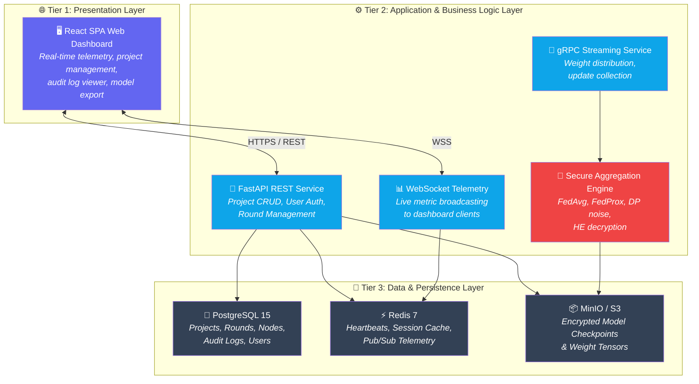
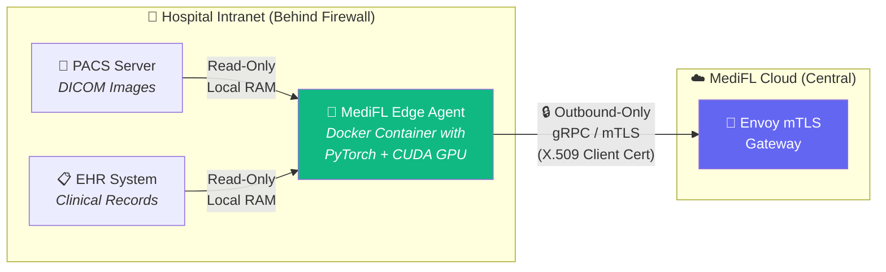
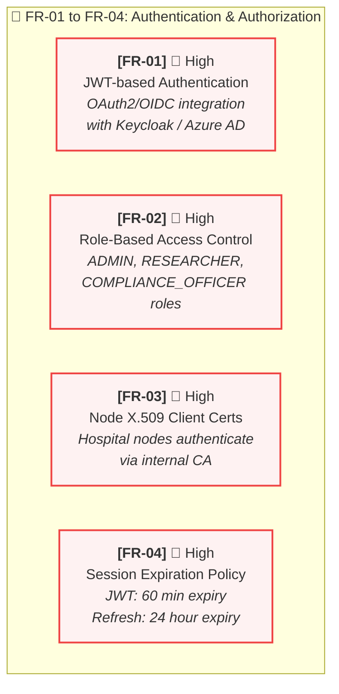
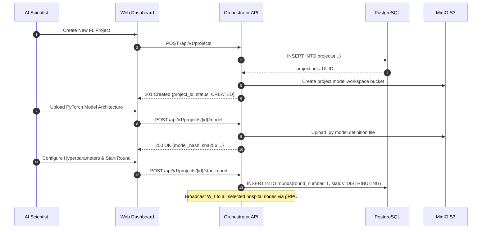
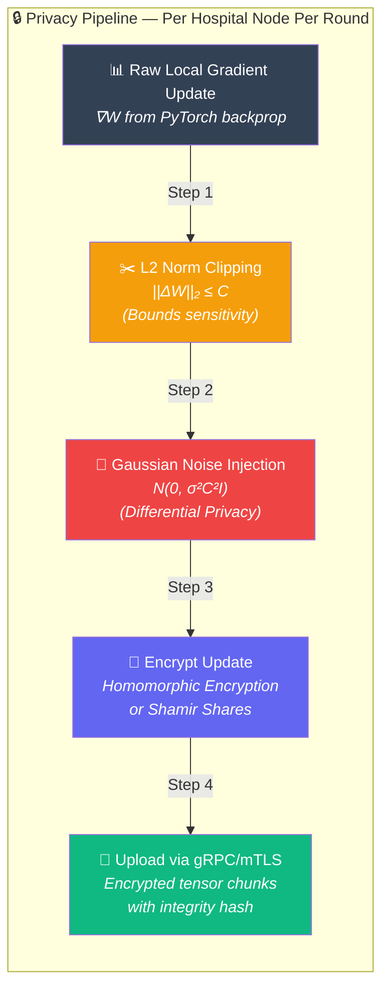
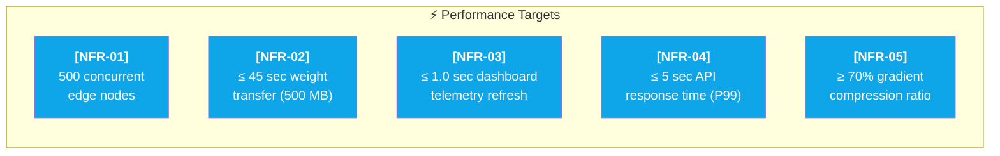
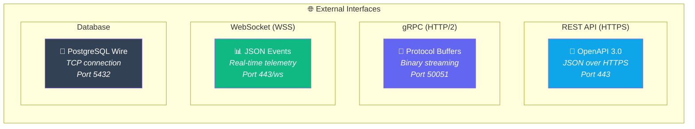

# 📋 MediFL — Software Requirements Specification (SRS)

### 🏥 IEEE Std 830-1998 Compliant

| **Document ID** | **Classification** | **Version** | **Status** |
|:---:|:---:|:---:|:---:|
| `MEDIFL-SRS-003` | 🔒 Confidential | `v1.0.0` | ✅ Approved |

| **Prepared By** | **Standard** | **Approved By** | **Date** |
|:---:|:---:|:---:|:---:|
| Software Architecture Team | IEEE 830-1998 | VP Engineering | August 2026 |

---

## 📑 Table of Contents

- [1. Introduction & Purpose](#1-introduction--purpose)
- [2. Overall System Description](#2-overall-system-description)
- [3. Functional Requirements](#3-functional-requirements)
- [4. Non-Functional Requirements](#4-non-functional-requirements)
- [5. External Interface Requirements](#5-external-interface-requirements)
- [6. Requirements Traceability Matrix](#6-requirements-traceability-matrix)

---

## 1. Introduction & Purpose

### 1.1 Document Conventions

| Convention | Meaning |
|:---|:---|
| `[FR-XX]` | Functional Requirement with unique identifier |
| `[NFR-XX]` | Non-Functional Requirement with unique identifier |
| 🔴 **High** | Must be implemented in v1.0 release |
| 🟡 **Medium** | Should be implemented in v1.1 release |
| 🔵 **Low** | Could be implemented in future releases |

> [!IMPORTANT]
> All requirements marked **🔴 High** are **mandatory** for v1.0 production release. The system SHALL NOT be deployed to production without 100% implementation of High-priority requirements.

---

## 2. Overall System Description

### 2.1 Three-Tier System Architecture Overview

### 2.2 Edge Node Integration Architecture

---

## 3. Functional Requirements

### 3.1 🔐 Authentication & Authorization Module

| Req ID | Requirement Statement | Priority | Validation Criteria |
|:---:|:---|:---:|:---|
| **FR-01** | The system **SHALL** support JWT-based authentication integrated with OAuth2/OIDC supporting Enterprise SSO (Keycloak, Azure AD, Okta). | 🔴 High | Login flow returns valid JWT with user claims; SSO redirect works. |
| **FR-02** | The system **SHALL** enforce RBAC with three roles: `ADMIN` (full access), `RESEARCHER` (project management), `COMPLIANCE_OFFICER` (audit read-only). | 🔴 High | Unauthorized role access returns HTTP 403. |
| **FR-03** | Hospital edge nodes **SHALL** authenticate using X.509 client certificates generated by MediFL's internal Certificate Authority. | 🔴 High | Invalid certificate results in TLS handshake rejection. |
| **FR-04** | JWT access tokens **SHALL** expire after 60 minutes; refresh tokens **SHALL** expire after 24 hours. | 🔴 High | Expired tokens return HTTP 401 Unauthorized. |

---

### 3.2 📡 FL Project & Round Management Module

| Req ID | Requirement Statement | Priority | Validation Criteria |
|:---:|:---|:---:|:---|
| **FR-05** | The system **SHALL** allow Project Managers to create an FL project by uploading a Python model definition (`.py`) or ONNX structure file (`.onnx`). | 🔴 High | File upload succeeds; SHA-256 hash computed and stored. |
| **FR-06** | The system **SHALL** allow setting total FL rounds ($R$), local epochs ($E$), batch size ($B$), learning rate ($\eta$), and optimizer (`SGD`, `AdamW`). | 🔴 High | Parameters persisted in JSONB column; validated against allowed ranges. |
| **FR-07** | The system **SHALL** allow selecting specific registered hospital nodes based on availability status and minimum dataset size criteria. | 🔴 High | Only nodes with status `READY` and `sample_count >= min_samples` are selectable. |
| **FR-08** | The server **SHALL** broadcast global model weights $W_t$ to selected active nodes at the beginning of each round $t$ via gRPC streaming. | 🔴 High | All selected nodes receive complete weight tensor; SHA-256 integrity verified. |
| **FR-09** | The server **SHALL** implement a configurable round timeout $T_{max}$ (default: 600 seconds). Nodes exceeding $T_{max}$ **SHALL** be excluded from round aggregation. | 🔴 High | Straggler nodes marked as `STRAGGLER` in round_participants table. |
| **FR-10** | The server **SHALL** auto-evaluate global validation metric $\mathcal{L}_{val}$ after each round and halt training if loss delta $\Delta \le 10^{-4}$ for 3 consecutive rounds. | 🟡 Medium | Training status changes to `COMPLETED_CONVERGED`. |

---

### 3.3 🔒 Privacy & Security Enforcement Module

> [!CAUTION]
> These requirements are **critical for regulatory compliance**. Failure to implement any FR-11 through FR-15 requirement will result in HIPAA/GDPR violation risk and is a **release blocker**.

| Req ID | Requirement Statement | Priority | Mathematical Specification |
|:---:|:---|:---:|:---|
| **FR-11** | Edge Agents **SHALL** clip local gradient updates such that $\|\| \Delta w_i \|\|_2 \le C$ | 🔴 High | $\bar{g}(x) = g(x) / \max(1, \frac{\|\|g(x)\|\|_2}{C})$ |
| **FR-12** | Edge Agents **SHALL** add calibrated Gaussian noise to clipped updates | 🔴 High | $\tilde{g} = \bar{g} + \mathcal{N}(0, \sigma^2 C^2 \mathbf{I})$ |
| **FR-13** | The system **SHALL** track cumulative $(\epsilon, \delta)$ privacy expenditure via Rényi DP | 🔴 High | $\epsilon_{RDP}(\alpha) = R \cdot \frac{\alpha}{2\sigma^2}$ |
| **FR-14** | The system **SHALL** auto-terminate experiments when $\epsilon \ge \epsilon_{max}$ | 🔴 High | Status → `TERMINATED_PRIVACY_LIMIT` |
| **FR-15** | The system **SHALL** support additive homomorphic encryption for weight tensor aggregation | 🟡 Medium | CKKS scheme with polynomial modulus degree $N = 8192$ |

---

## 4. Non-Functional Requirements

### 4.1 📊 Performance & Scalability Requirements

| Req ID | Category | Requirement | Target Metric | Measurement Method |
|:---:|:---|:---|:---:|:---|
| **NFR-01** | Scalability | Central server **SHALL** support up to 500 concurrent active edge nodes | 500 nodes | K6 load test with 500 simulated gRPC clients |
| **NFR-02** | Performance | Model updates ≤ 500 MB **SHALL** transfer via gRPC within 45 seconds | $\le 45$ sec | Network telemetry measurement at 100 Mbps |
| **NFR-03** | Responsiveness | Dashboard telemetry **SHALL** reflect within 1 second of server emission | $\le 1.0$ sec | WebSocket latency measurement (P95) |
| **NFR-04** | Latency | REST API endpoints **SHALL** respond within 5 seconds (P99) | $\le 5.0$ sec | Application Performance Monitoring (APM) |
| **NFR-05** | Efficiency | Gradient compression **SHALL** reduce payload size by ≥ 70% | $\ge 70\%$ | Payload size comparison (compressed vs. raw) |

### 4.2 🔐 Security & Compliance Requirements

| Req ID | Category | Requirement | Target | Standard Reference |
|:---:|:---|:---|:---:|:---|
| **NFR-06** | Encryption | All external communications **MUST** use TLS 1.3 with AES-256-GCM | TLS 1.3 | NIST SP 800-52 Rev. 2 |
| **NFR-07** | Data Isolation | Edge Agent **MUST NEVER** write local dataset samples to persistent disk | Zero writes | HIPAA § 164.312(a)(1) |
| **NFR-08** | Audit Logging | System logs **MUST** scrub PHI; logs **MUST** have 7-year retention | 7 years | HIPAA § 164.530(j)(2) |
| **NFR-09** | Integrity | Every checkpoint $W_t$ **MUST** be SHA-256 signed with immutable timestamps | SHA-256 | NIST FIPS 180-4 |
| **NFR-10** | Authentication | All API endpoints **MUST** require valid JWT or X.509 certificate | 100% coverage | OWASP API Security Top 10 |

### 4.3 🛡️ Reliability & Availability Requirements

| Req ID | Category | Requirement | Target | Recovery Strategy |
|:---:|:---|:---|:---:|:---|
| **NFR-11** | Availability | Central Orchestrator **SHALL** maintain 99.9% uptime | 99.9% SLA | Multi-AZ Kubernetes deployment |
| **NFR-12** | Resilience | Edge Agents **SHALL** auto-retry reconnection (exponential backoff, max 10 attempts) | 10 retries | Exponential delay: $2^n$ seconds |
| **NFR-13** | Failover | PostgreSQL **MUST** use HA streaming replication with $\le 30$ sec failover | $\le 30$ sec | PostgreSQL Primary-Replica with Patroni |

---

## 5. External Interface Requirements

### 5.1 Communication Protocols

---

## 6. Requirements Traceability Matrix

> [!TIP]
> This matrix maps every functional requirement to its corresponding Epic (from PRD), Test Case (from Test Plan), and Architecture Component (from HLD).

| Req ID | PRD Epic | Test Case ID | Architecture Component | Implementation File |
|:---:|:---:|:---:|:---|:---|
| FR-01 | EP-1.3 | TC-AUTH-001 | Auth Service / Keycloak | `src/auth/oauth_handler.py` |
| FR-05 | EP-1.1 | TC-PROJ-001 | Orchestrator Core | `src/api/projects.py` |
| FR-08 | EP-1.4 | TC-ROUND-003 | gRPC Streaming Service | `src/grpc/weight_broadcaster.py` |
| FR-11 | EP-2.1 | TC-PRIV-001 | Edge Agent DP Module | `edge/privacy/dp_clipper.py` |
| FR-13 | EP-2.2 | TC-PRIV-003 | Privacy Engine | `src/privacy/rdp_accountant.py` |
| NFR-01 | EP-4.1 | TC-PERF-001 | Kubernetes HPA Config | `k8s/hpa-api.yaml` |

---

| ← [Phase 2: PRD](./02_PRD.md) | 📄 **Next Document** | [Phase 4: BRD →](./04_BRD.md) |
|:---:|:---:|:---:|

---

*© 2026 MediFL Platform — Confidential & Proprietary*

