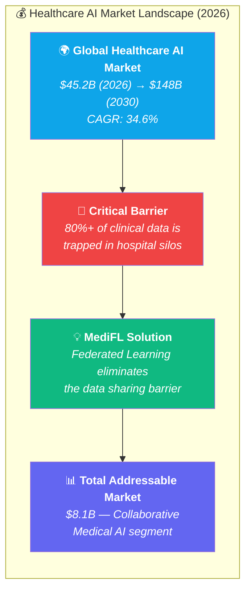
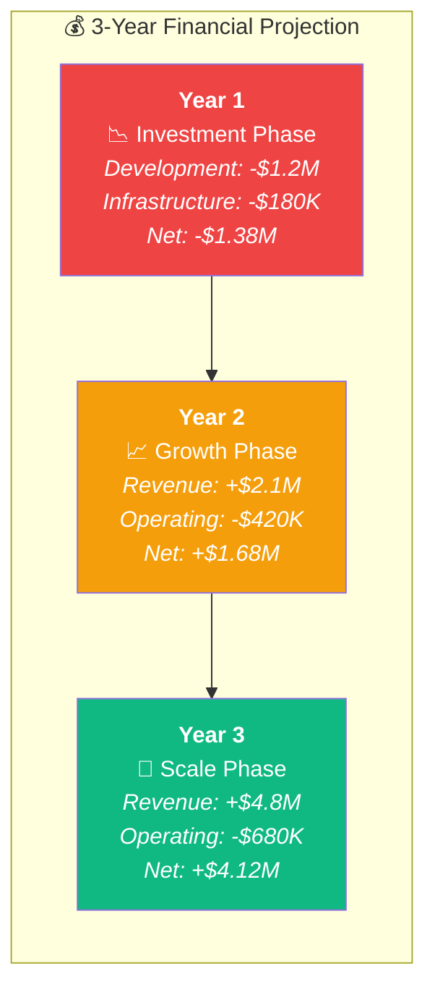
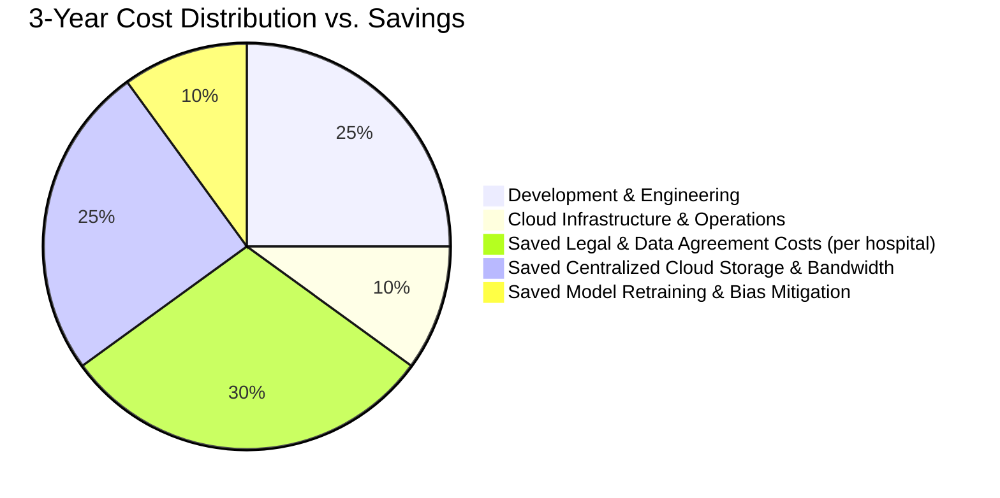
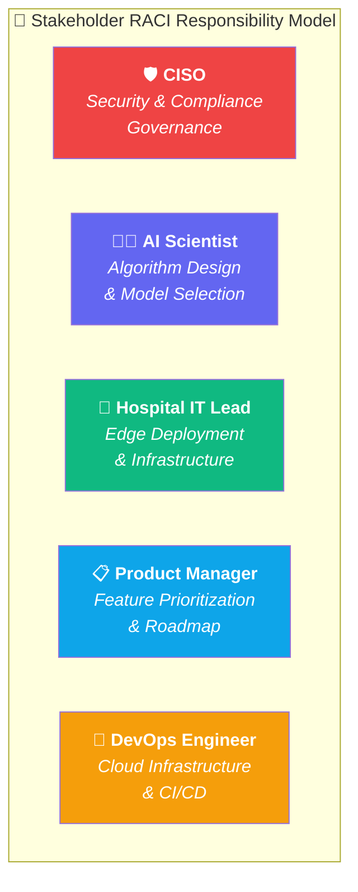

<div align="center">

# 📋 MediFL — Business Requirements Document (BRD)

### 🏥 Enterprise Medical Federated Learning Platform

| **Document ID** | **Classification** | **Version** | **Status** |
|:---:|:---:|:---:|:---:|
| `MEDIFL-BRD-004` | 🔒 Confidential | `v1.0.0` | ✅ Approved |

| **Prepared By** | **Target Audience** | **Approved By** | **Date** |
|:---:|:---:|:---:|:---:|
| Business Strategy Team | Executive Leadership & Steering Committee | CEO & VP Product | August 2026 |

---

</div>

## 📑 Table of Contents

- [1. Business Rationale & Market Opportunity](#1-business-rationale--market-opportunity)
- [2. Financial Feasibility & ROI Analysis](#2-financial-feasibility--roi-analysis)
- [3. Stakeholder RACI Matrix](#3-stakeholder-raci-matrix)
- [4. Regulatory Compliance Mapping](#4-regulatory-compliance-mapping)
- [5. Enterprise Risk Register & Mitigation Strategy](#5-enterprise-risk-register--mitigation-strategy)
- [6. Business Success Criteria](#6-business-success-criteria)

---

## 1. Business Rationale & Market Opportunity

### 1.1 The $45B Healthcare AI Market & The Data Barrier



### 1.2 Business Value Propositions

| # | Business Value | Quantified Impact |
|:---:|:---|:---|
| 1️⃣ | **Eliminate Data Sharing Agreements** | Reduce multi-center trial onboarding from 12+ months → < 2 weeks |
| 2️⃣ | **Unlock Global Patient Diversity** | Access 10M+ diverse patient records across 500+ institutions without data transfer |
| 3️⃣ | **Avoid Compliance Penalties** | Eliminate HIPAA breach risk ($10.93M avg cost per breach, IBM 2025) |
| 4️⃣ | **Accelerate FDA SaMD Submissions** | Provide multi-site validation evidence required by FDA AI/ML guidance |
| 5️⃣ | **Reduce Infrastructure Costs** | Eliminate $280K/year per hospital for centralized cloud storage & bandwidth |

---

## 2. Financial Feasibility & ROI Analysis

### 2.1 Development Investment & 3-Year Projection



### 2.2 Cost-Benefit Breakdown



| Financial Metric | Amount (USD) | Timeframe |
|:---|:---:|:---:|
| 💰 **Total Development Investment** | $1,200,000 | Year 1 |
| 🖥️ **Annual Cloud Infrastructure Cost** | $180,000 | Per Year |
| 💵 **Annual Savings per Hospital (Storage + Bandwidth)** | $280,000 | Per Hospital/Year |
| 📋 **Saved Legal Costs per Data Agreement** | $150,000 | Per Agreement |
| 📈 **Projected Annual Recurring Revenue (Year 3)** | $4,800,000 | Year 3 |
| 🎯 **Cumulative 3-Year ROI** | **240%** | 3 Years |

---

## 3. Stakeholder RACI Matrix

> [!NOTE]
> **RACI Legend:**
> - **R** = Responsible (does the work)
> - **A** = Accountable (final decision maker)
> - **C** = Consulted (provides input)
> - **I** = Informed (kept updated)



| Project Activity | 🛡️ CISO | 👨‍🔬 AI Scientist | 🏥 Hospital IT | 📋 Product Mgr | 🔧 DevOps |
|:---|:---:|:---:|:---:|:---:|:---:|
| **System Security Architecture Approval** | **A** | C | C | I | **R** |
| **FL Algorithm & Model Selection** | I | **A / R** | I | C | I |
| **Privacy Budget Threshold Setting** | **A** | **R** | I | C | I |
| **Edge Agent Deployment at Hospitals** | C | I | **A / R** | I | **R** |
| **Product Feature Prioritization** | C | C | I | **A / R** | I |
| **Production Cloud Infrastructure** | I | I | I | C | **A / R** |
| **SOC 2 / HIPAA Audit Coordination** | **A / R** | I | C | I | C |
| **Compliance Reporting to Steering Committee** | **R** | C | I | **A** | I |

---

## 4. Regulatory Compliance Mapping

### 4.1 Multi-Framework Compliance Architecture

```mermaid
graph TD
    subgraph "⚖️ Global Privacy & AI Regulatory Framework"
        direction TB
        
        subgraph HIPAA ["🇺🇸 HIPAA Security Rule"]
            H1["§ 164.312(a)(1)<br/><b>Access Controls</b><br/><i>Unique user identification<br/>Auto-logoff, emergency access</i>"]
            H2["§ 164.312(e)(1)<br/><b>Transmission Security</b><br/><i>Encryption in transit<br/>TLS 1.3, gRPC mTLS</i>"]
            H3["§ 164.312(c)(1)<br/><b>Integrity Controls</b><br/><i>SHA-256 model hashing<br/>Immutable audit logs</i>"]
        end

        subgraph GDPR ["🇪🇺 GDPR"]
            G1["Article 25<br/><b>Data Protection by Design</b><br/><i>DP-SGD noise guarantees<br/>zero re-identification</i>"]
            G2["Article 30<br/><b>Processing Records</b><br/><i>Immutable PostgreSQL<br/>transaction audit tables</i>"]
            G3["Article 32<br/><b>Security of Processing</b><br/><i>Encryption, access control<br/>regular security testing</i>"]
        end

        subgraph EUAI ["🇪🇺 EU AI Act"]
            E1["Article 9<br/><b>Risk Management</b><br/><i>Continuous privacy budget<br/>monitoring & limits</i>"]
            E2["Article 11<br/><b>Technical Documentation</b><br/><i>Complete model lineage<br/>& training provenance</i>"]
        end
    end

    subgraph Shield ["🛡️ MediFL Compliance Shield"]
        M1["🔒 mTLS + TLS 1.3<br/>Encrypted Transport"]
        M2["🎲 DP-SGD Zero<br/>Data Transfer"]
        M3["📋 Cryptographic<br/>Audit Ledger"]
    end

    H1 & H2 & H3 --> M1
    G1 & G2 & G3 --> M2
    E1 & E2 --> M3

    style HIPAA fill:#eff6ff,stroke:#3b82f6,stroke-width:2px
    style GDPR fill:#fef2f2,stroke:#ef4444,stroke-width:2px
    style EUAI fill:#fefce8,stroke:#eab308,stroke-width:2px
    style Shield fill:#f0fdf4,stroke:#10b981,stroke-width:3px
```



### 4.2 Compliance Certification Roadmap

| Certification | Target Date | Current Status | Owner |
|:---|:---:|:---:|:---|
| 🇺🇸 **HIPAA Security Rule Compliance** | Q4 2026 | 🟡 In Progress | CISO |
| 🇪🇺 **GDPR Article 28 Data Processor Obligations** | Q4 2026 | 🟡 In Progress | Legal Team |
| 🔒 **SOC 2 Type II Audit Certification** | Q1 2027 | ⬜ Not Started | External Auditor (Deloitte) |
| 🏥 **ISO/IEC 27001 Information Security** | Q2 2027 | ⬜ Not Started | IT Security Team |
| 🩺 **FDA SaMD Pre-Submission Package** | Q3 2027 | ⬜ Not Started | Regulatory Affairs |

---

## 5. Enterprise Risk Register & Mitigation Strategy

### 5.1 Risk Heat Map

```mermaid
quadrantChart
    title Enterprise Risk Assessment Heat Map
    x-axis Low Likelihood --> High Likelihood
    y-axis Low Severity --> High Severity
    quadrant-1 Critical Risks (Mitigate Immediately)
    quadrant-2 High Risks (Active Monitoring)
    quadrant-3 Low Risks (Accept)
    quadrant-4 Medium Risks (Contingency Plan)
    Gradient Inversion Attack: [0.25, 0.95]
    Node Dropout During Round: [0.7, 0.65]
    Non-IID Data Divergence: [0.8, 0.75]
    Firewall Blocking Connections: [0.5, 0.7]
    Privacy Budget Exhaustion: [0.45, 0.55]
    Model Poisoning Attack: [0.15, 0.9]
    Certificate Expiry Outage: [0.35, 0.45]
```

### 5.2 Detailed Risk Register

| Risk ID | Risk Description | Severity | Likelihood | Impact Score | Mitigation Strategy |
|:---:|:---|:---:|:---:|:---:|:---|
| 🔴 **RISK-01** | **Gradient Inversion Attack** — Adversary reconstructs patient images from uploaded gradient tensors | Critical | Low | 🟥 9.0 | DP-SGD noise injection ($\epsilon \le 2.0$) + Homomorphic Encryption for parameter updates |
| 🔴 **RISK-02** | **Model Poisoning Attack** — Compromised hospital node uploads malicious weight updates to corrupt global model | Critical | Low | 🟥 8.5 | Byzantine-robust aggregation (Krum/Trimmed Mean), anomaly detection on gradient norms |
| 🟠 **RISK-03** | **Non-IID Data Divergence** — Heterogeneous clinical data causes slow model convergence or oscillation | High | High | 🟧 7.5 | FedProx proximal penalty ($\mu = 0.01$), learning rate warmup scheduling |
| 🟠 **RISK-04** | **Hospital Node Drops Offline** — Network partition or hardware failure during FL round | High | Medium | 🟧 6.5 | Dynamic straggler timeout; require minimum $M$ of $N$ participant threshold |
| 🟡 **RISK-05** | **Firewall Blocking Connections** — Institutional firewall blocks orchestration requests | High | Medium | 🟨 6.0 | Outbound-only mTLS persistent gRPC connections initiated by edge agent |
| 🟡 **RISK-06** | **Privacy Budget Exhaustion** — DP $\epsilon$ exceeds allowed limit before model converges | Medium | Medium | 🟨 5.5 | Early convergence detection, adaptive noise scheduling, budget forecasting dashboard |

---

## 6. Business Success Criteria

### 6.1 Go/No-Go Launch Criteria

> [!IMPORTANT]
> All items below must be verified and signed off by the Steering Committee before v1.0 production deployment.

| # | Success Criterion | Target | Verification Method | Owner |
|:---:|:---|:---:|:---|:---|
| ✅ 1 | Federated model accuracy within 1.5% of centralized baseline | $\ge 98.5\%$ parity | Benchmark test suite | AI Lead |
| ✅ 2 | Zero raw patient data exposure across all FL experiments | 0 incidents | DP audit report & network packet inspection | CISO |
| ✅ 3 | HIPAA Security Rule compliance assessment passed | 100% | External audit firm assessment | Legal |
| ✅ 4 | Minimum 3 hospital partners successfully onboarded | $\ge 3$ hospitals | Production edge agent deployment logs | PM |
| ✅ 5 | System uptime during 30-day pilot exceeds 99.9% | $\ge 99.9\%$ | Prometheus/Grafana SLA monitoring | DevOps |

---

<div align="center">

| ← [Phase 3: SRS](./03_SRS.md) | 📄 **Next Document** | [Phase 5: HLD →](./05_HLD.md) |
|:---:|:---:|:---:|

---

*© 2026 MediFL Platform — Confidential & Proprietary*

</div>
