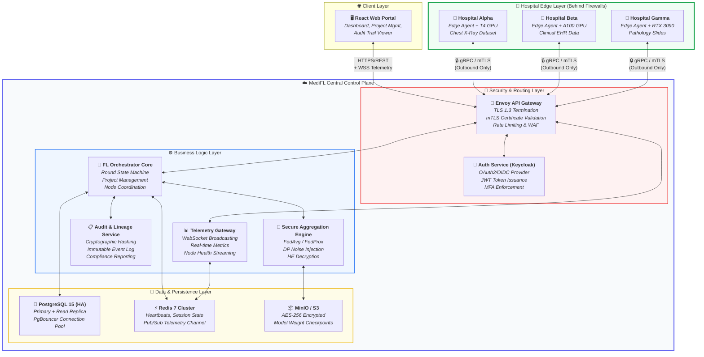
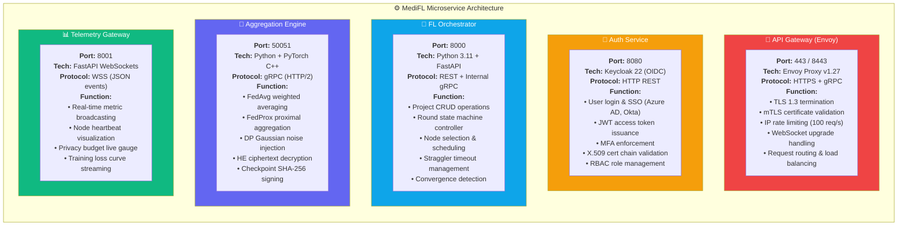
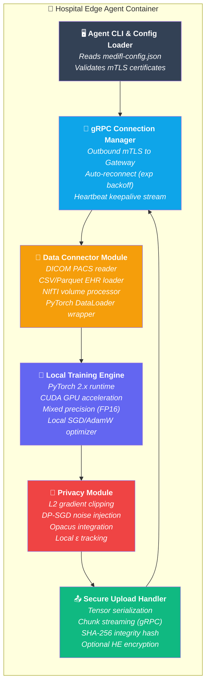
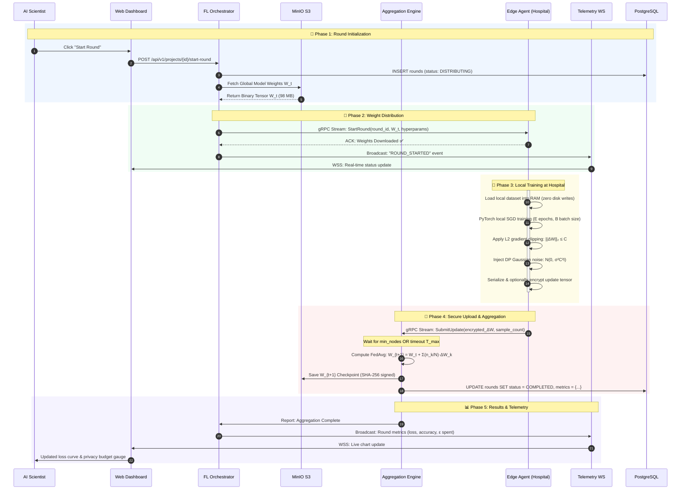
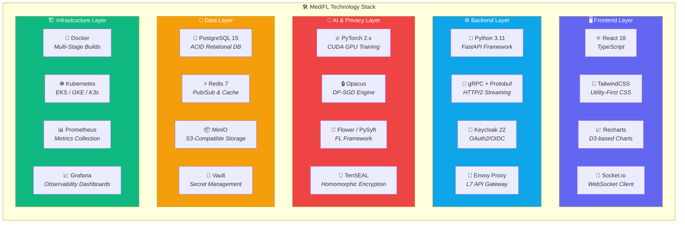
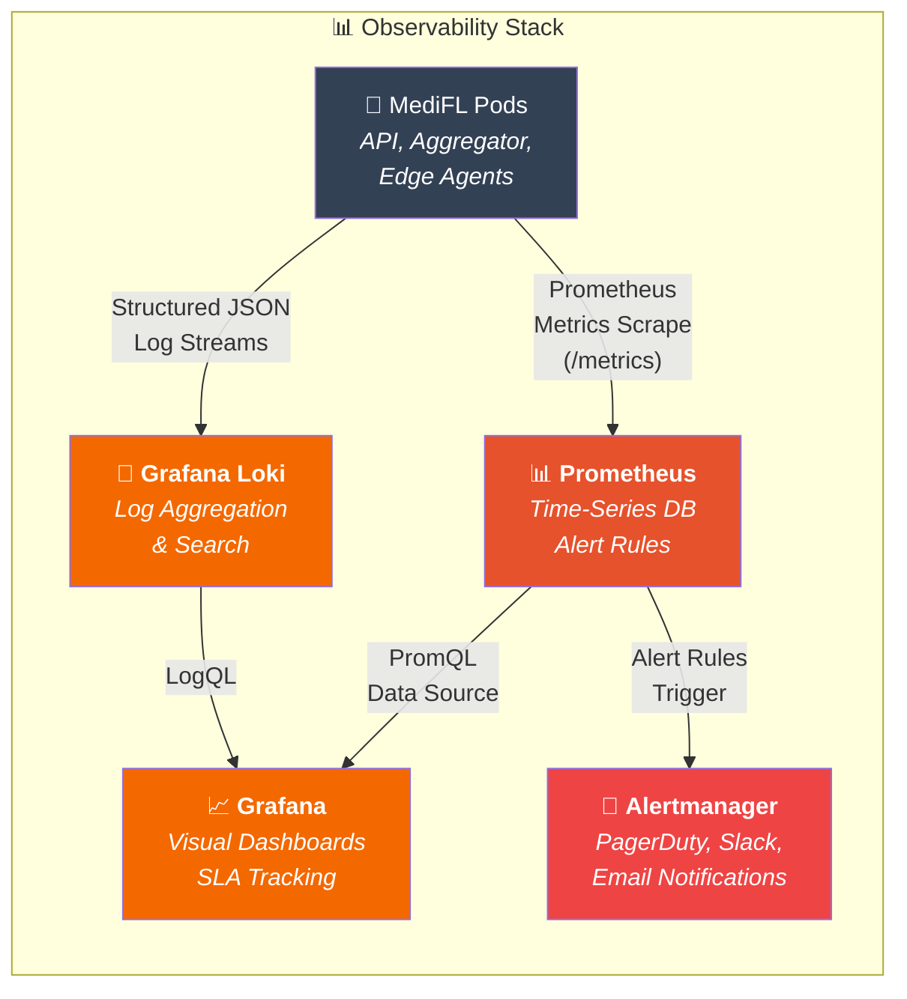

# 🏗️ MediFL — High Level Design (HLD)

### 🏥 Enterprise Medical Federated Learning Platform

| **Document ID** | **Classification** | **Version** | **Status** |
|:---:|:---:|:---:|:---:|
| `MEDIFL-HLD-005` | 🔒 Confidential | `v1.0.0` | ✅ Approved |

| **Prepared By** | **Architectural Pattern** | **Approved By** | **Date** |
|:---:|:---:|:---:|:---:|
| Principal Software Architect | Distributed Microservices + Edge Agents | VP Engineering | August 2026 |

---

## 📑 Table of Contents

- [1. System Context & Macro Architecture](#1-system-context--macro-architecture)
- [2. Microservice Decomposition](#2-microservice-decomposition)
- [3. High-Level Data Flow & Protocol Design](#3-high-level-data-flow--protocol-design)
- [4. Technology Stack Selection](#4-technology-stack-selection)
- [5. Cross-Cutting Concerns](#5-cross-cutting-concerns)

---

## 1. System Context & Macro Architecture

### 1.1 Complete System Topology

---

## 2. Microservice Decomposition

### 2.1 Service Specifications

### 2.2 Edge Agent Runtime Architecture

---

## 3. High-Level Data Flow & Protocol Design

### 3.1 Complete FL Round Execution Flow

---

## 4. Technology Stack Selection

### 4.1 Complete Stack Overview

### 4.2 Technology Selection Justification

| Layer | Component | Selected Technology | Alternatives Considered | Selection Rationale |
|:---|:---|:---|:---|:---|
| 🖥️ **Frontend** | Web Dashboard | React 18 + TypeScript | Vue 3, Angular 17, Svelte | Largest ecosystem for medical data visualization; Recharts/D3 integration |
| ⚙️ **Backend** | REST API | FastAPI (Python 3.11) | Django REST, Go Gin, Node Express | Native PyTorch compatibility; async performance; auto-OpenAPI docs |
| 📡 **Transport** | Model Weight Exchange | gRPC (HTTP/2 + Protobuf) | REST + JSON, GraphQL, WebSocket | 65% smaller payload than JSON; native streaming for 500 MB tensors |
| 🧠 **ML Runtime** | Local Training | PyTorch 2.x + CUDA | TensorFlow 2.x, JAX | 85%+ medical AI research uses PyTorch; torch.compile() JIT optimization |
| 🔒 **Privacy** | Differential Privacy | Opacus (Meta) + Custom RDP | TF Privacy, PySyft DP | PyTorch-native; per-sample gradient clipping; production-tested at Meta |
| 💾 **Database** | Relational Store | PostgreSQL 15 | MySQL 8, CockroachDB | JSONB column support for FL hyperparams; pgvector for future embedding search |
| ⚡ **Cache** | Real-time State | Redis 7 | Memcached, KeyDB | Pub/Sub for WebSocket broadcasting; sorted sets for leaderboard metrics |

---

## 5. Cross-Cutting Concerns

### 5.1 Observability, Logging & Monitoring Architecture

### 5.2 Error Handling Strategy

| Error Category | Example | Handling Strategy | User Notification |
|:---|:---|:---|:---|
| 🔴 **Critical** | Database connection failure | Circuit breaker pattern; automatic failover to replica | ❌ Service degraded banner |
| 🟠 **Recoverable** | Edge node straggler timeout | Exclude node from round; proceed with available updates | ⚠️ Straggler warning toast |
| 🟡 **Warning** | Privacy budget at 80% | Dashboard gauge turns amber; notification sent to CISO | 🔔 Budget warning alert |
| 🔵 **Informational** | New node successfully registered | Log event; update node status to READY | ✅ Success confirmation |

---

| ← [Phase 4: BRD](./04_BRD.md) | 📄 **Next Document** | [Phase 6: LLD →](./06_LLD.md) |
|:---:|:---:|:---:|

---

*© 2026 MediFL Platform — Confidential & Proprietary*

