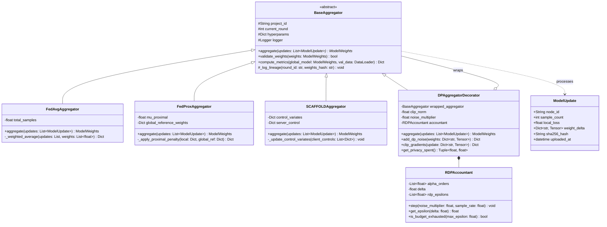
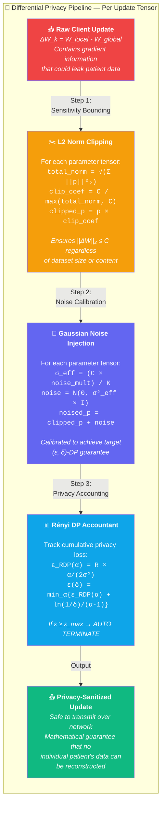
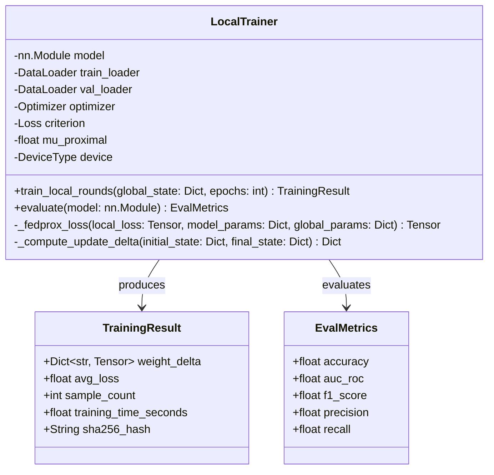
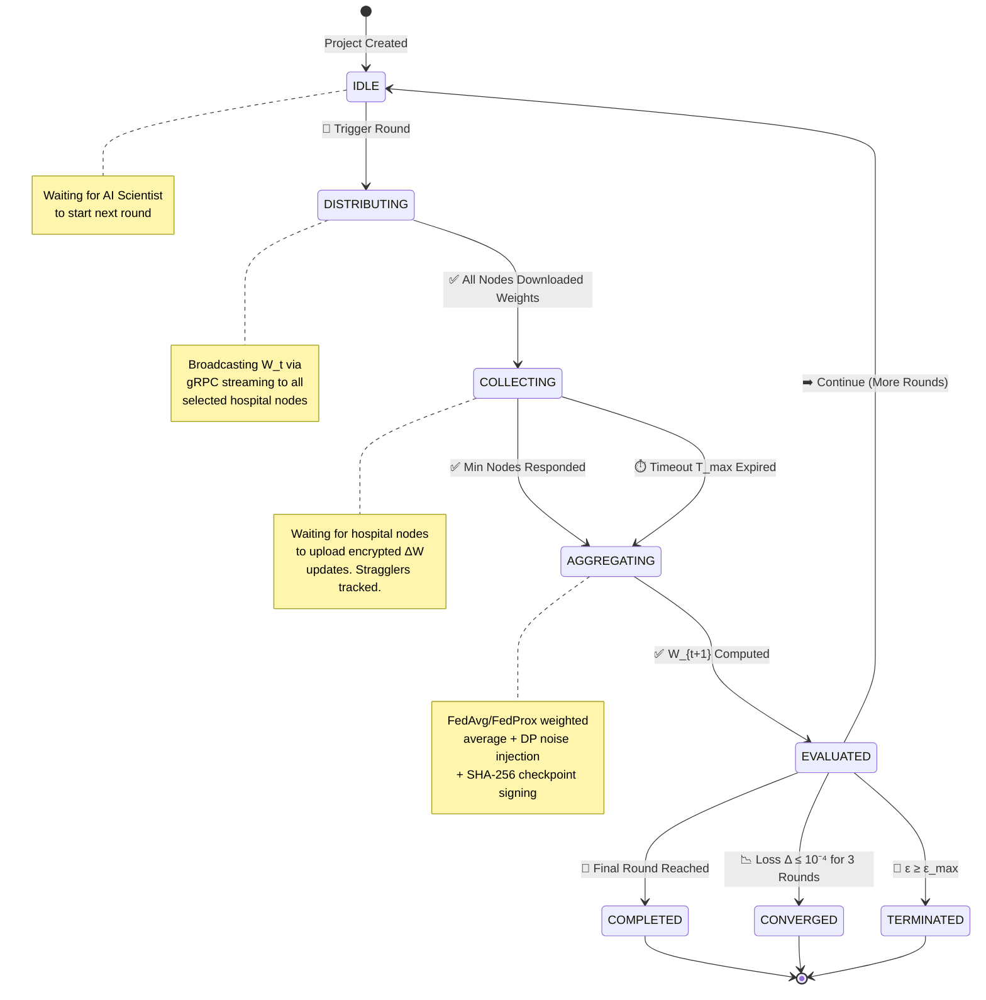
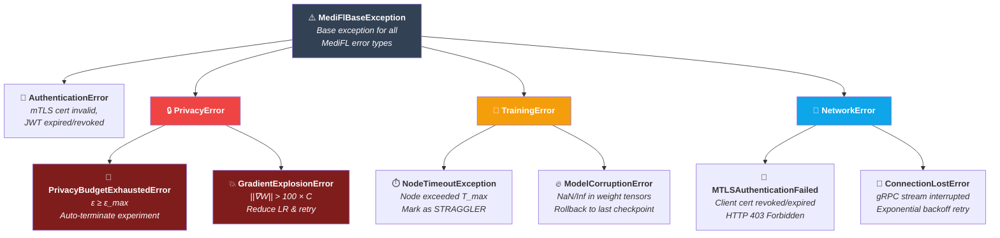

<div align="center">

# 🔧 MediFL — Low Level Design (LLD)

### 🏥 Module-Level Design & Implementation Specifications

| **Document ID** | **Classification** | **Version** | **Status** |
|:---:|:---:|:---:|:---:|
| `MEDIFL-LLD-006` | 🔒 Confidential | `v1.0.0` | ✅ Approved |

| **Prepared By** | **Approved By** | **Date** |
|:---:|:---:|:---:|
| Lead Software Engineer | VP Engineering | August 2026 |

---

</div>

## 📑 Table of Contents

- [1. Aggregator Engine Class Hierarchy](#1-aggregator-engine-class-hierarchy)
- [2. DP-SGD Algorithm Implementation](#2-dp-sgd-algorithm-implementation)
- [3. Edge Node Local Training Module](#3-edge-node-local-training-module)
- [4. Round State Machine Controller](#4-round-state-machine-controller)
- [5. Error Handling & Exception Strategy](#5-error-handling--exception-strategy)

---

## 1. Aggregator Engine Class Hierarchy

### 1.1 UML Class Diagram



> [!TIP]
> The `DPAggregatorDecorator` uses the **Decorator Pattern** to wrap any base aggregator (FedAvg, FedProx, SCAFFOLD) with Differential Privacy noise injection — allowing DP to be enabled/disabled per project without modifying core aggregation logic.

---

## 2. DP-SGD Algorithm Implementation

### 2.1 Privacy Pipeline Visualization



### 2.2 Production Python Implementation — `dp_aggregator.py`

```python
"""
MediFL Differential Privacy Aggregator Module.

Implements DP-SGD (Differentially Private Stochastic Gradient Descent) with:
- Per-update L2 norm clipping (sensitivity bounding)
- Calibrated Gaussian noise injection
- Rényi Differential Privacy (RDP) budget accounting

References:
    - Abadi et al., "Deep Learning with Differential Privacy" (CCS 2016)
    - Mironov, "Rényi Differential Privacy" (CSF 2017)

Author: MediFL AI Engineering Team
License: Apache 2.0
"""

import torch
import numpy as np
from typing import List, Dict, Tuple
from dataclasses import dataclass
import logging

logger = logging.getLogger(__name__)


@dataclass
class PrivacyConfig:
    """Configuration for Differential Privacy parameters."""
    clip_norm: float = 1.0           # L2 norm clipping bound C
    noise_multiplier: float = 1.2    # Gaussian noise scale factor σ
    delta: float = 1e-5              # Target δ for (ε, δ)-DP
    max_epsilon: float = 2.0         # Maximum allowed cumulative ε


class RDPAccountant:
    """Rényi Differential Privacy Accountant.
    
    Tracks cumulative privacy expenditure across FL rounds
    using Rényi divergence of orders α ∈ {2, 5, 10, 20, 100}.
    """

    def __init__(self, delta: float = 1e-5):
        self.delta = delta
        self.alpha_orders = [2.0, 5.0, 10.0, 20.0, 100.0]
        self.rdp_epsilons = [0.0] * len(self.alpha_orders)
        self._round_count = 0

    def step(self, noise_multiplier: float, sample_rate: float = 1.0) -> None:
        """Record one composition step (one FL round)."""
        for i, alpha in enumerate(self.alpha_orders):
            # RDP epsilon for Gaussian mechanism at order alpha
            rdp_eps = alpha / (2.0 * noise_multiplier ** 2)
            self.rdp_epsilons[i] += rdp_eps * sample_rate
        self._round_count += 1

    def get_epsilon(self) -> float:
        """Convert RDP guarantees to (ε, δ)-DP via optimal order selection."""
        eps_candidates = []
        for i, alpha in enumerate(self.alpha_orders):
            eps = self.rdp_epsilons[i] + np.log(1.0 / self.delta) / (alpha - 1.0)
            eps_candidates.append(eps)
        return min(eps_candidates)

    def is_budget_exhausted(self, max_epsilon: float) -> bool:
        """Check if cumulative ε exceeds maximum allowed budget."""
        return self.get_epsilon() >= max_epsilon


class DPAggregator:
    """Differential Privacy-aware Federated Aggregator.
    
    Wraps the standard FedAvg weighted aggregation with:
    1. Per-update L2 norm clipping (sensitivity bounding)
    2. Calibrated Gaussian noise injection (privacy guarantee)
    3. RDP budget accounting (cumulative tracking)
    """

    def __init__(self, config: PrivacyConfig):
        self.config = config
        self.accountant = RDPAccountant(delta=config.delta)
        logger.info(
            f"Initialized DPAggregator: clip_norm={config.clip_norm}, "
            f"noise_multiplier={config.noise_multiplier}, "
            f"max_epsilon={config.max_epsilon}"
        )

    def clip_gradients(
        self, model_update: Dict[str, torch.Tensor]
    ) -> Dict[str, torch.Tensor]:
        """Clip model update to L2 norm bound C.
        
        Ensures that no single client's contribution exceeds the
        sensitivity bound, regardless of their local dataset.
        
        Args:
            model_update: Dictionary mapping parameter names to delta tensors.
            
        Returns:
            Clipped update dictionary with ||ΔW||₂ ≤ C guaranteed.
        """
        # Compute global L2 norm across all parameter tensors
        total_norm_sq = sum(
            p.norm(2).item() ** 2 for p in model_update.values()
        )
        total_norm = np.sqrt(total_norm_sq)

        # Compute clipping coefficient (≤ 1.0 if norm exceeds C)
        clip_coef = min(1.0, self.config.clip_norm / max(total_norm, 1e-8))

        clipped = {k: v * clip_coef for k, v in model_update.items()}

        if clip_coef < 1.0:
            logger.debug(
                f"Clipped update: norm {total_norm:.4f} → "
                f"{total_norm * clip_coef:.4f} (C={self.config.clip_norm})"
            )

        return clipped

    def aggregate_with_privacy(
        self,
        client_updates: List[Dict[str, torch.Tensor]],
        sample_counts: List[int],
    ) -> Dict[str, torch.Tensor]:
        """Perform FedAvg aggregation with DP noise injection.
        
        Pipeline:
            1. Clip each client update to L2 norm ≤ C
            2. Compute weighted average (FedAvg)
            3. Add calibrated Gaussian noise N(0, σ²C²I / K²)
            4. Record privacy expenditure in RDP accountant
        
        Args:
            client_updates: List of model update dicts from participating nodes.
            sample_counts: Number of training samples per client.
            
        Returns:
            Privacy-sanitized aggregated model update.
            
        Raises:
            PrivacyBudgetExhaustedError: If ε exceeds max_epsilon.
        """
        K = len(client_updates)
        total_samples = sum(sample_counts)

        # Step 1: Clip all client updates
        clipped_updates = [self.clip_gradients(u) for u in client_updates]

        # Step 2: Weighted FedAvg aggregation
        aggregated: Dict[str, torch.Tensor] = {}
        first_keys = clipped_updates[0].keys()

        for key in first_keys:
            aggregated[key] = torch.zeros_like(
                clipped_updates[0][key], dtype=torch.float32
            )
            for update, n_k in zip(clipped_updates, sample_counts):
                weight = n_k / total_samples
                aggregated[key] += update[key] * weight

        # Step 3: Inject Gaussian noise for differential privacy
        noise_std = (self.config.clip_norm * self.config.noise_multiplier) / K
        for key in aggregated:
            noise = torch.normal(
                mean=0.0,
                std=noise_std,
                size=aggregated[key].shape,
                device=aggregated[key].device,
            )
            aggregated[key] += noise

        # Step 4: Record privacy expenditure
        self.accountant.step(
            noise_multiplier=self.config.noise_multiplier,
            sample_rate=1.0,
        )

        current_eps = self.accountant.get_epsilon()
        logger.info(
            f"Round aggregation complete: K={K}, "
            f"noise_std={noise_std:.6f}, ε={current_eps:.4f}"
        )

        # Check budget exhaustion
        if self.accountant.is_budget_exhausted(self.config.max_epsilon):
            raise PrivacyBudgetExhaustedError(
                f"Privacy budget exhausted: ε={current_eps:.4f} "
                f">= ε_max={self.config.max_epsilon}"
            )

        return aggregated


class PrivacyBudgetExhaustedError(Exception):
    """Raised when cumulative DP epsilon exceeds project maximum."""
    pass
```

---

## 3. Edge Node Local Training Module

### 3.1 Local Trainer Class Diagram



### 3.2 Implementation — `edge_worker.py`

```python
"""
MediFL Hospital Edge Node Local Training Engine.

Executes local model training within hospital intranet containers.
Supports standard SGD and FedProx proximal regularization.

Author: MediFL Edge SDK Team
"""

import torch
import torch.nn as nn
from torch.utils.data import DataLoader
from typing import Dict, Tuple
from dataclasses import dataclass
import hashlib
import time
import logging

logger = logging.getLogger(__name__)


@dataclass
class TrainingResult:
    """Container for local training output."""
    weight_delta: Dict[str, torch.Tensor]
    avg_loss: float
    sample_count: int
    training_time_seconds: float
    sha256_hash: str


class LocalTrainer:
    """Hospital edge node local training engine.
    
    Executes PyTorch training within isolated container environment.
    Supports FedProx proximal regularization for non-IID data.
    """

    def __init__(
        self,
        model: nn.Module,
        train_loader: DataLoader,
        val_loader: DataLoader = None,
        lr: float = 1e-3,
        optimizer_type: str = "AdamW",
        proximal_mu: float = 0.0,
        device: str = "cuda" if torch.cuda.is_available() else "cpu",
    ):
        self.model = model.to(device)
        self.train_loader = train_loader
        self.val_loader = val_loader
        self.device = device
        self.mu = proximal_mu
        self.criterion = nn.CrossEntropyLoss()

        # Initialize optimizer
        if optimizer_type == "AdamW":
            self.optimizer = torch.optim.AdamW(model.parameters(), lr=lr)
        elif optimizer_type == "SGD":
            self.optimizer = torch.optim.SGD(
                model.parameters(), lr=lr, momentum=0.9
            )

        logger.info(
            f"LocalTrainer initialized: device={device}, "
            f"optimizer={optimizer_type}, lr={lr}, mu={proximal_mu}"
        )

    def train_local_rounds(
        self,
        global_state: Dict[str, torch.Tensor],
        epochs: int = 3,
    ) -> TrainingResult:
        """Execute local training for E epochs and return weight delta.
        
        Args:
            global_state: Global model weights W_t from server.
            epochs: Number of local training epochs E.
            
        Returns:
            TrainingResult containing ΔW = W_local - W_global.
        """
        start_time = time.time()

        # Load global weights into local model
        self.model.load_state_dict(global_state)
        initial_state = {
            k: v.clone().detach() for k, v in global_state.items()
        }

        # Execute local training
        self.model.train()
        total_loss = 0.0
        total_samples = 0

        for epoch in range(epochs):
            epoch_loss = 0.0
            for batch_data, batch_target in self.train_loader:
                batch_data = batch_data.to(self.device)
                batch_target = batch_target.to(self.device)

                self.optimizer.zero_grad()
                output = self.model(batch_data)
                loss = self.criterion(output, batch_target)

                # FedProx proximal regularization term
                if self.mu > 0.0:
                    loss += self._fedprox_loss(
                        loss, dict(self.model.named_parameters()), initial_state
                    )

                loss.backward()
                self.optimizer.step()

                epoch_loss += loss.item() * batch_data.size(0)
                total_samples += batch_data.size(0)

            total_loss += epoch_loss

        # Compute weight delta: ΔW = W_local - W_global
        weight_delta = self._compute_update_delta(
            initial_state, dict(self.model.state_dict())
        )

        # Compute SHA-256 hash of update for integrity verification
        hash_input = b"".join(
            v.cpu().numpy().tobytes() for v in weight_delta.values()
        )
        sha256_hash = hashlib.sha256(hash_input).hexdigest()

        training_time = time.time() - start_time
        avg_loss = total_loss / (total_samples * epochs)

        logger.info(
            f"Local training complete: epochs={epochs}, "
            f"avg_loss={avg_loss:.4f}, time={training_time:.1f}s, "
            f"hash={sha256_hash[:16]}..."
        )

        return TrainingResult(
            weight_delta=weight_delta,
            avg_loss=avg_loss,
            sample_count=total_samples // epochs,
            training_time_seconds=training_time,
            sha256_hash=sha256_hash,
        )

    def _fedprox_loss(
        self,
        local_loss: torch.Tensor,
        model_params: Dict[str, torch.nn.Parameter],
        global_params: Dict[str, torch.Tensor],
    ) -> torch.Tensor:
        """Compute FedProx proximal penalty: (μ/2) × ||W - W_global||²."""
        proximal_term = torch.tensor(0.0, device=self.device)
        for name, param in model_params.items():
            if name in global_params:
                proximal_term += (
                    (param - global_params[name].to(self.device)) ** 2
                ).sum()
        return (self.mu / 2.0) * proximal_term

    def _compute_update_delta(
        self,
        initial: Dict[str, torch.Tensor],
        final: Dict[str, torch.Tensor],
    ) -> Dict[str, torch.Tensor]:
        """Compute ΔW = W_final - W_initial."""
        return {k: final[k] - initial[k] for k in initial.keys()}
```

---

## 4. Round State Machine Controller

### 4.1 State Transition Diagram



---

## 5. Error Handling & Exception Strategy

### 5.1 Exception Hierarchy



### 5.2 Exception Response Matrix

| Exception | Component | Trigger | System Response | Recovery Action |
|:---|:---|:---|:---|:---|
| 🛑 `PrivacyBudgetExhaustedError` | DP Accountant | $\epsilon \ge \epsilon_{max}$ | Force stop experiment | Status → `TERMINATED_PRIVACY_LIMIT`; notify all stakeholders |
| ⏱️ `NodeTimeoutException` | Orchestrator | Node > $T_{max}$ | Drop from current round | Mark `STRAGGLER`; aggregate with remaining nodes |
| 💥 `GradientExplosionError` | Edge Agent | $\|\|\nabla W\|\| > 100C$ | Abort local round | Reduce $\eta \leftarrow \eta/2$; notify central server |
| 🔐 `MTLSAuthenticationFailed` | Gateway | Cert revoked/expired | Reject handshake | Return HTTP 403; alert IT admin for cert renewal |
| 📡 `ConnectionLostError` | Edge Agent | gRPC stream broken | Auto-retry | Exponential backoff ($2^n$ sec, max 10 attempts) |
| 🔥 `ModelCorruptionError` | Aggregator | NaN/Inf in tensors | Reject update | Rollback to last valid checkpoint $W_{t-1}$ |

---

<div align="center">

| ← [Phase 5: HLD](./05_HLD.md) | 📄 **Next Document** | [Phase 7: System Architecture →](./07_SYSTEM_ARCHITECTURE.md) |
|:---:|:---:|:---:|

---

*© 2026 MediFL Platform — Confidential & Proprietary*

</div>
