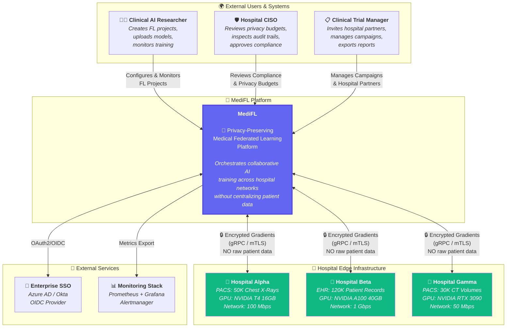
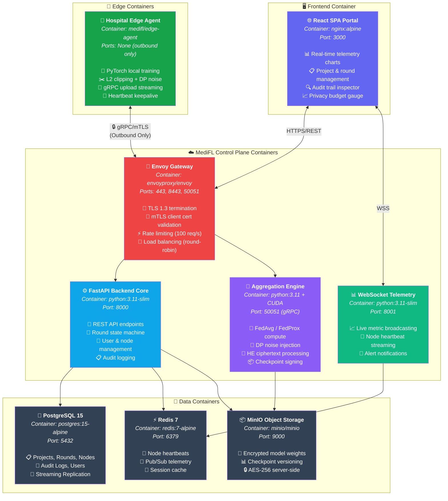
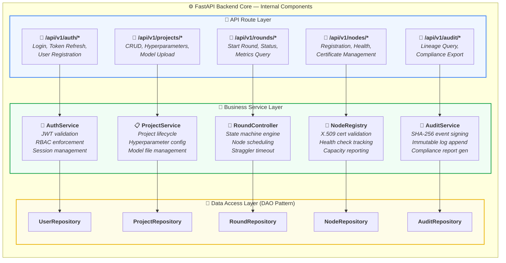
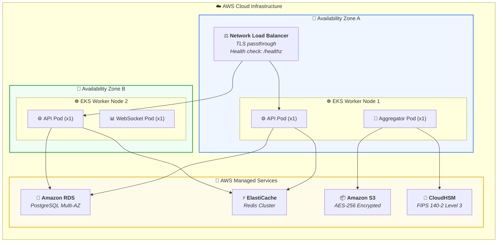
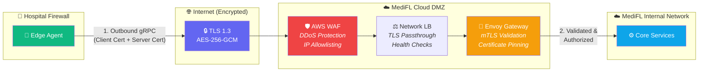

# 🏛️ MediFL — System Architecture Document

### 🏥 C4 Model Architecture & Architecture Decision Records

| **Document ID** | **Classification** | **Version** | **Status** |
|:---:|:---:|:---:|:---:|
| `MEDIFL-ARCH-007` | 🔒 Confidential | `v1.0.0` | ✅ Approved |

| **Prepared By** | **Architectural Pattern** | **Approved By** | **Date** |
|:---:|:---:|:---:|:---:|
| Software Architecture Board | C4 Model (Simon Brown) | CTO | August 2026 |

---

## 📑 Table of Contents

- [1. Level 1: System Context Diagram](#1-level-1-system-context-diagram)
- [2. Level 2: Container Diagram](#2-level-2-container-diagram)
- [3. Level 3: Component Diagram](#3-level-3-component-diagram)
- [4. Level 4: Deployment Diagram](#4-level-4-deployment-diagram)
- [5. Architecture Decision Records (ADRs)](#5-architecture-decision-records-adrs)
- [6. Network & Communication Flow Diagram](#6-network--communication-flow-diagram)

---

## 1. Level 1: System Context Diagram

> [!NOTE]
> The **System Context** diagram (C4 Level 1) shows MediFL as a single box and its relationships with external users, systems, and environments.

---

## 2. Level 2: Container Diagram

> [!NOTE]
> The **Container Diagram** (C4 Level 2) zooms into MediFL and shows the major deployable containers (Docker/K8s pods) and their responsibilities.

---

## 3. Level 3: Component Diagram

> [!NOTE]
> The **Component Diagram** (C4 Level 3) zooms into the **FastAPI Backend Core** container to reveal its internal components.

---

## 4. Level 4: Deployment Diagram

---

## 5. Architecture Decision Records (ADRs)

### ADR-001: gRPC over REST for Model Weight Exchange

| Field | Detail |
|:---|:---|
| **Status** | ✅ **Accepted** |
| **Context** | Model weight tensors are 50–500 MB binary objects. JSON/REST serialization causes 2–3x memory overhead and cannot stream. |
| **Decision** | Use **gRPC over HTTP/2** with Protocol Buffers and bidirectional streaming for all weight/gradient exchange. |
| **Consequences** | ✅ 65% payload reduction vs. JSON — ✅ Native streaming for large tensors — ⚠️ Requires protobuf schema management |

### ADR-002: Outbound-Only Connection Model

| Field | Detail |
|:---|:---|
| **Status** | ✅ **Accepted** |
| **Context** | Hospital firewalls prohibit opening inbound ports. No cloud service can initiate connections to hospital internal networks. |
| **Decision** | Edge agents initiate **outbound-only persistent mTLS gRPC connections** to the central gateway. Server sends commands via the established stream. |
| **Consequences** | ✅ Zero firewall changes at hospitals — ✅ Dramatically simplified IT approval — ⚠️ Requires keepalive heartbeat management |

### ADR-003: PostgreSQL over MongoDB for Primary Database

| Field | Detail |
|:---|:---|
| **Status** | ✅ **Accepted** |
| **Context** | Need ACID compliance for round state transitions, JSONB for flexible hyperparameter storage, and strong ecosystem for HA. |
| **Decision** | Use **PostgreSQL 15** with JSONB columns, PgBouncer connection pooling, and Patroni for HA failover. |
| **Consequences** | ✅ ACID guarantees for state machine — ✅ JSONB flexibility — ✅ Mature HA ecosystem — ⚠️ Requires schema migrations |

### ADR-004: Decorator Pattern for DP Integration

| Field | Detail |
|:---|:---|
| **Status** | ✅ **Accepted** |
| **Context** | Differential Privacy should be optional per project. Core aggregation algorithms (FedAvg, FedProx) should not be tightly coupled to DP logic. |
| **Decision** | Implement DP as a **Decorator** (`DPAggregatorDecorator`) that wraps any `BaseAggregator` implementation. |
| **Consequences** | ✅ DP enabled/disabled without modifying aggregation code — ✅ Single Responsibility Principle — ✅ Easy testing of aggregation in isolation |

---

## 6. Network & Communication Flow Diagram

---

| ← [Phase 6: LLD](./06_LLD.md) | 📄 **Next Document** | [Phase 8: AI Architecture →](./08_AI_ARCHITECTURE.md) |
|:---:|:---:|:---:|

---

*© 2026 MediFL Platform — Confidential & Proprietary*

