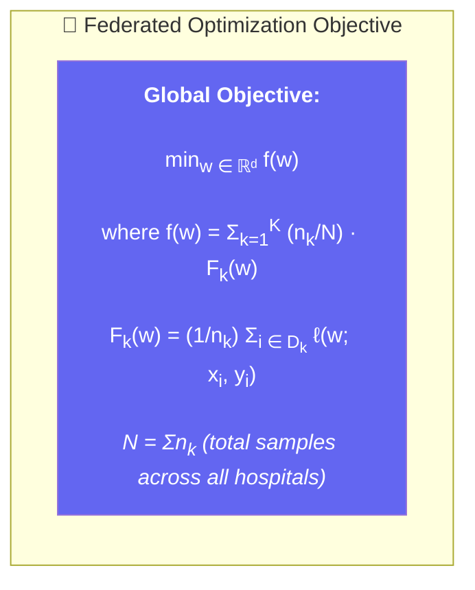
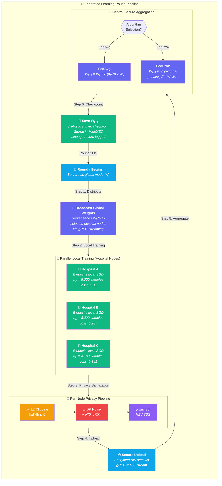
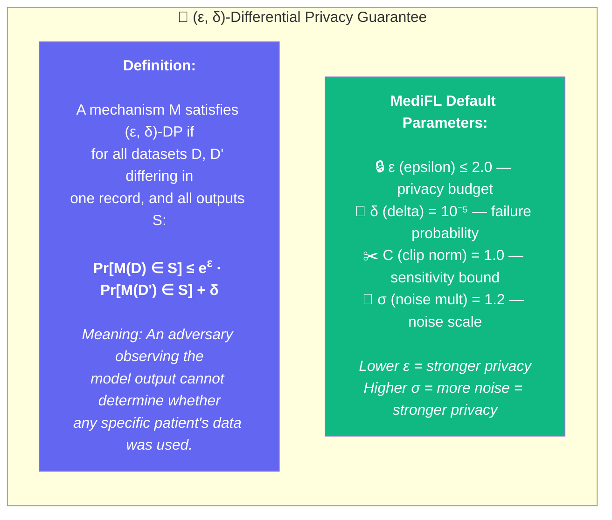
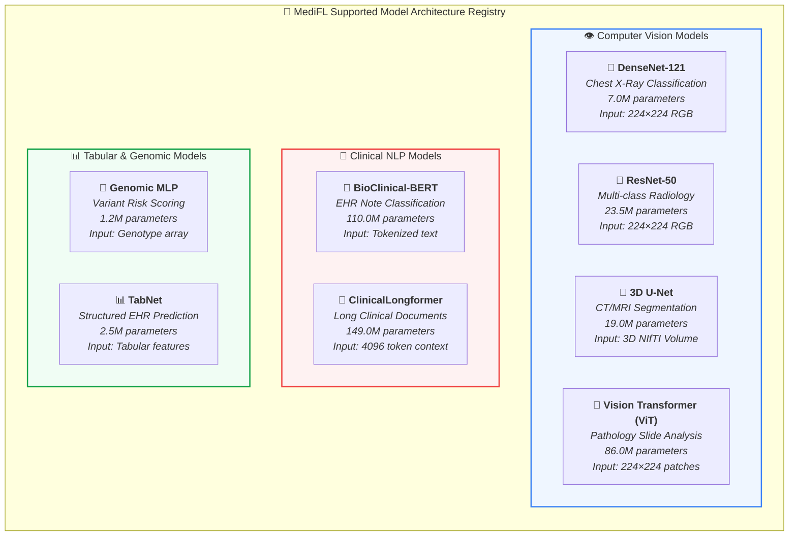
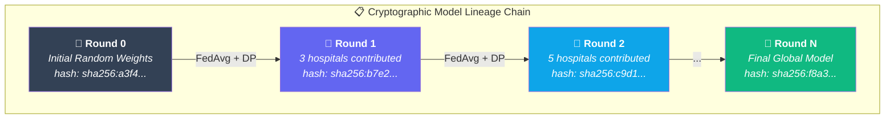

<div align="center">

# 🧠 MediFL — AI Architecture Document

### 🏥 Federated Learning Pipeline, Differential Privacy & Model Lineage

| **Document ID** | **Classification** | **Version** | **Status** |
|:---:|:---:|:---:|:---:|
| `MEDIFL-AI-008` | 🔒 Confidential | `v1.0.0` | ✅ Approved |

| **Prepared By** | **Focus Area** | **Approved By** | **Date** |
|:---:|:---:|:---:|:---:|
| Lead AI Research Scientist | FL Algorithms, DP-SGD, Secure Aggregation | CTO & Chief AI Officer | August 2026 |

---

</div>

## 📑 Table of Contents

- [1. Federated Learning Mathematical Framework](#1-federated-learning-mathematical-framework)
- [2. Aggregation Algorithm Engine](#2-aggregation-algorithm-engine)
- [3. Differential Privacy (DP-SGD) & Budget Accounting](#3-differential-privacy-dp-sgd--budget-accounting)
- [4. Supported Medical AI Model Architectures](#4-supported-medical-ai-model-architectures)
- [5. Model Lineage & Reproducibility Ledger](#5-model-lineage--reproducibility-ledger)

---

## 1. Federated Learning Mathematical Framework

### 1.1 Problem Formulation

MediFL coordinates distributed optimization across $K$ heterogeneous hospital nodes, each with local dataset $\mathcal{D}_k$ of size $n_k$:



> [!IMPORTANT]
> Each hospital's local loss function $F_k(w)$ is computed entirely within the hospital intranet. Only the **resulting model parameter updates** (not data) are transmitted to the central aggregator.

---

## 2. Aggregation Algorithm Engine

### 2.1 Complete FL Round Pipeline



### 2.2 Algorithm Comparison Matrix

| Property | **FedAvg** | **FedProx** | **SCAFFOLD** (v1.2) |
|:---|:---:|:---:|:---:|
| **Handles Non-IID Data** | ⚠️ Moderate | ✅ Strong | ✅ Best |
| **Communication Rounds to Converge** | Medium | Medium | Low |
| **Computation Overhead per Node** | Low | Low (+proximal) | Medium (+control variates) |
| **Memory Overhead per Node** | Low | Low | High (stores control variates) |
| **Mathematical Formulation** | $W_{t+1} = \sum \frac{n_k}{N} W_k$ | $+ \frac{\mu}{2}\|\|w - W_t\|\|^2$ | $+ c_k - c$ (variance reduction) |
| **Best Use Case** | IID / mild non-IID data | Non-IID clinical demographics | Extreme non-IID across institutions |

---

## 3. Differential Privacy (DP-SGD) & Budget Accounting

### 3.1 Privacy Guarantee Visualization



### 3.2 Privacy vs. Accuracy Trade-off Landscape

```mermaid
quadrantChart
    title DP Privacy Budget vs. Model Accuracy Trade-off
    x-axis Weaker Privacy (High ε) --> Stronger Privacy (Low ε)
    y-axis Lower Accuracy --> Higher Accuracy
    quadrant-1 Ideal Zone (Strong Privacy + High Accuracy)
    quadrant-2 High Accuracy but Weak Privacy
    quadrant-3 Poor on Both
    quadrant-4 Strong Privacy but Low Accuracy
    No DP (ε=∞): [0.05, 0.95]
    ε=4.2 (σ=0.8): [0.3, 0.92]
    ε=1.95 (σ=1.2) TARGET: [0.55, 0.88]
    ε=0.65 (σ=2.5): [0.85, 0.78]
    ε=0.1 (σ=10.0): [0.98, 0.55]
```

### 3.3 Rényi DP Accounting Formula

> [!IMPORTANT]
> MediFL uses **Rényi Differential Privacy** (RDP) for tighter composition bounds compared to basic composition. The RDP accountant tracks privacy loss at multiple orders $\alpha$ and converts to $(\epsilon, \delta)$-DP via optimal order selection.

**Step 1 — Per-round RDP at order $\alpha$:**
$$\epsilon_{RDP}(\alpha) = \frac{\alpha}{2\sigma^2}$$

**Step 2 — Composition over $R$ rounds:**
$$\epsilon_{total}(\alpha) = R \cdot \epsilon_{RDP}(\alpha) = \frac{R \cdot \alpha}{2\sigma^2}$$

**Step 3 — Convert to $(\epsilon, \delta)$-DP:**
$$\epsilon(\delta) = \min_{\alpha > 1} \left\{ \epsilon_{total}(\alpha) + \frac{\ln(1/\delta)}{\alpha - 1} \right\}$$

---

## 4. Supported Medical AI Model Architectures



---

## 5. Model Lineage & Reproducibility Ledger

### 5.1 Immutable Lineage Record Structure



### 5.2 Lineage Record JSON Schema

```json
{
  "schema_version": "1.0",
  "project_id": "medifl-proj-cxr-2026",
  "round_number": 42,
  "timestamp": "2026-08-03T10:15:32.847Z",
  
  "model_lineage": {
    "parent_model_hash": "sha256:e3b0c44298fc1c149afbf4c8996fb924...",
    "current_model_hash": "sha256:9f86d081884c7d659a2feaa0c55ad015...",
    "model_architecture": "ResNet-50",
    "total_parameters": 23508032
  },
  
  "participating_nodes": [
    {
      "node_id": "hospital-alpha",
      "hospital_name": "Alpha Medical Center",
      "sample_count": 1250,
      "local_loss": 0.2841,
      "participation_signature": "0x8f3a2b1c...",
      "certificate_fingerprint": "SHA256:AB:CD:EF:..."
    },
    {
      "node_id": "hospital-beta",
      "hospital_name": "Beta Research Hospital",
      "sample_count": 890,
      "local_loss": 0.3102,
      "participation_signature": "0x3c1b7d9e...",
      "certificate_fingerprint": "SHA256:12:34:56:..."
    }
  ],
  
  "privacy_metrics": {
    "l2_clip_bound": 1.5,
    "noise_multiplier": 1.2,
    "round_epsilon_spent": 0.042,
    "cumulative_epsilon": 0.840,
    "delta": 1e-5,
    "budget_utilization_percent": 42.0
  },
  
  "validation_metrics": {
    "accuracy": 0.942,
    "auc_roc": 0.968,
    "f1_score": 0.938,
    "precision": 0.951,
    "recall": 0.926,
    "confusion_matrix": [[1200, 45], [38, 1150]]
  },
  
  "aggregation_config": {
    "algorithm": "FedAvg",
    "total_nodes_invited": 5,
    "nodes_responded": 4,
    "stragglers_dropped": 1,
    "aggregation_time_seconds": 12.4
  }
}
```

---

<div align="center">

| ← [Phase 7: System Architecture](./07_SYSTEM_ARCHITECTURE.md) | 📄 **Next Document** | [Phase 9: Database Design →](./09_DATABASE_DESIGN.md) |
|:---:|:---:|:---:|

---

*© 2026 MediFL Platform — Confidential & Proprietary*

</div>
