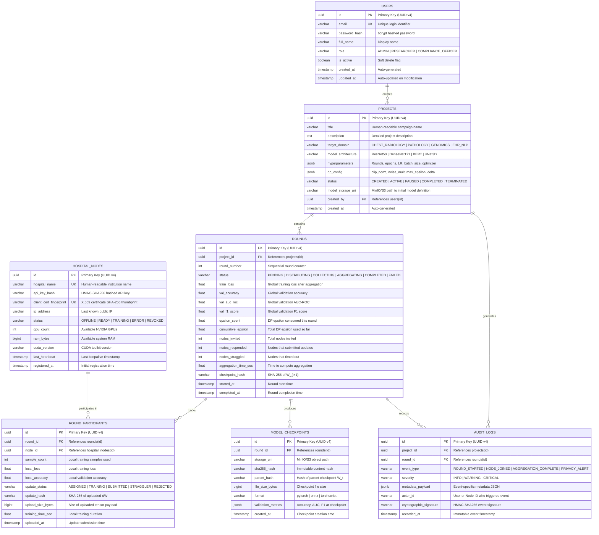
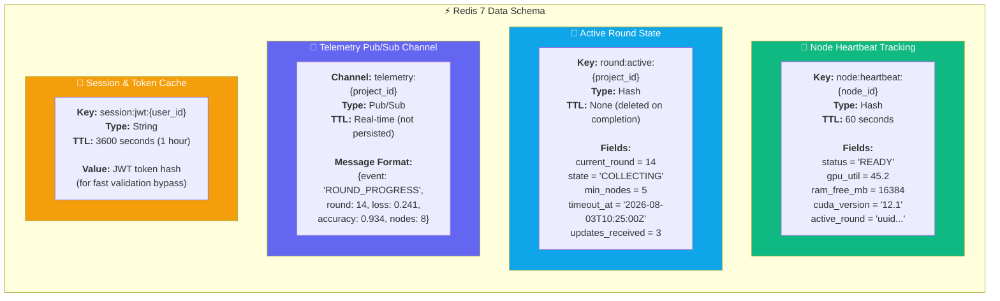

<div align="center">

# 💾 MediFL — Database Design Document

### 🏥 ERD, PostgreSQL Schema & Redis Data Architecture

| **Document ID** | **Classification** | **Version** | **Status** |
|:---:|:---:|:---:|:---:|
| `MEDIFL-DB-009` | 🔒 Confidential | `v1.0.0` | ✅ Approved |

| **Prepared By** | **Database Engine** | **Approved By** | **Date** |
|:---:|:---:|:---:|:---:|
| Database Architecture Team | PostgreSQL 15 + Redis 7 | Principal Engineer | August 2026 |

---

</div>

## 📑 Table of Contents

- [1. Entity Relationship Diagram](#1-entity-relationship-diagram)
- [2. PostgreSQL DDL Schema](#2-postgresql-ddl-schema)
- [3. Redis In-Memory Data Architecture](#3-redis-in-memory-data-architecture)
- [4. Query Optimization & Indexing Strategy](#4-query-optimization--indexing-strategy)

---

## 1. Entity Relationship Diagram



---

## 2. PostgreSQL DDL Schema

### 2.1 Complete Production SQL Script (`schema.sql`)

```sql
-- ============================================================
-- MediFL Database Schema — PostgreSQL 15
-- Version: 1.0.0
-- Author: Database Architecture Team
-- Description: Complete relational schema for MediFL platform
-- ============================================================

-- Enable required extensions
CREATE EXTENSION IF NOT EXISTS "uuid-ossp";      -- UUID generation
CREATE EXTENSION IF NOT EXISTS "pg_trgm";         -- Trigram text search
CREATE EXTENSION IF NOT EXISTS "btree_gist";      -- GiST index support

-- ============================================================
-- ENUM TYPES
-- ============================================================

CREATE TYPE user_role AS ENUM ('ADMIN', 'RESEARCHER', 'COMPLIANCE_OFFICER');

CREATE TYPE project_status AS ENUM (
    'CREATED', 'ACTIVE', 'PAUSED', 'COMPLETED', 'TERMINATED'
);

CREATE TYPE node_status AS ENUM (
    'OFFLINE', 'READY', 'TRAINING', 'ERROR', 'REVOKED'
);

CREATE TYPE round_status AS ENUM (
    'PENDING', 'DISTRIBUTING', 'COLLECTING', 
    'AGGREGATING', 'COMPLETED', 'FAILED'
);

CREATE TYPE participant_status AS ENUM (
    'ASSIGNED', 'TRAINING', 'SUBMITTED', 'STRAGGLER', 'REJECTED'
);

CREATE TYPE audit_severity AS ENUM ('INFO', 'WARNING', 'CRITICAL');

-- ============================================================
-- TABLE: users
-- ============================================================

CREATE TABLE users (
    id              UUID PRIMARY KEY DEFAULT uuid_generate_v4(),
    email           VARCHAR(255) NOT NULL UNIQUE,
    password_hash   VARCHAR(255) NOT NULL,
    full_name       VARCHAR(255) NOT NULL,
    role            user_role NOT NULL DEFAULT 'RESEARCHER',
    is_active       BOOLEAN NOT NULL DEFAULT TRUE,
    created_at      TIMESTAMPTZ NOT NULL DEFAULT CURRENT_TIMESTAMP,
    updated_at      TIMESTAMPTZ NOT NULL DEFAULT CURRENT_TIMESTAMP
);

COMMENT ON TABLE users IS 'Platform user accounts with RBAC roles';

-- ============================================================
-- TABLE: projects
-- ============================================================

CREATE TABLE projects (
    id                  UUID PRIMARY KEY DEFAULT uuid_generate_v4(),
    title               VARCHAR(255) NOT NULL,
    description         TEXT,
    target_domain       VARCHAR(100) NOT NULL,
    model_architecture  VARCHAR(100) NOT NULL,
    hyperparameters     JSONB NOT NULL DEFAULT '{}'::jsonb,
    dp_config           JSONB NOT NULL DEFAULT '{}'::jsonb,
    status              project_status NOT NULL DEFAULT 'CREATED',
    model_storage_uri   VARCHAR(512),
    created_by          UUID NOT NULL REFERENCES users(id) ON DELETE CASCADE,
    created_at          TIMESTAMPTZ NOT NULL DEFAULT CURRENT_TIMESTAMP
);

COMMENT ON TABLE projects IS 'Federated Learning project campaigns';

-- ============================================================
-- TABLE: hospital_nodes
-- ============================================================

CREATE TABLE hospital_nodes (
    id                      UUID PRIMARY KEY DEFAULT uuid_generate_v4(),
    hospital_name           VARCHAR(255) NOT NULL UNIQUE,
    api_key_hash            VARCHAR(255) NOT NULL,
    client_cert_fingerprint VARCHAR(128) NOT NULL UNIQUE,
    ip_address              VARCHAR(45),
    status                  node_status NOT NULL DEFAULT 'OFFLINE',
    gpu_count               INT DEFAULT 0,
    ram_bytes               BIGINT DEFAULT 0,
    cuda_version            VARCHAR(20),
    last_heartbeat          TIMESTAMPTZ,
    registered_at           TIMESTAMPTZ NOT NULL DEFAULT CURRENT_TIMESTAMP
);

COMMENT ON TABLE hospital_nodes IS 'Registered hospital edge node registry';

-- ============================================================
-- TABLE: rounds
-- ============================================================

CREATE TABLE rounds (
    id                  UUID PRIMARY KEY DEFAULT uuid_generate_v4(),
    project_id          UUID NOT NULL REFERENCES projects(id) ON DELETE CASCADE,
    round_number        INT NOT NULL,
    status              round_status NOT NULL DEFAULT 'PENDING',
    train_loss          FLOAT,
    val_accuracy        FLOAT,
    val_auc_roc         FLOAT,
    val_f1_score        FLOAT,
    epsilon_spent       FLOAT DEFAULT 0.0,
    cumulative_epsilon  FLOAT DEFAULT 0.0,
    nodes_invited       INT DEFAULT 0,
    nodes_responded     INT DEFAULT 0,
    nodes_straggled     INT DEFAULT 0,
    aggregation_time_sec FLOAT,
    checkpoint_hash     VARCHAR(64),
    started_at          TIMESTAMPTZ,
    completed_at        TIMESTAMPTZ,
    CONSTRAINT uq_project_round UNIQUE (project_id, round_number)
);

COMMENT ON TABLE rounds IS 'FL training round execution records';

-- ============================================================
-- TABLE: round_participants
-- ============================================================

CREATE TABLE round_participants (
    id              UUID PRIMARY KEY DEFAULT uuid_generate_v4(),
    round_id        UUID NOT NULL REFERENCES rounds(id) ON DELETE CASCADE,
    node_id         UUID NOT NULL REFERENCES hospital_nodes(id) ON DELETE CASCADE,
    sample_count    INT NOT NULL DEFAULT 0,
    local_loss      FLOAT,
    local_accuracy  FLOAT,
    update_status   participant_status NOT NULL DEFAULT 'ASSIGNED',
    update_hash     VARCHAR(64),
    upload_size_bytes BIGINT,
    training_time_sec FLOAT,
    uploaded_at     TIMESTAMPTZ,
    CONSTRAINT uq_round_node UNIQUE (round_id, node_id)
);

COMMENT ON TABLE round_participants IS 'Per-node participation tracking per round';

-- ============================================================
-- TABLE: model_checkpoints
-- ============================================================

CREATE TABLE model_checkpoints (
    id              UUID PRIMARY KEY DEFAULT uuid_generate_v4(),
    round_id        UUID NOT NULL REFERENCES rounds(id) ON DELETE CASCADE,
    storage_uri     VARCHAR(512) NOT NULL,
    sha256_hash     VARCHAR(64) NOT NULL,
    parent_hash     VARCHAR(64),
    file_size_bytes BIGINT NOT NULL,
    format          VARCHAR(20) NOT NULL DEFAULT 'pytorch',
    validation_metrics JSONB DEFAULT '{}'::jsonb,
    created_at      TIMESTAMPTZ NOT NULL DEFAULT CURRENT_TIMESTAMP
);

COMMENT ON TABLE model_checkpoints IS 'Immutable model weight checkpoint registry';

-- ============================================================
-- TABLE: audit_logs
-- ============================================================

CREATE TABLE audit_logs (
    id                      UUID PRIMARY KEY DEFAULT uuid_generate_v4(),
    project_id              UUID REFERENCES projects(id) ON DELETE SET NULL,
    round_id                UUID REFERENCES rounds(id) ON DELETE SET NULL,
    event_type              VARCHAR(100) NOT NULL,
    severity                audit_severity NOT NULL DEFAULT 'INFO',
    metadata_payload        JSONB NOT NULL DEFAULT '{}'::jsonb,
    actor_id                VARCHAR(128) NOT NULL,
    cryptographic_signature VARCHAR(512) NOT NULL,
    recorded_at             TIMESTAMPTZ NOT NULL DEFAULT CURRENT_TIMESTAMP
);

COMMENT ON TABLE audit_logs IS 'Immutable cryptographically signed audit trail';

-- ============================================================
-- INDEXES for Performance Optimization
-- ============================================================

-- Fast project listing by status
CREATE INDEX idx_projects_status ON projects(status);
CREATE INDEX idx_projects_created_by ON projects(created_by);

-- Fast round queries (most common access pattern)
CREATE INDEX idx_rounds_project_round ON rounds(project_id, round_number DESC);
CREATE INDEX idx_rounds_status ON rounds(status);

-- Node health monitoring
CREATE INDEX idx_nodes_status ON hospital_nodes(status);
CREATE INDEX idx_nodes_heartbeat ON hospital_nodes(last_heartbeat DESC);

-- Audit trail queries (compliance reporting)
CREATE INDEX idx_audit_project ON audit_logs(project_id);
CREATE INDEX idx_audit_event_type ON audit_logs(event_type);
CREATE INDEX idx_audit_recorded_at ON audit_logs(recorded_at DESC);
CREATE INDEX idx_audit_severity ON audit_logs(severity);

-- Participant tracking
CREATE INDEX idx_participants_round ON round_participants(round_id);
CREATE INDEX idx_participants_node ON round_participants(node_id);
```

---

## 3. Redis In-Memory Data Architecture



---

## 4. Query Optimization & Indexing Strategy

| Query Pattern | Frequency | Index Used | Expected Latency |
|:---|:---:|:---|:---:|
| Get latest round for a project | 🔴 Very High | `idx_rounds_project_round` (composite B-tree DESC) | < 1 ms |
| List all READY hospital nodes | 🔴 Very High | `idx_nodes_status` (B-tree on enum) | < 2 ms |
| Fetch audit logs for compliance report | 🟡 Medium | `idx_audit_project` + `idx_audit_recorded_at` | < 10 ms |
| Get participant updates for a round | 🔴 Very High | `idx_participants_round` (B-tree) | < 1 ms |
| Search nodes by heartbeat staleness | 🟡 Medium | `idx_nodes_heartbeat` (B-tree DESC) | < 5 ms |

---

<div align="center">

| ← [Phase 8: AI Architecture](./08_AI_ARCHITECTURE.md) | 📄 **Next Document** | [Phase 10: API Specification →](./10_API_SPECIFICATION.md) |
|:---:|:---:|:---:|

---

*© 2026 MediFL Platform — Confidential & Proprietary*

</div>
