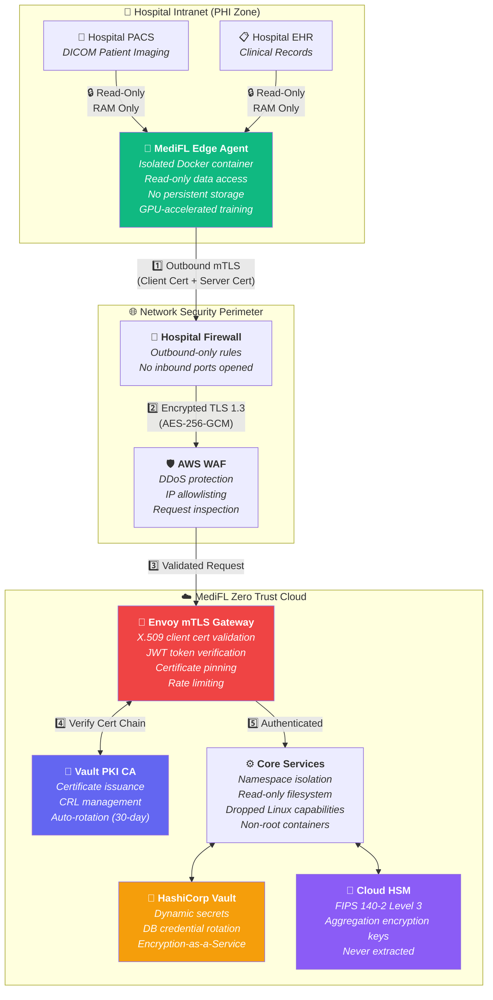
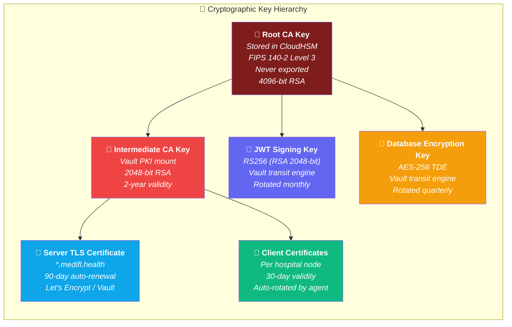
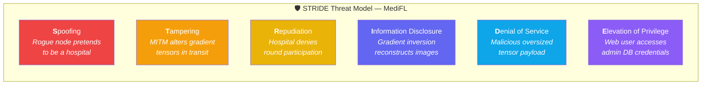
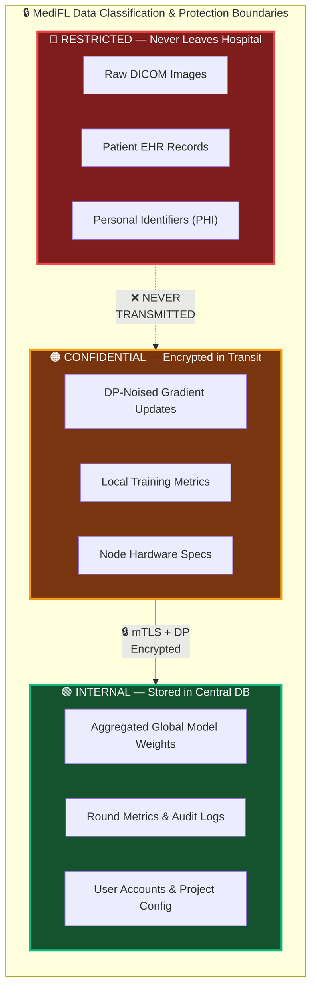

# 🛡️ MediFL — Security Architecture Document

### 🏥 Zero Trust Model, mTLS, Differential Privacy & STRIDE Threat Analysis

| **Document ID** | **Classification** | **Version** | **Status** |
|:---:|:---:|:---:|:---:|
| `MEDIFL-SEC-011` | 🔴 Highly Confidential | `v1.0.0` | ✅ Approved |

---

## 📑 Table of Contents

- [1. Zero Trust Security Architecture](#1-zero-trust-security-architecture)
- [2. Authentication & Identity Architecture](#2-authentication--identity-architecture)
- [3. Cryptographic Key Management](#3-cryptographic-key-management)
- [4. STRIDE Threat Analysis & Defense Matrix](#4-stride-threat-analysis--defense-matrix)
- [5. Data Protection & Privacy Boundaries](#5-data-protection--privacy-boundaries)

---

## 1. Zero Trust Security Architecture

> [!CAUTION]
> MediFL processes privacy-sensitive medical AI model updates derived from Protected Health Information (PHI). **Every component operates under Zero Trust** — no implicit trust based on network location, and every request is authenticated, authorized, and encrypted.

---

## 2. Authentication & Identity Architecture

### 2.1 Dual Authentication Model

```mermaid
graph LR
    subgraph "🔐 MediFL Dual Authentication"
        direction TB
        
        subgraph Human ["👤 Human User Authentication"]
            Login["👤 User Login<br/><i>Email + Password</i>"]
            -->MFA["🔑 Multi-Factor Auth<br/><i>TOTP / WebAuthn</i>"]
            -->OIDC["🎫 OIDC Token Exchange<br/><i>Keycloak issues JWT</i>"]
            -->JWT["📋 JWT Access Token<br/><i>60-min expiry<br/>Contains: user_id, role,<br/>permissions, iss, exp</i>"]
        end

        subgraph Machine ["🤖 Machine (Edge Node) Authentication"]
            Cert["📜 X.509 Client Certificate<br/><i>Issued by MediFL Vault CA<br/>30-day validity</i>"]
            -->TLS["🤝 mTLS Handshake<br/><i>Mutual certificate exchange<br/>TLS 1.3 negotiation</i>"]
            -->Verify["✅ Certificate Validation<br/><i>Chain verification<br/>CRL check<br/>Fingerprint DB lookup</i>"]
            -->Session["🔗 Authenticated gRPC Session<br/><i>Persistent bidirectional<br/>stream established</i>"]
        end
    end

    style Human fill:#eff6ff,stroke:#3b82f6,stroke-width:2px
    style Machine fill:#f0fdf4,stroke:#16a34a,stroke-width:2px
```

### 2.2 RBAC Permission Matrix

| Permission | 🔴 ADMIN | 🟡 RESEARCHER | 🔵 COMPLIANCE_OFFICER |
|:---|:---:|:---:|:---:|
| Create / Delete Users | ✅ | ❌ | ❌ |
| Create / Configure FL Projects | ✅ | ✅ | ❌ |
| Start / Pause Training Rounds | ✅ | ✅ | ❌ |
| Register Hospital Nodes | ✅ | ❌ | ❌ |
| Revoke Node Certificates | ✅ | ❌ | ❌ |
| View Training Metrics & Dashboard | ✅ | ✅ | ✅ |
| View Audit Logs & Privacy Reports | ✅ | ✅ | ✅ |
| Export Compliance Audit PDF | ✅ | ❌ | ✅ |
| Modify Privacy Budget Limits | ✅ | ❌ | ❌ |

---

## 3. Cryptographic Key Management

---

## 4. STRIDE Threat Analysis & Defense Matrix

| STRIDE Category | Threat | Severity | Defense Control |
|:---|:---|:---:|:---|
| **🔴 Spoofing** | Rogue node masquerades as hospital participant | Critical | ✅ mTLS X.509 client cert binding + API key HMAC |
| **🟠 Tampering** | Man-in-the-middle alters tensor in transit | Critical | ✅ TLS 1.3 AES-256-GCM + SHA-256 per-chunk hash verification |
| **🟡 Repudiation** | Hospital denies participation in FL round | High | ✅ Immutable audit log with cryptographic node signature |
| **🔵 Info Disclosure** | Gradient Inversion Attack (DLG/iDLG) | Critical | ✅ DP-SGD noise ($\epsilon \le 2.0$) + Homomorphic Encryption |
| **⚪ DoS** | Oversized corrupt tensor exhausts server memory | High | ✅ gRPC max payload 500 MB + rate limiting + node timeout |
| **🟣 Privilege Escalation** | Compromised user accesses admin secrets | High | ✅ RBAC enforcement + Vault dynamic secrets + least privilege |

---

## 5. Data Protection & Privacy Boundaries

---

| ← [Phase 10: API Specification](./10_API_SPECIFICATION.md) | 📄 **Next Document** | [Phase 12: UI/UX Design Guide →](./12_UI_UX_DESIGN_GUIDE.md) |
|:---:|:---:|:---:|

---

*© 2026 MediFL Platform — Confidential & Proprietary*

