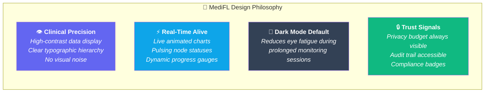
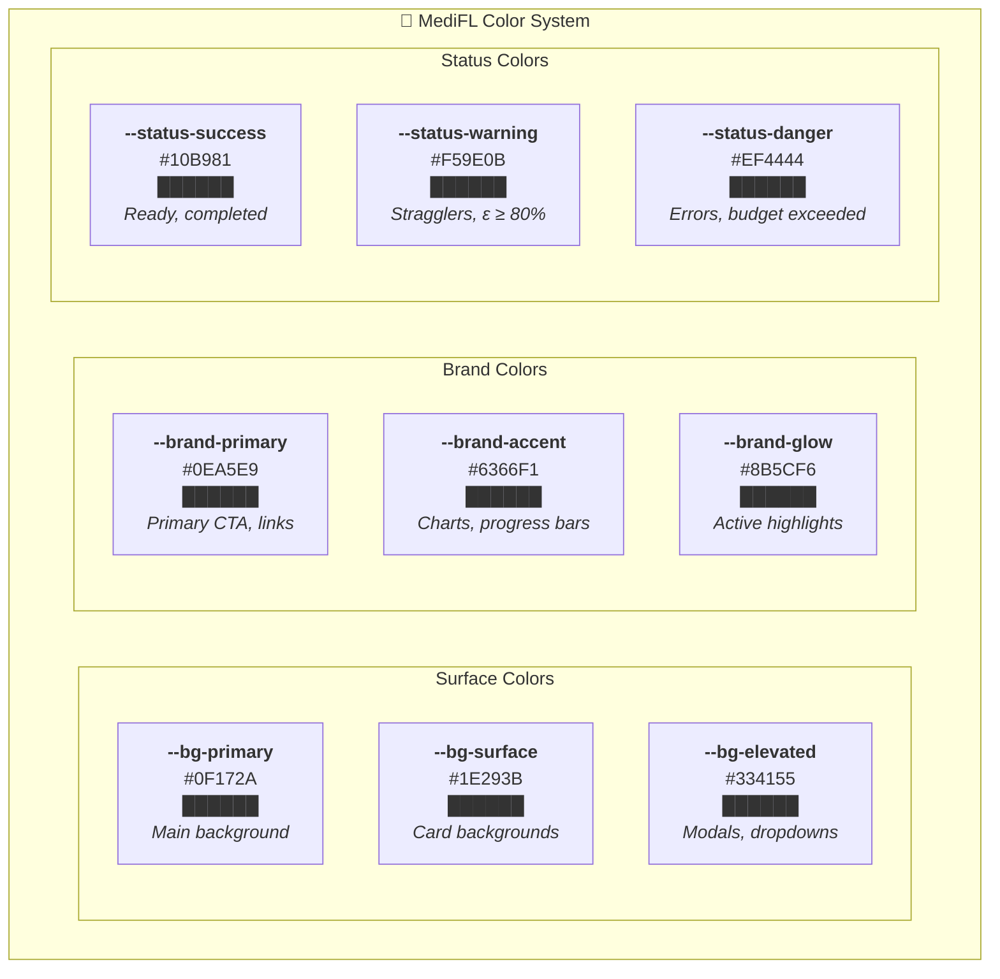
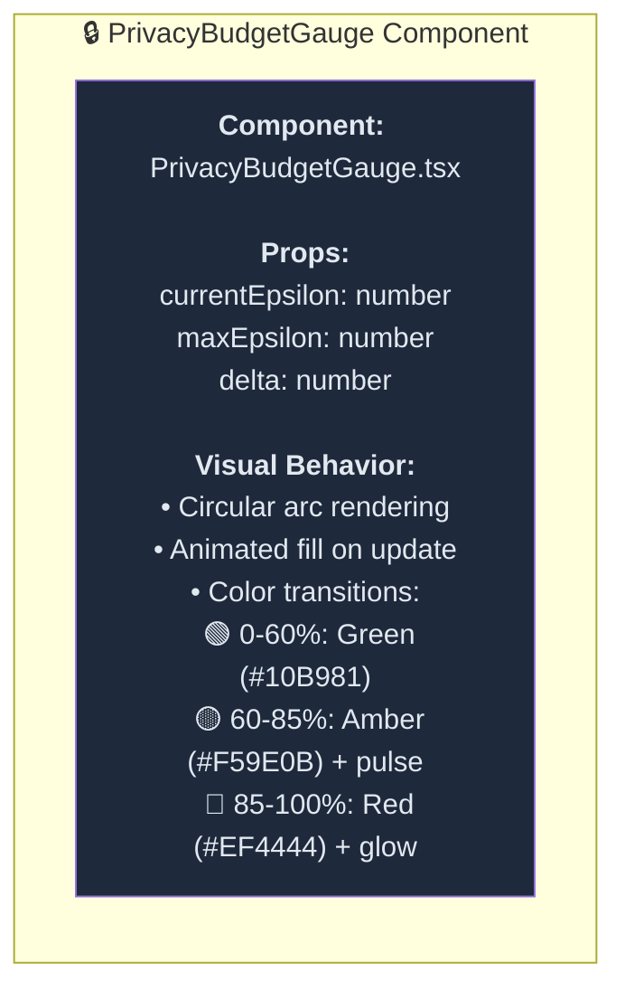
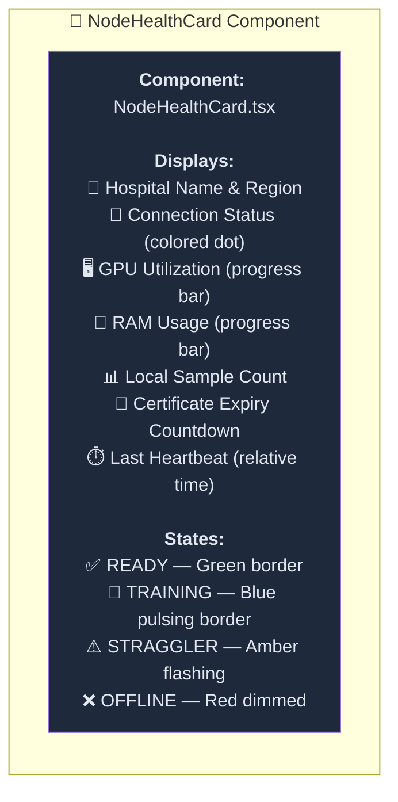

<div align="center">

# 🎨 MediFL — UI/UX Design Guide

### 🏥 Design System, Component Library & Dashboard Wireframes

| **Document ID** | **Classification** | **Version** | **Status** |
|:---:|:---:|:---:|:---:|
| `MEDIFL-UX-012` | 🔒 Confidential | `v1.0.0` | ✅ Approved |

---

</div>

## 📑 Table of Contents

- [1. Design Principles](#1-design-principles)
- [2. Design Token System](#2-design-token-system)
- [3. Screen Layout Architecture](#3-screen-layout-architecture)
- [4. Key UI Components](#4-key-ui-components)

---

## 1. Design Principles



---

## 2. Design Token System

### 2.1 Color Palette



### 2.2 Typography Scale

| Token | Size | Weight | Font Family | Usage |
|:---|:---:|:---:|:---|:---|
| `--text-display` | 2.5rem (40px) | Bold 700 | JetBrains Mono | Metric values, hero numbers |
| `--text-h1` | 2.25rem (36px) | Bold 700 | Inter | Page titles |
| `--text-h2` | 1.5rem (24px) | SemiBold 600 | Inter | Section headings |
| `--text-h3` | 1.125rem (18px) | Medium 500 | Inter | Card titles |
| `--text-body` | 0.875rem (14px) | Regular 400 | Inter | Body text, descriptions |
| `--text-caption` | 0.75rem (12px) | Regular 400 | Inter | Labels, timestamps |
| `--text-code` | 0.8125rem (13px) | Regular 400 | JetBrains Mono | Hashes, IDs, code |

---

## 3. Screen Layout Architecture

### 3.1 Main Dashboard Layout

```
╔══════════════════════════════════════════════════════════════════════════╗
║  🧠 MediFL  │  Dashboard  │  Projects  │  Nodes  │  Audit  │ 👤 Profile ║
╠══════════════════════════════════════════════════════════════════════════╣
║                                                                        ║
║  📋 PROJECT: Multi-Center Chest X-Ray Campaign v1                      ║
║  Status: 🟢 ACTIVE (Round 14 / 50)   │   🔒 Privacy: ε = 0.584 / 2.0 ║
║                                                                        ║
╠═══════════════════════════════╦════════════════════════════════════════╣
║  📈 LIVE TRAINING TELEMETRY   ║  🏥 HOSPITAL NODE STATUS              ║
║                               ║                                        ║
║  ╭───────────────────────╮    ║  ┌──────────────────────────────────┐  ║
║  │ Loss   ╲              │    ║  │ ✅ Hospital Alpha   GPU: 87% ██▓ │  ║
║  │ 0.40    ╲             │    ║  │ ✅ Hospital Beta    GPU: 94% ███ │  ║
║  │ 0.20     ╲___         │    ║  │ ⚠️ Hospital Gamma  [STRAGGLER]  │  ║
║  │ 0.00         ╲___     │    ║  │ ✅ Hospital Delta   GPU: 72% ██▒ │  ║
║  │                   Acc  │    ║  │ ✅ Hospital Epsilon GPU: 88% ██▓ │  ║
║  │        Round 1 ... 14  │    ║  │ ❌ Hospital Zeta   [OFFLINE]    │  ║
║  ╰───────────────────────╯    ║  └──────────────────────────────────┘  ║
║                               ║                                        ║
╠═══════════════════════════════╩════════════════════════════════════════╣
║  🔒 PRIVACY BUDGET GAUGE              📊 ROUND METRICS SUMMARY       ║
║                                                                        ║
║  ╭──────────╮   ε Used: 29.2%         Accuracy:  93.4%  ↑ +0.3%      ║
║  │  ╱    ╲  │   ε Remaining: 70.8%    AUC-ROC:   96.1%  ↑ +0.1%      ║
║  │ │  29% │ │   Budget Status: 🟢     F1-Score:  92.8%  ↑ +0.4%      ║
║  │  ╲    ╱  │   Rounds Remaining: ~36  Loss:     0.241  ↓ -0.012     ║
║  ╰──────────╯                                                          ║
║                                                                        ║
╠════════════════════════════════════════════════════════════════════════╣
║  📋 AUDIT LOG & CHECKPOINT HISTORY                                     ║
║                                                                        ║
║  ▸ 10:15:32  Round 14 Aggregation Complete  │ Hash: sha256:9f86d0...  ║
║  ▸ 10:14:28  Hospital Gamma marked STRAGGLER │ Timeout: 600s           ║
║  ▸ 10:12:05  Round 14 Started               │ 6 nodes selected        ║
║  ▸ 10:11:30  Round 13 Checkpoint Saved      │ Val Acc: 93.1%          ║
╚════════════════════════════════════════════════════════════════════════╝
```

---

## 4. Key UI Components

### 4.1 Privacy Budget Gauge Component



### 4.2 Node Health Card Component



---

<div align="center">

| ← [Phase 11: Security](./11_SECURITY_ARCHITECTURE.md) | 📄 **Next Document** | [Phase 13: Deployment →](./13_DEPLOYMENT_ARCHITECTURE.md) |
|:---:|:---:|:---:|

---

*© 2026 MediFL Platform — Confidential & Proprietary*

</div>
