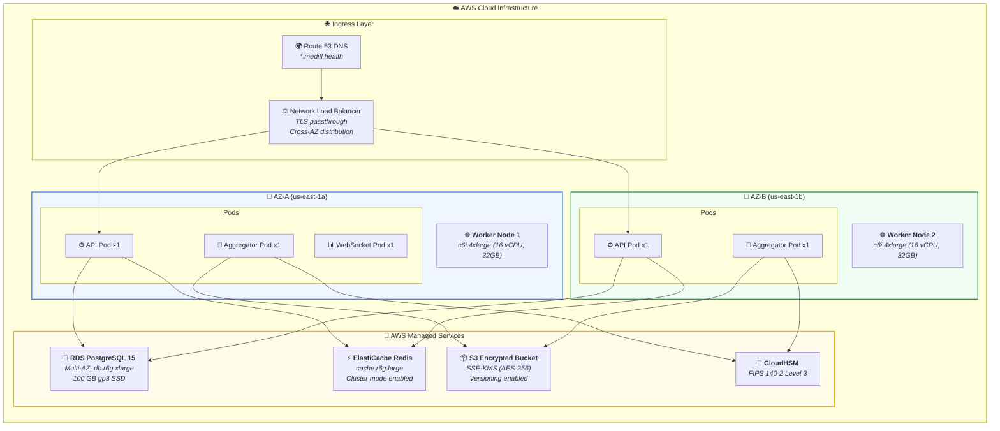

<div align="center">

# 🚀 MediFL — Deployment Architecture Document

### 🏥 Kubernetes, Docker & Cloud Infrastructure

| **Document ID** | `MEDIFL-DEPLOY-013` | **Version** | `v1.0.0` | **Status** | ✅ Approved |
|:---:|:---:|:---:|:---:|:---:|:---:|

---

</div>

## 1. Kubernetes Cluster Topology



## 2. Docker Multi-Stage Build

```dockerfile
# ================================================================
# MediFL Aggregator Service — Multi-Stage Dockerfile
# ================================================================

# Stage 1: Build & Dependency Resolution
FROM python:3.11-slim AS builder
WORKDIR /app

RUN apt-get update && apt-get install -y --no-install-recommends \
    build-essential libpq-dev && rm -rf /var/lib/apt/lists/*

COPY requirements.txt .
RUN pip install --no-cache-dir --user -r requirements.txt

# Stage 2: Minimal Production Runtime
FROM python:3.11-slim AS final
WORKDIR /app

# Security: Non-root user with minimal permissions
RUN addgroup --system medifl && adduser --system --group medifl

COPY --from=builder /root/.local /home/medifl/.local
COPY --chown=medifl:medifl ./src /app/src

ENV PATH=/home/medifl/.local/bin:$PATH
ENV PYTHONUNBUFFERED=1

# Security: Read-only filesystem, drop capabilities
USER medifl
EXPOSE 8000 50051

HEALTHCHECK --interval=30s --timeout=5s --start-period=10s --retries=3 \
  CMD curl -f http://localhost:8000/healthz || exit 1

ENTRYPOINT ["python", "-m", "src.main"]
```

## 3. Helm Chart Values (`values.yaml`)

```yaml
global:
  environment: production
  domain: medifl.health
  imagePullSecrets: [name: medifl-registry-secret]

apiService:
  replicaCount: 3
  image:
    repository: registry.medifl.health/control-plane/api
    tag: v1.0.0
  resources:
    limits: { cpu: 2000m, memory: 4Gi }
    requests: { cpu: 500m, memory: 1Gi }
  autoscaling:
    enabled: true
    minReplicas: 3
    maxReplicas: 10
    targetCPU: 75

aggregatorService:
  replicaCount: 2
  image:
    repository: registry.medifl.health/control-plane/aggregator
    tag: v1.0.0
  resources:
    limits: { cpu: 4000m, memory: 16Gi }
    requests: { cpu: 2000m, memory: 4Gi }

postgresql:
  enabled: true
  architecture: replication
  auth: { database: medifl_db, username: medifl_admin }
  primary:
    persistence: { size: 100Gi, storageClass: gp3 }

redis:
  architecture: replication
  master:
    persistence: { size: 20Gi }
```

---

<div align="center">

| ← [Phase 12: UI/UX](./12_UI_UX_DESIGN_GUIDE.md) | 📄 **Next** | [Phase 14: DevOps →](./14_DEVOPS_GUIDE.md) |
|:---:|:---:|:---:|

*© 2026 MediFL Platform — Confidential & Proprietary*

</div>
