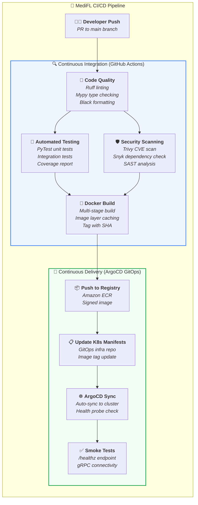
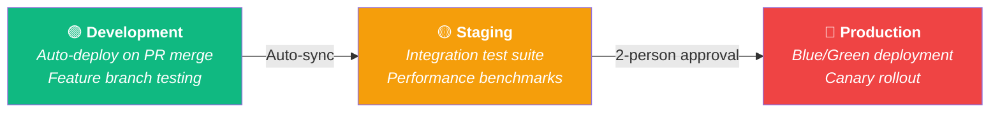

<div align="center">

# ⚙️ MediFL — DevOps & CI/CD Guide

### 🏥 GitHub Actions, GitOps (ArgoCD) & Automated Quality Gates

| **Document ID** | `MEDIFL-DEVOPS-014` | **Version** | `v1.0.0` | **Status** | ✅ Approved |
|:---:|:---:|:---:|:---:|:---:|:---:|

---

</div>

## 1. CI/CD Pipeline Architecture



## 2. GitHub Actions Workflow (`ci-cd.yml`)

```yaml
name: MediFL Enterprise CI/CD Pipeline

on:
  push:
    branches: [main, release/*]
  pull_request:
    branches: [main]

jobs:
  lint-and-test:
    name: 📝 Code Quality & 🧪 Tests
    runs-on: ubuntu-latest
    steps:
      - uses: actions/checkout@v4
      - uses: actions/setup-python@v5
        with: { python-version: '3.11', cache: 'pip' }
      - run: pip install ruff mypy pytest pytest-cov
      - run: ruff check ./src
      - run: mypy ./src --strict
      - run: pytest --cov=src --cov-report=xml tests/

  security-scan:
    name: 🛡️ Vulnerability Scan
    runs-on: ubuntu-latest
    steps:
      - uses: actions/checkout@v4
      - uses: aquasecurity/trivy-action@master
        with: { scan-type: 'fs', severity: 'CRITICAL,HIGH' }

  build-and-push:
    name: 🐳 Build & Push
    needs: [lint-and-test, security-scan]
    if: github.ref == 'refs/heads/main'
    runs-on: ubuntu-latest
    steps:
      - uses: actions/checkout@v4
      - uses: aws-actions/amazon-ecr-login@v2
      - uses: docker/build-push-action@v5
        with:
          push: true
          tags: ${{ steps.ecr.outputs.registry }}/medifl-api:${{ github.sha }}
```

## 3. Environment Promotion Strategy



---

<div align="center">

| ← [Phase 13: Deployment](./13_DEPLOYMENT_ARCHITECTURE.md) | 📄 **Next** | [Phase 15: Test Plan →](./15_TEST_PLAN.md) |
|:---:|:---:|:---:|

*© 2026 MediFL Platform — Confidential & Proprietary*

</div>
