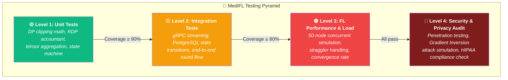

<div align="center">

# 🧪 MediFL — Master Test Plan

### 🏥 Unit, Integration, Privacy Verification, Security & Load Testing

| **Document ID** | `MEDIFL-TEST-015` | **Version** | `v1.0.0` | **Status** | ✅ Approved |
|:---:|:---:|:---:|:---:|:---:|:---:|

---

</div>

## 1. Test Pyramid Strategy



## 2. Test Coverage Matrix

| Test Level | Focus Area | Target Coverage | Tools | Run Frequency |
|:---|:---|:---:|:---|:---:|
| 🟢 **Unit** | DP noise math, RDP accountant, aggregation | $\ge 90\%$ | PyTest, torch.testing | Every PR |
| 🟡 **Integration** | gRPC streaming, DB state, round lifecycle | $\ge 80\%$ | PyTest-asyncio, Testcontainers | Every PR |
| 🟠 **Load** | 50 concurrent nodes, bandwidth stress | N/A | K6, Locust | Weekly |
| 🔴 **Security** | Gradient inversion defense, CVE scan | 100% rules | Opacus, Trivy, OWASP ZAP | Pre-release |

## 3. Privacy Verification Test

```python
def test_dp_noise_injection_variance():
    """Verify Gaussian noise matches prescribed σ parameter."""
    aggregator = DPAggregator(
        config=PrivacyConfig(clip_norm=1.0, noise_multiplier=2.0)
    )
    # Zero updates from 10 nodes → output should be pure noise
    zero_updates = [{"w": torch.zeros(1000, 1000)} for _ in range(10)]
    samples = [100] * 10

    result = aggregator.aggregate_with_privacy(zero_updates, samples)
    
    expected_std = (1.0 * 2.0) / 10.0  # (C × σ) / K
    actual_std = result["w"].std().item()
    
    assert abs(actual_std - expected_std) / expected_std < 0.05  # 5% tolerance
```

## 4. Acceptance Criteria

| # | Criterion | Target | Gate Type |
|:---:|:---|:---:|:---:|
| ✅ 1 | Unit test pass rate | 100% | 🔴 Release blocker |
| ✅ 2 | Integration test pass rate | 100% | 🔴 Release blocker |
| ✅ 3 | Zero Critical/High CVEs (Trivy) | 0 findings | 🔴 Release blocker |
| ✅ 4 | Membership inference attack accuracy | $\le 50.5\%$ | 🔴 Release blocker |
| ✅ 5 | 50-node load test round completion | $\ge 95\%$ | 🟡 Warning |

---

<div align="center">

| ← [Phase 14: DevOps](./14_DEVOPS_GUIDE.md) | 📄 **Next** | [Phase 16: Benchmark →](./16_BENCHMARK_REPORT.md) |
|:---:|:---:|:---:|

*© 2026 MediFL Platform — Confidential & Proprietary*

</div>
