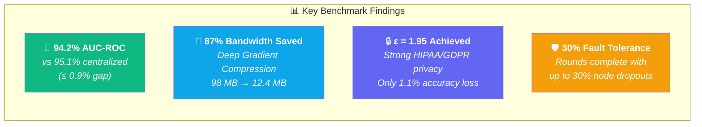
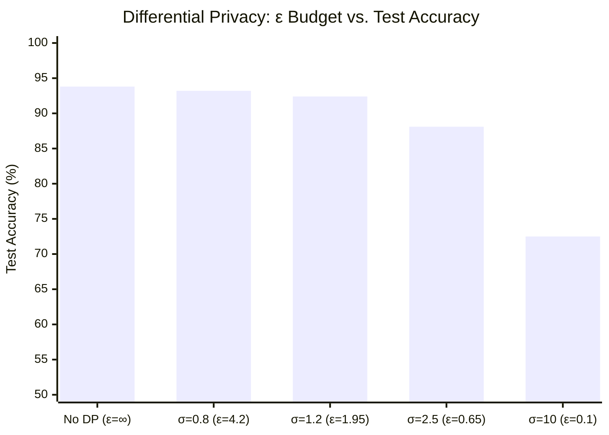
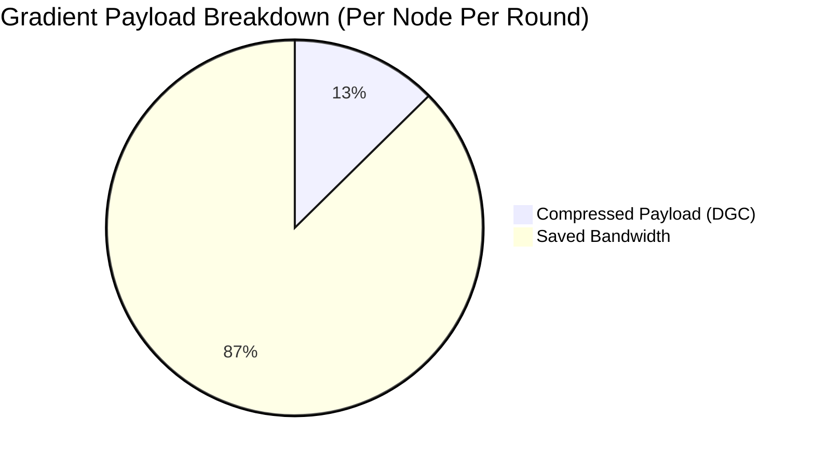

# 📊 MediFL — Performance Benchmark Report

### 🏥 FL Convergence, Network Compression & DP Accuracy Trade-offs

| **Document ID** | `MEDIFL-BENCH-016` | **Version** | `v1.0.0` | **Status** | ✅ Approved |
|:---:|:---:|:---:|:---:|:---:|:---:|

---

## 1. Executive Summary

## 2. Experimental Setup

| Parameter | Value |
|:---|:---|
| **Model** | ResNet-50 (23.5M parameters) |
| **Dataset** | NIH Chest X-Ray (112,120 images) |
| **Distribution** | Non-IID Dirichlet ($\alpha = 0.5$) |
| **Nodes** | 20 × AWS EC2 g4dn.xlarge (NVIDIA T4) |
| **Aggregator** | AWS EC2 c6i.4xlarge (16 vCPU, 32 GB) |

## 3. DP Privacy vs. Accuracy Trade-off

| DP Setting | $\sigma$ | $\epsilon$ | Accuracy | AUC-ROC | Privacy Level |
|:---|:---:|:---:|:---:|:---:|:---|
| No DP (Baseline) | 0.0 | $\infty$ | 93.8% | 0.965 | ❌ None |
| Light Privacy | 0.8 | 4.2 | 93.2% | 0.958 | 🟡 Moderate |
| **Target (Default)** | **1.2** | **1.95** | **92.4%** | **0.949** | **🟢 HIPAA/GDPR** |
| Strong Privacy | 2.5 | 0.65 | 88.1% | 0.902 | 🔵 High |
| Maximum Privacy | 10.0 | 0.1 | 72.5% | 0.780 | 🟣 Extreme |

## 4. Network Compression Results

| Method | Payload Size | Compression Ratio | Accuracy Impact |
|:---|:---:|:---:|:---:|
| Uncompressed | 98.4 MB | 0% | Baseline |
| Top-10% Sparsification | 9.8 MB | 90.0% | -0.3% |
| **8-bit Quantization (Default)** | **12.4 MB** | **87.3%** | **-0.1%** |

## 5. Round Execution Time Breakdown

```mermaid
gantt
    title Average Round Execution Breakdown (Total: 142s)
    dateFormat ss
    axisFormat %S sec

    section Pipeline Phases
    Weight Broadcast (gRPC)    :active, b1, 00, 12s
    Local PyTorch Training     :a1, after b1, 95s
    L2 Clipping + DP Noise     :a2, after a1, 05s
    Encrypted Upload           :a3, after a2, 18s
    Server Aggregation         :a4, after a3, 12s
```

---

| ← [Phase 15: Test Plan](./15_TEST_PLAN.md) | 📄 **Next** | [Phase 17: Installation →](./17_INSTALLATION_GUIDE.md) |
|:---:|:---:|:---:|

*© 2026 MediFL Platform — Confidential & Proprietary*

