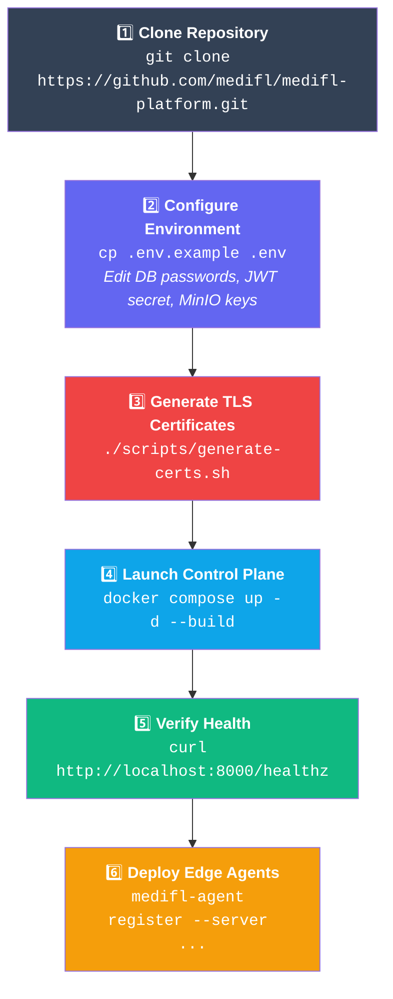

<div align="center">

# 📦 MediFL — Installation & Deployment Guide

### 🏥 Local Development Setup & Hospital Edge Node Onboarding

| **Document ID** | `MEDIFL-INSTALL-017` | **Version** | `v1.0.0` | **Status** | ✅ Approved |
|:---:|:---:|:---:|:---:|:---:|:---:|

---

</div>

## 1. Prerequisites

| Component | Requirement | Purpose |
|:---|:---|:---|
| 🐳 **Docker Engine** | v24.0+ | Container runtime |
| 🐳 **Docker Compose** | v2.20+ | Multi-container orchestration |
| 🐍 **Python** | 3.11+ | Backend development |
| 🔧 **Git** | 2.40+ | Version control |
| 🖥️ **GPU (Edge Only)** | NVIDIA CUDA ≥ 7.0, Driver ≥ 525 | Local model training |

## 2. Setup Workflow



## 3. Environment Configuration (`.env`)

```env
# ============================================================
# MediFL Environment Configuration
# ============================================================

# PostgreSQL
POSTGRES_DB=medifl_db
POSTGRES_USER=medifl_admin
POSTGRES_PASSWORD=SuperSecretPassword123!

# Redis
REDIS_URL=redis://localhost:6379/0

# JWT Security
JWT_SECRET=c8e7f9a1b2c3d4e5f6a7b8c9d0e1f2a3
JWT_EXPIRY_MINUTES=60

# MinIO Object Storage
MINIO_ROOT_USER=minio_admin
MINIO_ROOT_PASSWORD=MinioStorageSecret2026!
MINIO_BUCKET=medifl-models

# Differential Privacy Defaults
DP_DEFAULT_CLIP_NORM=1.0
DP_DEFAULT_NOISE_MULTIPLIER=1.2
DP_DEFAULT_MAX_EPSILON=2.0
```

## 4. Docker Compose Verification

```bash
docker compose ps
```

Expected output:

```
NAME                    SERVICE        STATUS              PORTS
medifl-api-1            api            running (healthy)   0.0.0.0:8000->8000
medifl-aggregator-1     aggregator     running (healthy)   0.0.0.0:50051->50051
medifl-db-1             postgres       running (healthy)   0.0.0.0:5432->5432
medifl-redis-1          redis          running (healthy)   0.0.0.0:6379->6379
medifl-web-1            web            running (healthy)   0.0.0.0:3000->80
medifl-minio-1          minio          running (healthy)   0.0.0.0:9000->9000
```

## 5. Hospital Edge Agent Setup

```bash
# Install MediFL Edge Agent
pip install medifl-edge-agent

# Register with central server
medifl-agent register \
  --server https://api.medifl.health \
  --hospital-name "Hospital Alpha Radiology" \
  --api-key "medifl_key_9f8371a2..." \
  --data-dir "/mnt/pacs/dicom_images" \
  --gpu-device 0
```

> [!TIP]
> For Docker deployment with GPU access:
> ```bash
> docker run -d --gpus all \
>   -v /path/to/config:/etc/medifl:ro \
>   -v /path/to/data:/data:ro \
>   registry.medifl.health/edge/agent:v1.0.0
> ```

---

<div align="center">

| ← [Phase 16: Benchmark](./16_BENCHMARK_REPORT.md) | 📄 **Next** | [Phase 18: Runbook →](./18_OPERATIONS_RUNBOOK.md) |
|:---:|:---:|:---:|

*© 2026 MediFL Platform — Confidential & Proprietary*

</div>
