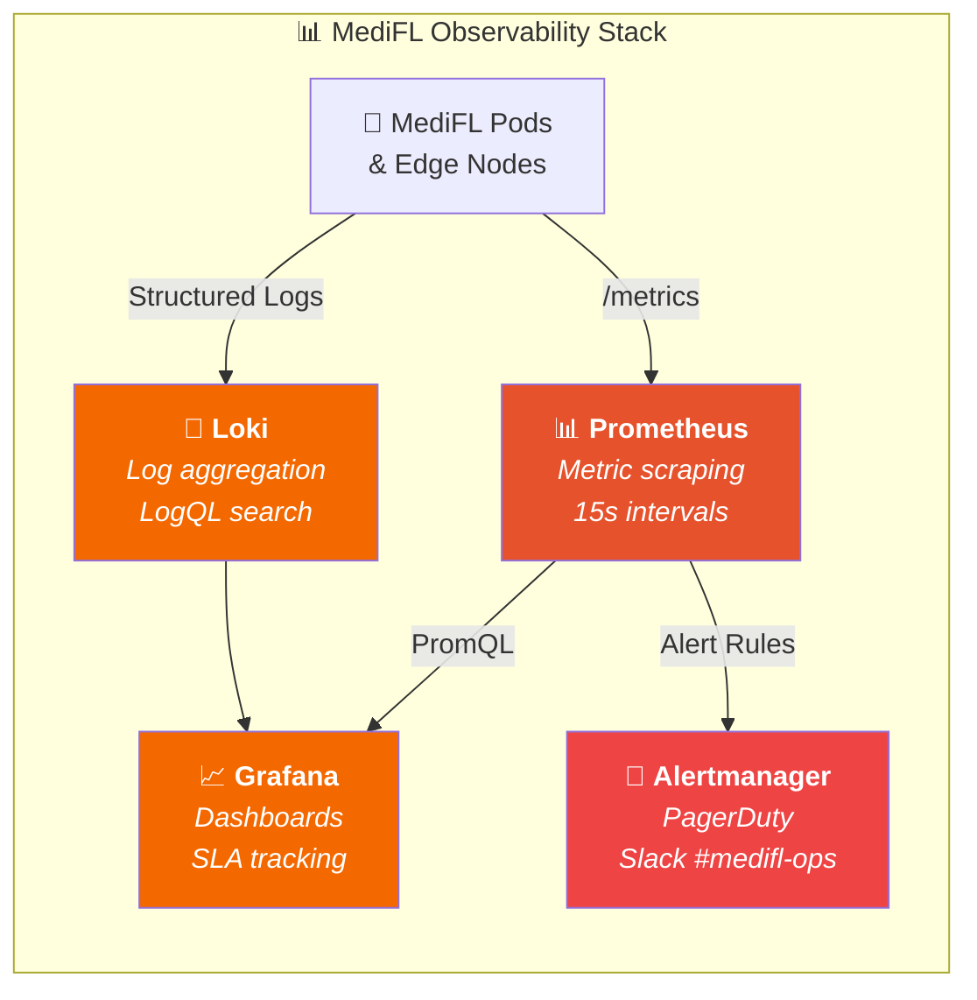
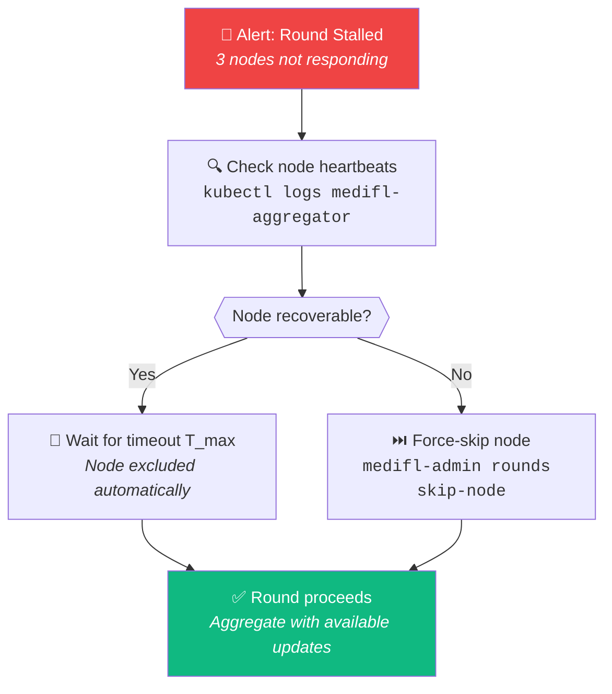

# 🔧 MediFL — Operations Runbook

### 🏥 Monitoring, Alerting & Incident Response Procedures

| **Document ID** | `MEDIFL-OPS-018` | **Version** | `v1.0.0` | **Status** | ✅ Approved |
|:---:|:---:|:---:|:---:|:---:|:---:|

---

## 1. Monitoring Stack Architecture

## 2. Critical Alert Rules

| Alert Name | Condition | Severity | Response SLA |
|:---|:---|:---:|:---:|
| 🔴 `AggregatorOOM` | Container memory > 90% | Critical | ⏱️ 5 min |
| 🔴 `PostgreSQLDown` | DB connection failures > 10/min | Critical | ⏱️ 5 min |
| 🟠 `PrivacyBudgetHigh` | $\epsilon / \epsilon_{max} \ge 85\%$ | High | ⏱️ 15 min |
| 🟠 `HighNodeDropout` | Dropout rate > 30% over 5 min | High | ⏱️ 15 min |
| 🟡 `RoundStalled` | Round in COLLECTING > 10 min | Warning | ⏱️ 30 min |
| 🟡 `CertExpiryWarning` | Node cert expires in < 7 days | Warning | ⏱️ 24 hours |

## 3. Incident Response SOPs

### SOP-101: Straggler Node Recovery

### SOP-102: Privacy Budget Exhaustion

> [!CAUTION]
> This is a **critical compliance event**. Follow these steps immediately:

1. **Pause** the FL campaign: `POST /api/v1/projects/{id}/pause`
2. **Notify** Lead AI Scientist and CISO within 15 minutes
3. **Review** RDP budget logs in database
4. **Decision**: Extend budget (CISO approval required) or terminate experiment

---

| ← [Phase 17: Installation](./17_INSTALLATION_GUIDE.md) | 📄 **Next** | [Phase 19: Developer Guide →](./19_DEVELOPER_GUIDE.md) |
|:---:|:---:|:---:|

*© 2026 MediFL Platform — Confidential & Proprietary*

