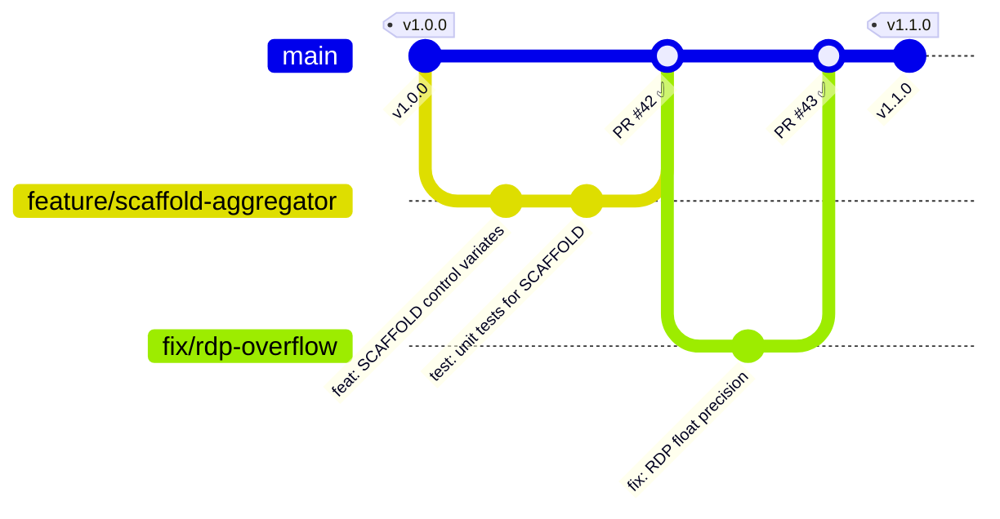

<div align="center">

# 👨‍💻 MediFL — Developer Guide & Coding Standards

### 🏥 Contribution Guidelines, Code Style & Git Workflow

| **Document ID** | `MEDIFL-DEV-019` | **Version** | `v1.0.0` | **Status** | ✅ Approved |
|:---:|:---:|:---:|:---:|:---:|:---:|

---

</div>

## 1. Development Setup

```bash
# Clone & initialize
git clone https://github.com/medifl/medifl-platform.git
cd medifl-platform

# Create virtual environment
python -m venv .venv
source .venv/bin/activate  # Windows: .venv\Scripts\activate

# Install with dev dependencies
pip install -e ".[dev]"

# Install pre-commit hooks
pre-commit install
```

## 2. Code Style Rules

| Rule | Standard | Enforcement |
|:---|:---|:---|
| 📝 **Linting** | Ruff (PEP 8 superset) | Pre-commit + CI |
| 🔤 **Formatting** | Black (100 char line length) | Pre-commit + CI |
| 🔍 **Type Checking** | Mypy (strict, no implicit Any) | Pre-commit + CI |
| 📋 **Docstrings** | Google style, all public functions | Code review |
| 🏷️ **Type Hints** | 100% coverage, explicit return types | Mypy strict |

### Code Example (Proper Style)

```python
def compute_fedprox_loss(
    local_loss: torch.Tensor,
    model_params: Dict[str, torch.Tensor],
    global_params: Dict[str, torch.Tensor],
    mu: float,
) -> torch.Tensor:
    """Calculates FedProx proximal regularization term.

    Args:
        local_loss: Primary criterion loss tensor.
        model_params: Current local model state dict.
        global_params: Reference global model state dict.
        mu: Proximal penalty coefficient (0.0 = standard FedAvg).

    Returns:
        Combined loss with proximal penalty term.
    """
    proximal_term = sum(
        ((p - global_params[n]) ** 2).sum()
        for n, p in model_params.items()
        if n in global_params
    )
    return local_loss + (mu / 2.0) * proximal_term
```

## 3. Git Branching Model



### Commit Message Convention (Conventional Commits)

| Type | Description | Example |
|:---|:---|:---|
| `feat` | New feature | `feat(aggregator): add SCAFFOLD algorithm` |
| `fix` | Bug fix | `fix(dp): correct Gaussian variance scale` |
| `docs` | Documentation | `docs(api): update OpenAPI schema` |
| `test` | Tests | `test(edge): add OOM exception test` |
| `refactor` | Code refactor | `refactor(core): extract state machine` |
| `ci` | CI/CD changes | `ci: add Trivy container scan step` |

## 4. Pull Request Checklist

> [!IMPORTANT]
> Every PR must pass these gates before merge:

- [ ] ✅ All unit tests pass (`pytest tests/`)
- [ ] ✅ Type checking passes (`mypy src/ --strict`)
- [ ] ✅ Linting passes (`ruff check src/`)
- [ ] ✅ Code coverage ≥ 90% for new code
- [ ] ✅ Google-style docstrings on all public functions
- [ ] ✅ At least 1 reviewer approval
- [ ] ✅ No Critical/High CVEs in dependency scan

---

<div align="center">

| ← [Phase 18: Runbook](./18_OPERATIONS_RUNBOOK.md) | 📄 **Next** | [Phase 20: User Manual →](./20_USER_MANUAL.md) |
|:---:|:---:|:---:|

*© 2026 MediFL Platform — Confidential & Proprietary*

</div>
