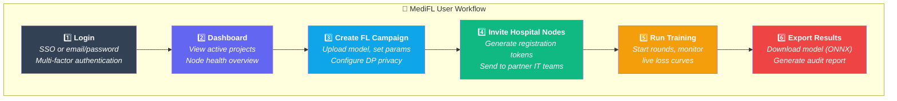

<div align="center">

# 📖 MediFL — User Manual

### 🏥 Guide for Clinical Trial Managers, IT Admins & AI Researchers

| **Document ID** | `MEDIFL-USER-020` | **Version** | `v1.0.0` | **Status** | ✅ Approved |
|:---:|:---:|:---:|:---:|:---:|:---:|

---

</div>

## 1. Getting Started



## 2. Guide for AI Researchers

### Creating a Federated Learning Campaign

1. Navigate to **Projects** → Click **➕ New Campaign**
2. Enter project details:
   - **Name:** *Multi-Center Chest X-Ray Pneumonia Model*
   - **Domain:** Select `CHEST_RADIOLOGY`
   - **Model:** Upload your PyTorch `.py` or ONNX `.onnx` file
3. Configure training hyperparameters:
   - **Total Rounds:** `50`
   - **Local Epochs:** `3`
   - **Learning Rate:** `0.001`
   - **Algorithm:** Select `FedAvg` or `FedProx`
4. Configure privacy parameters:
   - **Max Privacy Budget (ε):** `2.0` *(Recommended for HIPAA)*
   - **Noise Multiplier (σ):** `1.2`
   - **Delta (δ):** `1e-5`
5. Click **🚀 Initialize Project**

### Monitoring Training Progress

| Dashboard Element | What It Shows |
|:---|:---|
| 📈 **Loss Curve** | Real-time training loss across rounds (should decrease) |
| 📊 **Accuracy Chart** | Validation accuracy and AUC-ROC per round (should increase) |
| 🔒 **Privacy Gauge** | Cumulative ε consumed vs. ε_max budget |
| 🏥 **Node Status Grid** | Hospital node connectivity, GPU utilization, training status |

## 3. Guide for Hospital IT Administrators

### Deploying the Edge Agent

> [!TIP]
> The MediFL Edge Agent runs as a Docker container inside your hospital network. It only makes **outbound** connections — no firewall changes needed.

```bash
# Step 1: Download the registration config (from web portal)
# Step 2: Run the edge agent container
docker run -d --gpus all \
  --name medifl-agent \
  -v /path/to/medifl-config.json:/etc/medifl/config.json:ro \
  -v /mnt/pacs/dicom:/data/dicom:ro \
  --read-only \
  --security-opt no-new-privileges \
  registry.medifl.health/edge/agent:v1.0.0
```

### Verifying Node Registration

After deployment, check the **Hospital Nodes** page on the web portal:

| Status | Meaning | Action Required |
|:---|:---|:---|
| 🟢 **READY** | Connected and waiting for training commands | ✅ None |
| 🔄 **TRAINING** | Actively running local model training | ✅ None |
| ⚠️ **STRAGGLER** | Exceeded timeout for current round | Check network/GPU |
| 🔴 **OFFLINE** | No heartbeat received in 60 seconds | Check container logs |

## 4. Guide for Compliance Officers

### Inspecting Audit Trails

1. Navigate to **Privacy & Audit** tab inside your active project
2. View the **Cryptographic Hash Ledger** — every round's model checkpoint is SHA-256 signed
3. Review **Privacy Budget Report** — shows ε consumed per round with trend
4. Click **📄 Export Compliance PDF** — generates a formal audit report with:
   - Complete model lineage chain
   - Per-node participation proofs (cryptographic signatures)
   - Cumulative (ε, δ) privacy expenditure log
   - Zero data transfer verification certificate

---

<div align="center">

| ← [Phase 19: Developer Guide](./19_DEVELOPER_GUIDE.md) | 📄 **Next** | [Phase 21: Roadmap →](./21_PROJECT_ROADMAP.md) |
|:---:|:---:|:---:|

*© 2026 MediFL Platform — Confidential & Proprietary*

</div>
