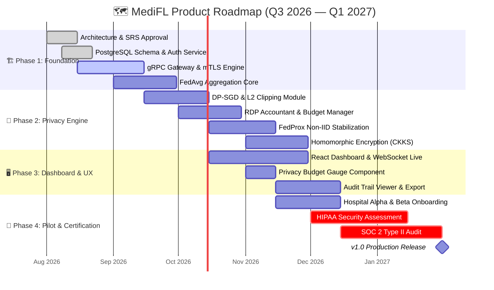
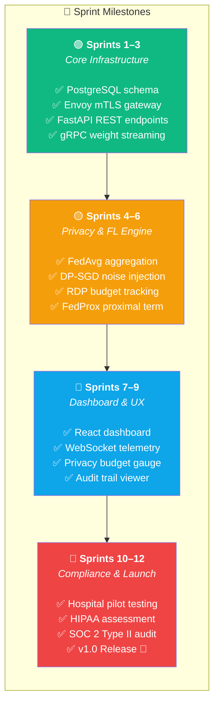

# 🗺️ MediFL — Project Roadmap & Sprint Planning

### 🏥 6-Month Release Timeline (Q3 2026 – Q1 2027)

| **Document ID** | `MEDIFL-ROAD-021` | **Version** | `v1.0.0` | **Status** | ✅ Approved |
|:---:|:---:|:---:|:---:|:---:|:---:|

---

## 1. Release Timeline

## 2. Sprint Milestone Breakdown

## 3. Release Version Matrix

| Version | Target Date | Key Features | Status |
|:---:|:---:|:---|:---:|
| **v1.0** | Jan 2027 | FedAvg, FedProx, DP-SGD, mTLS, Dashboard, Audit | 🔴 Critical |
| **v1.1** | Apr 2027 | Homomorphic Encryption, DICOM PACS Connector, Dynamic Straggler Handling | 🟡 Planned |
| **v1.2** | Jul 2027 | SCAFFOLD Algorithm, FedOpt Optimizer, Multi-Cloud Support | 🔵 Planned |
| **v2.0** | Q4 2027 | Federated Analytics, Vertical FL, Blockchain Audit Ledger | ⬜ Roadmap |

## 4. Risk Mitigation Schedule

| Risk | Mitigation Sprint | Owner |
|:---|:---:|:---|
| Non-IID data divergence | Sprint 5 (FedProx) | AI Lead |
| HIPAA compliance gaps | Sprint 10 (Assessment) | CISO |
| Hospital network unreliability | Sprint 6 (Straggler handling) | DevOps |
| Privacy budget exhaustion pre-convergence | Sprint 4 (Adaptive noise) | AI Lead |

---

| ← [Phase 20: User Manual](./20_USER_MANUAL.md) | 📄 **Next** | [Phase 22: README →](../README.md) |
|:---:|:---:|:---:|

*© 2026 MediFL Platform — Confidential & Proprietary*

